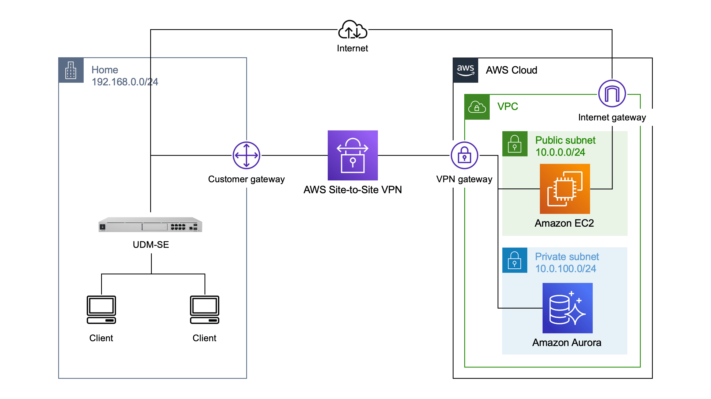
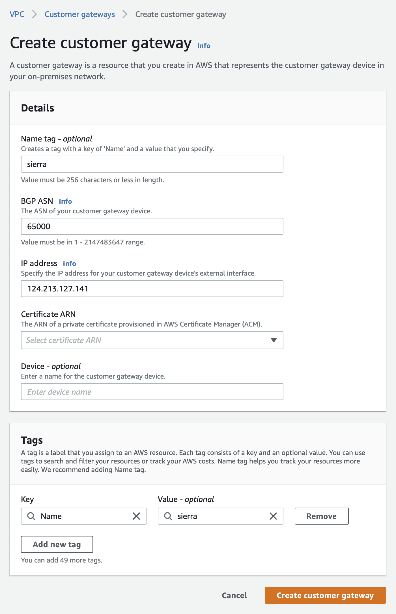
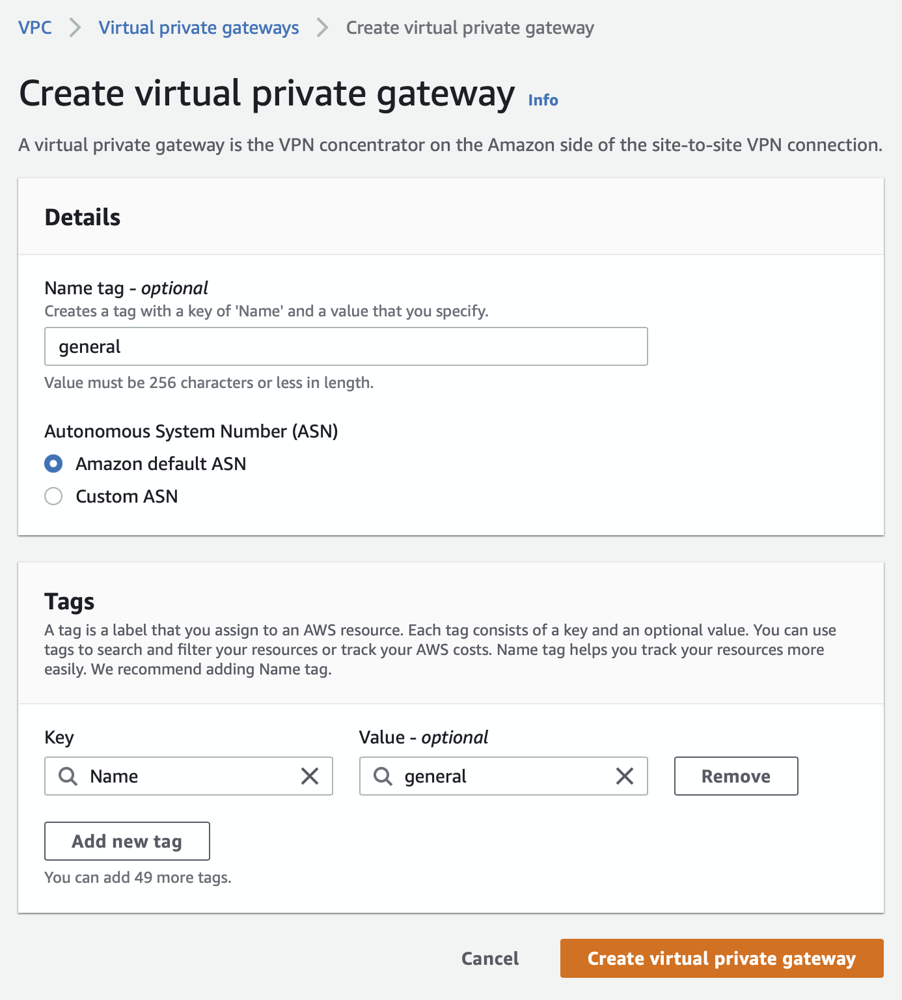
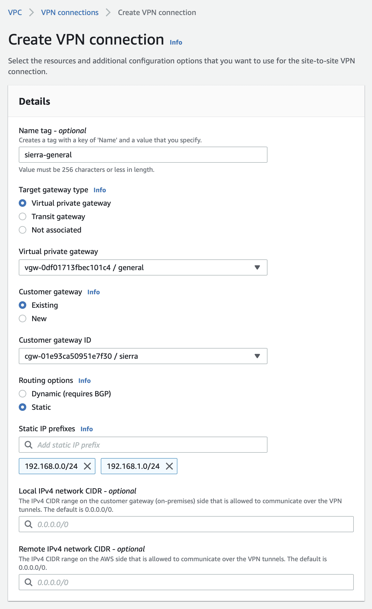
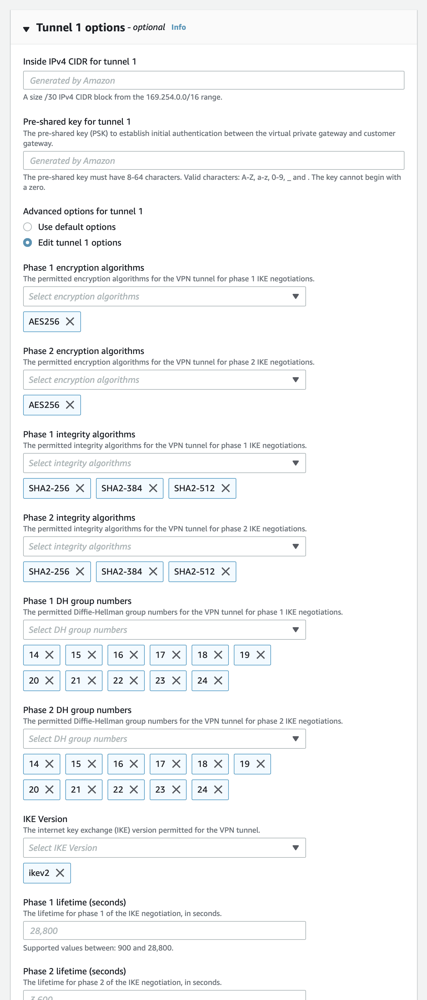
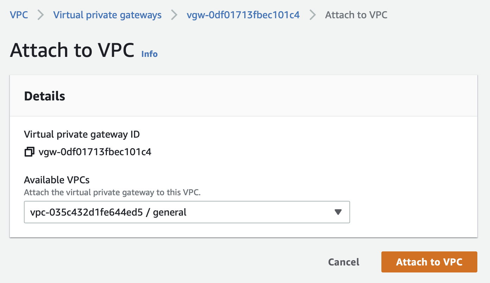
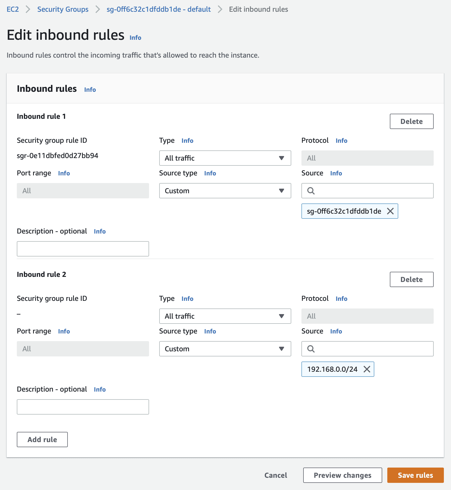
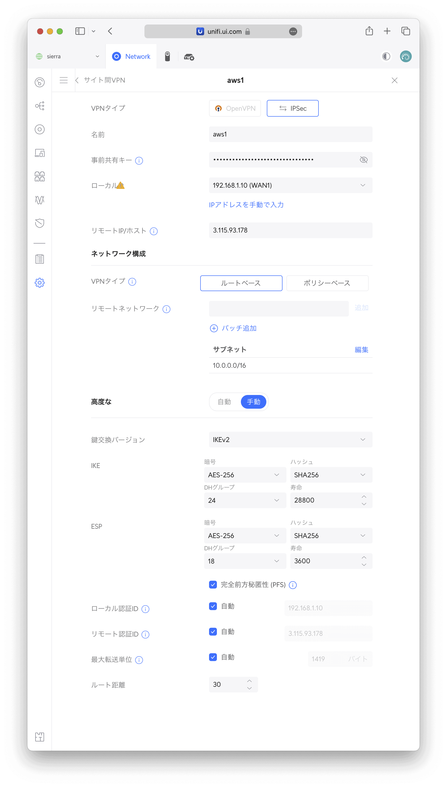

UniFi OS コンソールの最上位機種 [Ubiquiti UniFi Dream Machine Special Edition (UDM-SE)](https://jp.store.ui.com/collections/unifi-network-unifi-os-consoles/products/dream-machine-se) を使用する機会を得たので、現在使っている [YAMAHA RTX1200](https://network.yamaha.com/products/routers/rtx1200/) をUDM-SEに置き換えてみようと思います。RTX1200ではAWSと Site-to-Site VPN を構築していたので、静的ルーティングを使ってUDM-SEでも同様にAWSと Site-to-Site VPN を構成します。


アーキテクチャ図は以下のようになり、自宅のグローバルIPアドレスを Customer gateway として定義し、VPC側に VPN gateway をアタッチし、その間で Site-to-Site VPN を構築します。VPN gateway には Public subnet だけでなく Private subnet にもつなぐことで、自宅のクライアントから Private subnet 内のデータベースにも直接アクセスできるようにします。





## Customer gateway の作成


まずはAWS側の設定を行います。


1. [Amazon VPC コンソール](https://console.aws.amazon.com/vpc/)にアクセス
2. 左パネルから Customer gateways を選択
3. Create customer gateway ボタンを選択
   1. Name tag に好きな名前を設定
   2. IP address に自宅のグローバルIPアドレスを入力
   3. Create customer gateway ボタンを選択





私はauひかりを使っているため、Home Gateway (HGW) のMACアドレスが変わらない限りグローバルIPアドレスは変更されないため、グローバルIPアドレスは変更されないものとして運用しています。グローバルIPアドレスがしばしば変更される環境の場合は、変更を何らかの方法で検知して、`aws ec2 create-customer-gateway` コマンドで新しいIPアドレスの Customer gateway を自動作成するようにする必要があるでしょう。


## VPN gateway の作成


1. [Amazon VPC コンソール](https://console.aws.amazon.com/vpc/)にアクセス
2. 左パネルから Virtual priavte gateways を選択
3. Create virtual private gateway ボタンを選択
   1. Name tag に好きな名前を設定
   2. Create virtal private gateway ボタンを選択





## Site-to-Site VPN の作成


1. [Amazon VPC コンソール](https://console.aws.amazon.com/vpc/)にアクセス
2. 左パネルから Site-to-Site VPN connections を選択
3. Create VPN connection ボタンを選択
   1. Name tag に好きな名前を設定
   2. Target gateway type で Virtual private gateway を選択
   3. Virtual private gateway で先ほど作成した VPN gateway を選択
   4. Customer gateway でExitingを選択
   5. Customer gateway ID で先ほど作成した Customer gateway を選択
   6. Routing options でStaticを選択
   7. Static IP prefixes に自宅のプライベートIPとサブネットを入力
   8. Tunnel 1 options を開く
      1. Advanced options for tunnel 1 を Edit tunnel 1 options に変更
      2. Phase 1 encryption algorithms をAES256のみに変更
      3. Phase 2 encryption algorithms もAES256のみに変更
      4. Phase 1 integrity algorithms を SHA2-256, SHA2-384, SHA2-512 に変更
      5. Phase 2 integrity algorithms も SHA2-256, SHA2-384, SHA2-512 に変更
      6. Phase 1 DH group numbers を14以上に変更
      7. Phase 2 DH group numbers も14以上に変更
      8. IKE Version をikev2のみに変更
   9. Tunnel 2 options も Tunnel 1 options と同様に設定
   10. Create VPN connection ボタンを選択
   11. 作成した VPN connection を選んで、Download configuration ボタンを選択
       - VenderでGenericを選択
       - IKE version でikev2を選択
       - Downloadボタンを選択








ダウンロードしたvpn-xxxxxxxxxxxxxxxxxx.txtというファイルは後で使用します。


グローバルIPアドレスがしばしば変更される環境のため Customer gateway を自動作成している場合は、`aws ec2 modify-vpn-connection` コマンドで Customer gateway を自動変更しましょう。


## VPCに VPN gateway をアタッチ


1. [Amazon VPC コンソール](https://console.aws.amazon.com/vpc/)にアクセス
2. 左パネルから Virtual priavte gateways を選択
3. 先ほど作成した VPN gateway を選択して、Actionsメニューから Attach to VPC を選択
   1. Availables VPCs からアタッチするVPCを選択
   2. Attach to VPC ボタンを選択





## Route table の編集


自宅のプライベートIPアドレスが宛先の場合は Internet Gateway ではなく、VPN gateway に行くように Route table を編集します。


1. [Amazon VPC コンソール](https://console.aws.amazon.com/vpc/)にアクセス
2. 左パネルから Route tables を選択
3. Public subnet で使用している Route table を選択して、Actionsメニューから Edit route prepagation を選択
   1. 先ほど作成した VPN gateway のEanbledをチェック
   2. Saveボタンを選択
4. Route table を見て、自宅のプライベートIPアドレスが宛先の場合は VPN gateway が目標になっていることを確認
5. Private subnet も Public subnet と同様に設定


## Security Group の編集


自宅のプライベートIPアドレスからのアクセスを許可するため、Security Group を編集します。以下ではすべてのインスタンスにすでにアタッチされている Security Group に追加しています。


1. [Amazon EC2 コンソール](https://console.aws.amazon.com/ec2/)にアクセス
2. 左パネルから Security Groups を選択
3. すべてのインスタンスにすでにアタッチされている Security Group を選択して、Edit inbound rules を選択
4. Add rule ボタンを選択
   1. Typeで All traffic を選択
   2. Source type でCustomを選択
   3. Sourceで自宅のプライベートIPとサブネットを入力
5. Save rules ボタンを選択





AWS側の設定は以上です。


## UDM-SEの設定


続いてUDM-SE側の設定を行います。


1. <https://unifi.ui.com/> にアクセス
2. UniFi Network を選択
3. 設定 > VPN を選択
4. 〈サイト間 VPN〉の〈新しい作成〉を選択
   1. 〈VPNタイプ〉でIPSecを選択
   2. 〈名前〉に好きな名前を設定
   3. 〈事前共有キー〉に、ダウンロードしたvpn-xxxxxxxxxxxxxxxxxx.txtというファイルの36行目にある IPSec Tunnel #1 の Pre-Shared Key に記載されている32文字を入力
   4. 〈ローカルIP〉で使用するWANを選択
   5. 〈リモートIP/ホスト〉に、vpn-xxxxxxxxxxxxxxxxxx.txtの94行目にある IPSec Tunnel #1 の Virtual Private Gateway に記載されているグローバルIPアドレスを入力
   6. 〈VPNタイプ〉で〈ルートベース〉を選択
   7. 〈リモートネットワーク〉にVPCのプライベートIPとサブネットを入力
   8. 〈高度な〉を〈手動〉に変更
      - 〈鍵交換バージョン〉でIKEv2を選択
      - IKEの〈暗号〉でAES-256を選択
      - IKEの〈ハッシュ〉でSHA256を選択
      - IKEの〈DHグループ〉で24を選択
      - ESPの〈暗号〉でAES-256を選択
      - ESPの〈ハッシュ〉でSHA256を選択
      - ESPの〈DHグループ〉で18を選択
5. 〈追加〉ボタンを選択





AWS側は2個のトンネルを用意していますが、UDM-SEがBGPなどの動的ルーティングに対応していないため、同一宛先のものは1個ずつしか有効にすることができません。また、UDM-SEのサイト間VPNをコマンドラインから無効/有効にする方法が現状では分かっていないため、なにかあったら手動で切り替える必要があります。


1. 〈管理〉を選択
2. 上記で作成したVPNを選んで〈一時停止〉
3. 〈新しい作成〉を選択
   1. 〈VPNタイプ〉でIPSecを選択
   2. 〈名前〉に好きな名前を設定
   3. 〈事前共有キー〉に、ダウンロードしたvpn-xxxxxxxxxxxxxxxxxx.txtというファイルの136行目にある IPSec Tunnel #2 の Pre-Shared Key に記載されている32文字を入力
   4. 〈ローカルIP〉で使用するWANを選択
   5. 〈リモートIP/ホスト〉に、vpn-xxxxxxxxxxxxxxxxxx.txtの194行目にある IPSec Tunnel #2 の Virtual Private Gateway に記載されているIPアドレスを入力
   6. 〈VPNタイプ〉で〈ルートベース〉を選択
   7. 〈リモートネットワーク〉にVPCのプライベートIPとサブネットを入力
   8. 〈高度な〉を〈手動〉に変更
      - 〈鍵交換バージョン〉でIKEv2を選択
      - IKEの〈暗号〉でAES-256を選択
      - IKEの〈ハッシュ〉でSHA256を選択
      - IKEの〈DHグループ〉で24を選択
      - ESPの〈暗号〉でAES-256を選択
      - ESPの〈ハッシュ〉でSHA256を選択
      - ESPの〈DHグループ〉で18を選択
4. 〈追加〉ボタンを選択


## VPN疎通の確認


1. [Amazon VPC コンソール](https://console.aws.amazon.com/vpc/)にアクセス
2. 左パネルから Site-to-Site VPN connections を選択
3. 上記で作成した VPN connection を選択
4. 下パネルから Tunnel details タブを選択
5. Tunnel Status の1個がUpになっていることを確認


UDM-SEで有効にしたトンネル側のみがUpになっている状態で正しいです。


宛先が Amazon EC2 の場合は、自宅のクライアントからEC2のプライベートIPアドレスにpingを実行してみましょう。


```
[tats@zoom ~]% ping 10.0.0.63 -c 3
PING 10.0.0.63 (10.0.0.63): 56 data bytes
64 bytes from 10.0.0.63: icmp_seq=0 ttl=63 time=6.621 ms
64 bytes from 10.0.0.63: icmp_seq=1 ttl=63 time=6.937 ms
64 bytes from 10.0.0.63: icmp_seq=2 ttl=63 time=6.829 ms

--- 10.0.0.63 ping statistics ---
3 packets transmitted, 3 packets received, 0.0% packet loss
round-trip min/avg/max/stddev = 6.621/6.796/6.937/0.131 ms
```


Amazon Aurora はpingに応答しないため、実際に接続してみましょう。Private subnet にあるAuroraに自宅のクライアントから直接ログインできるはずです。


```
[tats@zoom ~]% mysql -uexample -p -hexample.cluster-c8xun5aepybs.ap-northeast-1.rds.amazonaws.com example
Enter password:
Reading table information for completion of table and column names
You can turn off this feature to get a quicker startup with -A

Welcome to the MySQL monitor.  Commands end with ; or \g.
Your MySQL connection id is 129094
Server version: 8.0.23 Source distribution

Copyright (c) 2000, 2022, Oracle and/or its affiliates.

Oracle is a registered trademark of Oracle Corporation and/or its
affiliates. Other names may be trademarks of their respective
owners.

Type 'help;' or '\h' for help. Type '\c' to clear the current input statement.

mysql>
```


## 参考


[How to setup AWS Site-to-Site VPN with Unifi UDM 🔒](https://mjasion.pl/posts/cloud/how-to-setup-aws-site-to-site-vpn-with-unifi-udm/)