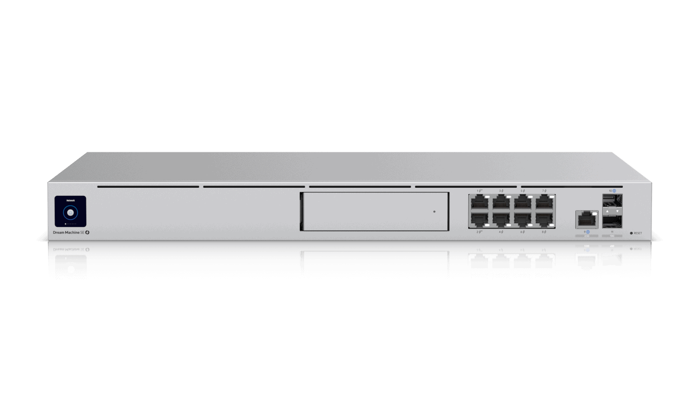

[Ubiquiti UniFi Dream Machine Special Edition](https://jp.store.ui.com/products/dream-machine-se) (UDM-SE) とその配下のクライアントにauひかりからIPv6アドレスを割り当てたいと思います。我が家のネットワーク環境は以下のようになっており、auひかりのホームゲートウェイ [Aterm BL900HW](https://www.au.com/support/service/internet/guide/modem/gateway-05/) の下にUDM-SEを配置しています。



flowchart TD
    Internet([auひかり]) --- ONU[ONU: au Mitsubishi H06NU5]
    ONU --- HGW[HGW: au NEC Aterm BL900HW]
    HGW --- Router[Router: Ubiquiti UDM-SE]
    Router --- Clients-1
    Router --- AP1[Wi-Fi AP: Ubiquiti U6-Pro]
    Router --- AP2[Wi-Fi AP: Ubiquiti U6-Lite]
    AP1 -.- Clients-2
    AP1 -.- Clients-3
    AP2 -.- Clients-4



## Aterm BL900HW の設定


UDM-SEはDHCPv6のみに対応しているので、Aterm BL900HW の「詳細設定 > DHCPv6サーバ設定」から「配布する情報」を「設定2 [RA: プレフィックス配布 DHCPv6: プレフィックス/IPv6アドレス配布]」にします。


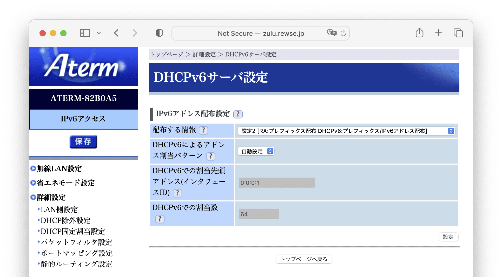


## Prefix Delegation Size の設定


UDM-SE自身にIPv6アドレスを割り当てる方法は UniFi Network の Settings > Internet > Primary (WAN1) にありますが、Prefix Delegation Size に設定すべき値が分かりません。そのため、ひとまず IPv6 Connection: DHCPv6 / Prefix Delegation Size: 56 にして、UDM-SEにSSHし、tcpdumpでパケットキャプチャしてみます。WANポートが Port 9 の場合、指定するインタフェースはeth8になります。tcpdump実行中にWANポートのケーブルを抜き差しし、Ctrl + C でキャプチャを終了します。


```
[tats@zoom ~]% ssh root@sierra.rewse.jp
root@sierra:~# tcpdump -npi eth8 ip6 -w /tmp/capture.pcap
```


できたcapture.pcapをWindowsやMacにSCPでコピーし、[Wireshark](https://www.wireshark.org/)で開きます。


```
[tats@zoom ~]% scp root@sierra.rewse.jp:/tmp/capture.pcap Desktop
capture.pcap                                  100%   38KB   5.6MB/s   00:00
```


ProtocolがDHCPv6の2行目を見てみると、Prefix length: 64 で応答されていることが分かります。auひかり電話を使用している場合のauひかりのプレフィックス長は64でした。auひかり電話を使用していない場合は異なるかもしれません。


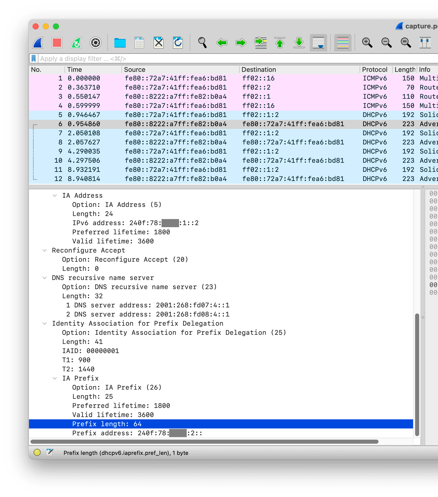


```
Identity Association for Prefix Delegation
    Option: Identity Association for Prefix Delegation (25)
    Length: 41
    IAID: 00000001
    T1: 900
    T2: 1440
    IA Prefix
        Option: IA Prefix (26)
        Length: 25
        Preferred lifetime: 1800
        Valid lifetime: 3600
        Prefix length: 64
        Prefix address: 240f:78:xxxx:2::
```


UniFi Network の Settings > Internet > Primary (WAN1) から、IPv6 Connection: DHCPv6 / Prefix Delegation Size: 64 に指定します。


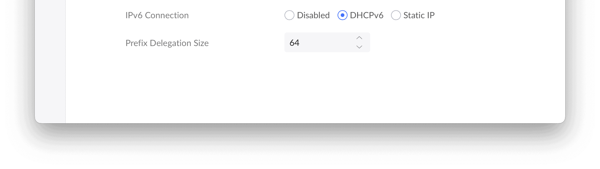


## Firewall Rule の設定


先ほどのパケットキャプチャを見ると、ソースポートがエフェメラルポート（今回の場合は49156）になっていることが分かります。


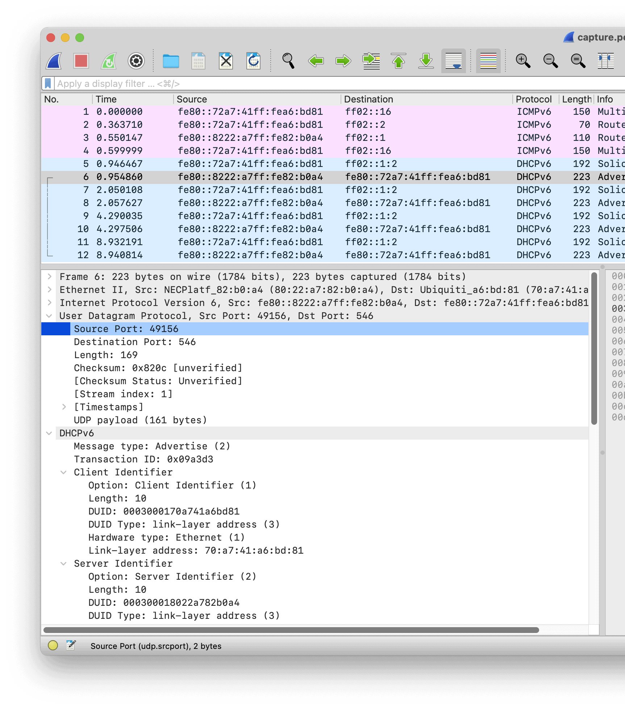


```
User Datagram Protocol, Src Port: 49156, Dst Port: 546
    Source Port: 49156
    Destination Port: 546
    Length: 169
    Checksum: 0x820c [unverified]
    [Checksum Status: Unverified]
    [Stream index: 1]
    [Timestamps]
    UDP payload (161 bytes)
```


UniFi Network > Settings > Firewall & Security の Firewall Rules > Internet v6 には Allow DHCPv6 というルールが事前に定義されていますが、UDM-SEにSSHログインしてip6tablesを見てみると、ソースポートが547、宛先ポートが546のときしか許可されていません。つまり、ソースポートがエフェメラルポートになっているとファイアウォールで拒否されてしまっています。


```
root@sierra:~# ip6tables -L -n | grep 546
RETURN     udp      ::/0                 ::/0                 udp spt:547 dpt:546 /* 00000000008589937602 */
```


エフェメラルポートがソースの場合を許可するルールを追加します。まずは UniFi Network > Settings > Profiles からプロファイルを設定します。IP Groups > Create New から DHCPv6 Port を定義します。


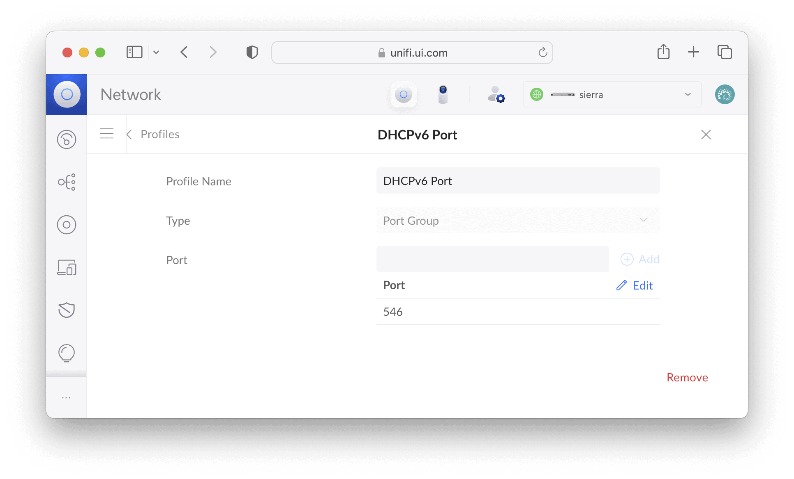


同様にリンクローカルアドレスを定義します。


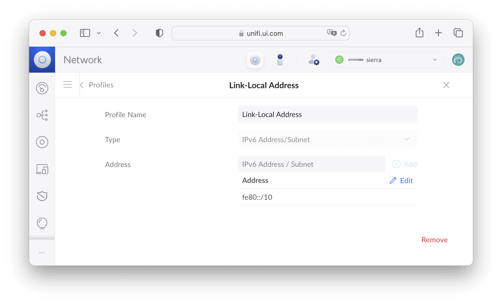


UniFi Network > Settings > Firewall & Security の Firewall Rules > Internet v6 に戻り、Create Entry から以下のように新しいルールを追加します。


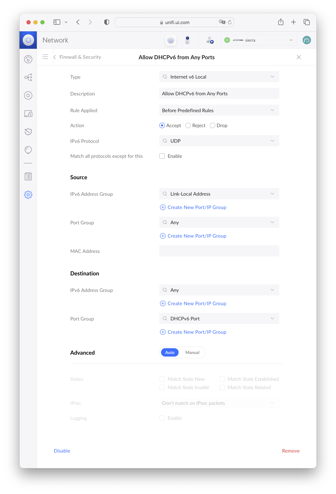


WANポートのケーブルを抜き差ししたあと、UDM-SEのSSHログインし、UDM-SEにグローバルIPv6アドレスが割り当てられていることを確認しましょう。


```
root@sierra:~# ip -6 address show scope global
11: eth8: <BROADCAST,MULTICAST,UP,LOWER_UP> mtu 1500 state UP qlen 1000
    inet6 240f:78:xxxx:1::2/128 scope global dynamic
       valid_lft 2859sec preferred_lft 1059sec
14: br0: <BROADCAST,MULTICAST,UP,LOWER_UP> mtu 9216 state UP qlen 1000
    inet6 240f:78:xxxx:2::1/64 scope global dynamic
       valid_lft 2859sec preferred_lft 1059sec
```


## クライアントへのIPv6アドレス配布のための設定


UniFi Network > Settings > Networks からDefaultを選び、IPv6 Inteface Type を Prefix Delegation に設定します。


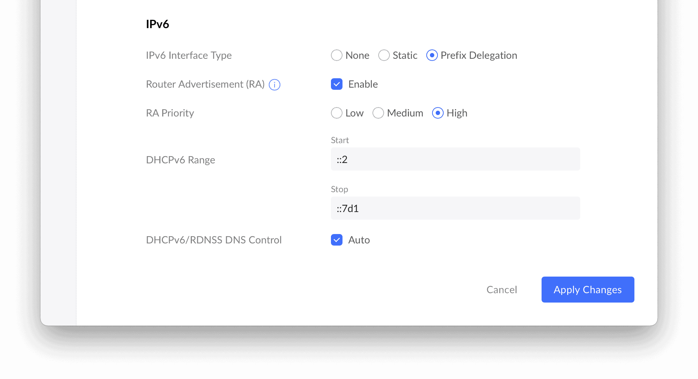


クライアントにIPv6アドレスが割り当てられていることを確認します。macOS Ventura の場合、システム設定... > Wi-Fi > 詳細... > TCP/IP です。RAによるステートレスなIPv6アドレスとDHCPv6によるステートフルなIPv6アドレスの両方が割り当てられています。


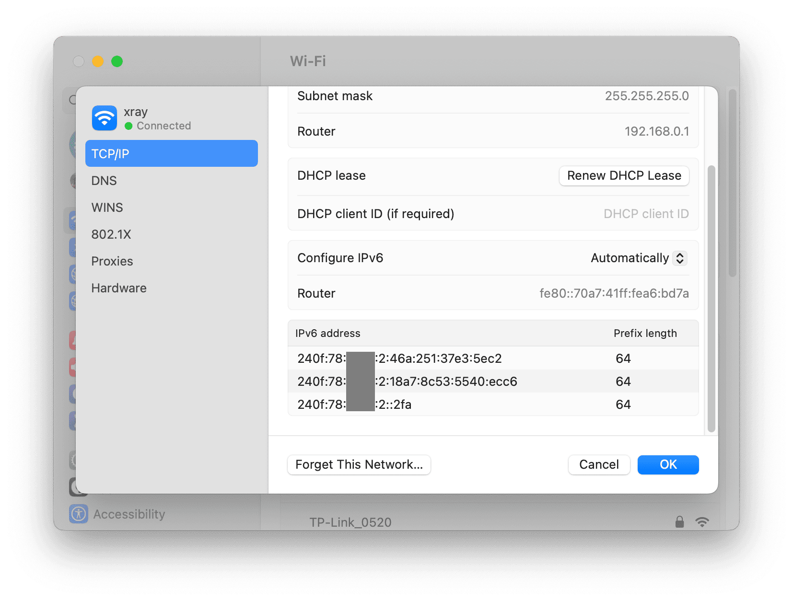


[Test your IPv6.](https://test-ipv6.com/) にクライアントのWebブラウザーからアクセスして、IPv6で通信できるていることを確認しましょう。


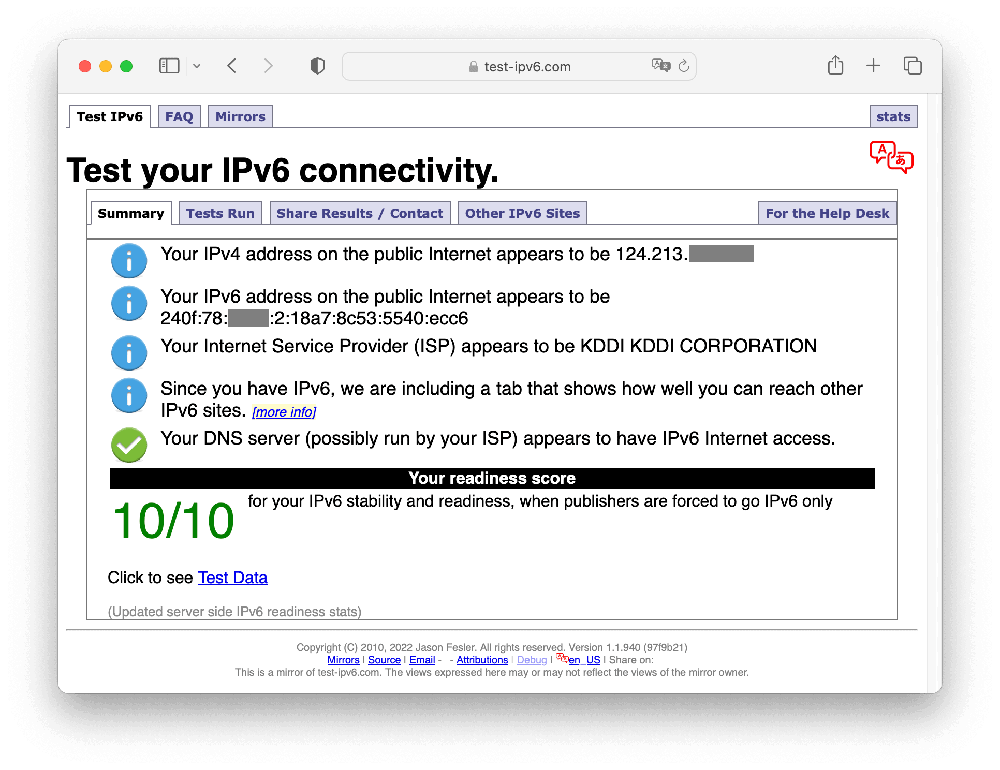


## 参考


- [Ubiquiti UDM-SE でIPv6を有効にする - Qiita](https://qiita.com/shigeokamoto/items/0b3cf2396edd422552dd)
- [フレッツ光クロス+IPv6利用時のUniFi OSコンソール設定 | Hirolog](https://blog.hiroaki.jp/blog/2023/05/15/unifi-os-console-settings-when-using-flets-hikari-cross/)