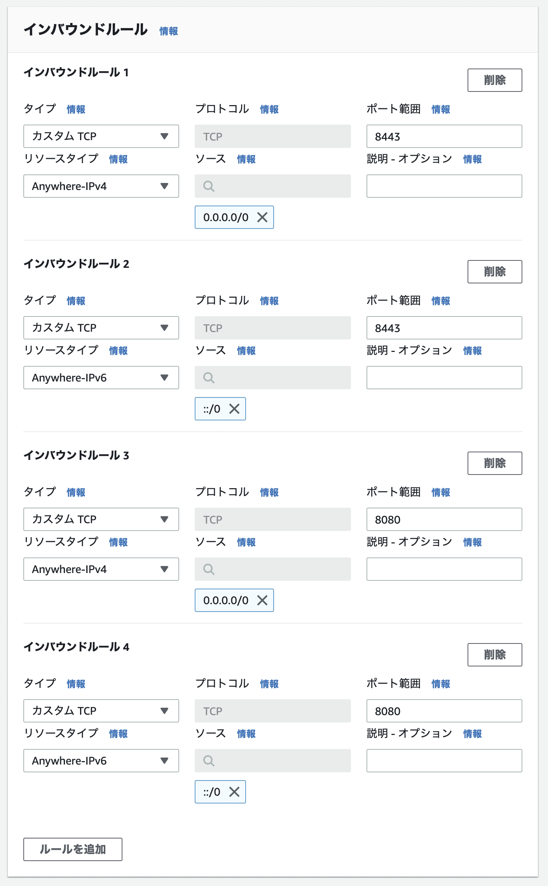
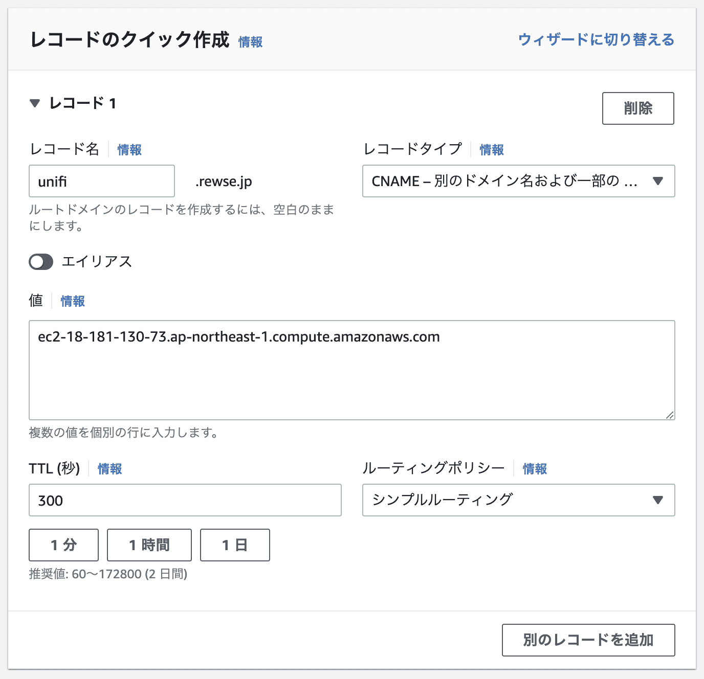
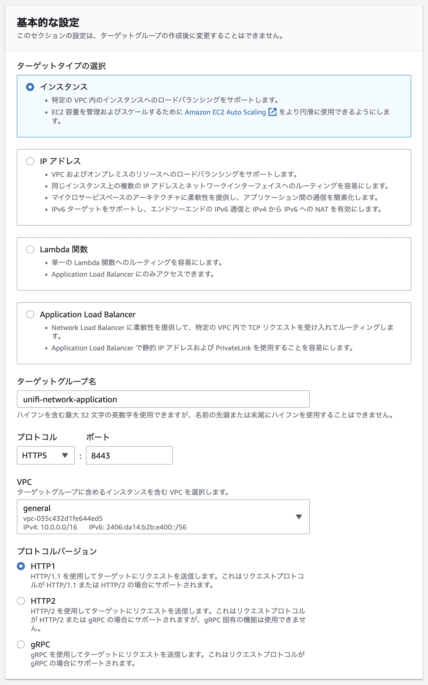
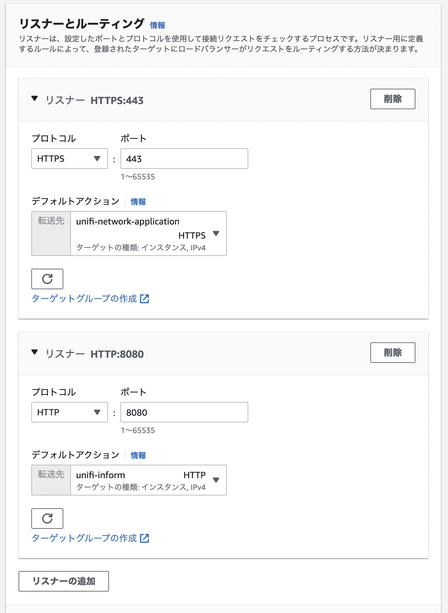
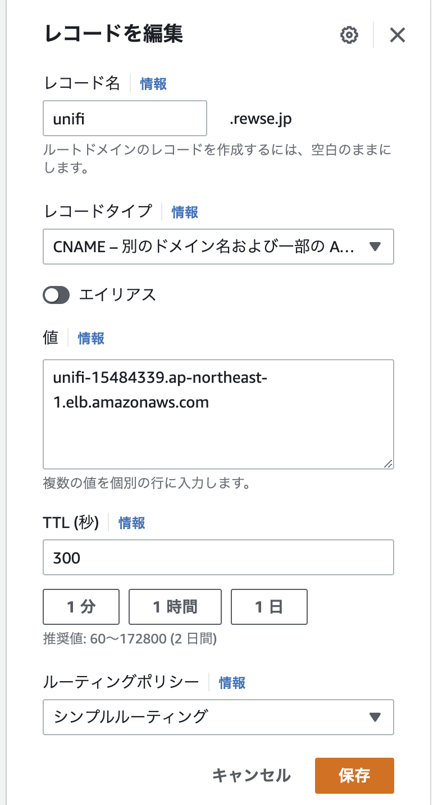

[Ubiquiti](https://ui.com/jp/ja) UniFi は別途コントローラーを用意する必要があります。コントローラーには [UniFi OS Console](https://ui.com/jp/ja/cloud-gateways) が推奨されていますが、手間を掛ければ Ubuntu / Debian / Windows / macOS に無償配布されている [UniFi Network Application](https://www.ui.com/download/unifi) をインストールして、Self-Hosted環境を構築することもできます。また、UniFi Network Application はUniFiデバイスと同一L2に設置することが期待されていますが、[UniFi Network - Layer 3 Adoption – Ubiquiti Support and Help Center](https://help.ui.com/hc/en-us/articles/204909754-UniFi-Layer-3-Adoption-for-Remote-UniFi-Network-Applications) に従って設定することで、異なるL2をまたぐことができます。この記事では UniFi Network Application を Amazon EC2 上にインストールし、インターネット経由で自宅のUniFiデバイスをコントロールする環境を構築します。


## システム要件


システム要件は [UniFi Network - Self-Hosting your UniFi Network Without a Console (Advanced) – Ubiquiti Support and Help Center](https://help.ui.com/hc/en-us/articles/360012282453-UniFi-Network-Self-Hosting-your-UniFi-Network-Without-a-Console-Advanced-) に記載されています。


- Ubuntu Desktop / Server 16.04; Debian 9 "Stretch"
- CPU: x86-64 Processor (Intel / AMD x64 Processors)
- RAM: 2GB
- Network: 100Mbps Wired Ethernet
- HDD: Minimum 10GB free (20GB or more preferred)
- Java: Java Runtime Environment (JRE) 8
- MongoDB: version 3.2 or later


このブログが動いている Amazon EC2 がm5a.large (8GB Memroy) で、Ubuntu 20.04 がインストールされているので、要件を満たした状態です。そのため、これに相乗りさせることにしました。


## インストール


APTの依存パッケージ解決に任せるとopenjdk-17-jre-headlessがインストールされてしまいますが、UniFi Network Application は JRE 8 である必要があります。そのため、事前に JRE 8 と関連パッケージだけインストールしておきます。


```
tats@delta:~$ sudo apt install openjdk-8-jre-headless jsvc libcommons-daemon-java
```


UbiquitiがAPTリポジトリを提供しているので、それを使用します。まずはAPTキーとAPTリポジトリを追加します。


```
tats@delta:~$ sudo curl -o /etc/apt/trusted.gpg.d/unifi-repo.gpg https://dl.ui.com/unifi/unifi-repo.gpg
tats@delta:~$ echo 'deb https://www.ui.com/downloads/unifi/debian stable ubiquiti' | sudo tee /etc/apt/sources.list.d/unifi.list
```


APTを使って UniFi Network Application をインストールします


```
tats@delta:~$ sudo apt install unifi
```


UniFi Network Application が動作していることを確認しましょう。


```
tats@delta:~$ systemctl status unifi
● unifi.service - unifi
     Loaded: loaded (/lib/systemd/system/unifi.service; enabled; vendor preset: enabled)
     Active: active (running) since Wed 2022-06-22 11:07:32 JST; 1 weeks 1 days ago
   Main PID: 1100 (jsvc)
      Tasks: 122 (limit: 4435)
     CGroup: /system.slice/unifi.service
```


## セキュリティグループの設定


UniFi Network Application はTCP/8443をリスンしています。また、AdoptationにはTCP/8080を使うので、こちらも合わせて許可します。


1. AWS Management Console から EC2 > セキュリティグループ > 「セキュリティグループを作成」を選択
2. 「基本的な詳細」の「セキュリティグループ名」にunifi、「詳細」に UniFi Network Application と入力し、VPCに UniFi Network Application をインストールしたEC2のあるVPCを選択
3. 「インバウンドルール」を設定
   1. 「タイプ」を「カスタムTCP」、「ポート範囲」を8443、「ソース」にAnywhere-IPv4を選択
   2. 「タイプ」を「カスタムTCP」、「ポート範囲」を8443、「ソース」にAnywhere-IPv6を選択
   3. 「タイプ」を「カスタムTCP」、「ポート範囲」を8080、「ソース」にAnywhere-IPv4を選択
   4. 「タイプ」を「カスタムTCP」、「ポート範囲」を8080、「ソース」にAnywhere-IPv6を選択
4. 「アウトバウンドルール」はデフォルトのまま
5. 「セキュリティグループを作成」を選択
6. AWS Management Console から EC2 > 「インスタンス」を選択し、UniFi Network Application をインストールしたEC2のチェックボックスを選択
7. 右上の「アクション」ボタン > セキュリティ > 「セキュリティグループを変更」を選択
8. 上記で作成したunifiセキュリティグループを追加して保存





「ソース」のIPアドレスを限定できる場合は、その限定されたIPアドレスを指定するほうがより良いです。


`https://ec2-18-181-130-73.ap-northeast-1.compute.amazonaws.com:8443/` のように「パブリック IPv4 DNS」でアクセスするとSSL証明書の警告が出るものの、Unifi Network Application にアクセスできます。接続エラーが出る場合はセキュリティグループの設定を見直してください。


また、`http://ec2-18-181-130-73.ap-northeast-1.compute.amazonaws.com:8080/inform` でHTTPエラー400が返ればセキュリティグループは正しく設定できています。接続エラーが出る場合はセキュリティグループの設定を見直してください。


## DNSの設定


異なるL2の UniFi Network Application にAdoptationするための設定方法は、SSH / DHCP / DNSの3種類があります。SSHだと各デバイスごとにAdoptationする必要がありますが、DHCP / DNSの場合は同一L2のとき同様に自動でAdoptationされます。詳細は [UniFi Network - Layer 3 Adoption – Ubiquiti Support and Help Center](https://help.ui.com/hc/en-us/articles/204909754-UniFi-Layer-3-Adoption-for-Remote-UniFi-Network-Applications) にありますが、DNSの場合はunifiというホスト名が UniFi Network Application をインストールしたEC2に名前解決できるようにすることで実現できます。以下では、すでに構築されている Route 53 にunifiを追加しています。


1. AWS Management Console から Route 53 > 「ホストゾーン」を選択し、「タイプ」が「パブリック」な使用するドメインを選択
2. 「レコードを作成」を選択
   1. 「レコード名」をunifi.example.com
   2. 「レコードタイプ」をCNAME
   3. 「値」に UniFi Network Application をインストールしたEC2の「パブリック IPv4 DNS」を設定





これで `https://unifi.example.com:8443/` のようにアクセスするとSSL証明書の警告が出るものの、Unifi Network Application にアクセスできます。


また、`http://unifi.example.com:8080/inform` でHTTPエラー400が返るはずです。各デバイスから自動的にこのURLに問い合わせるため、数分待っていると同一L2のとき同様に UniFi Network Application からデバイスが検知されるので、Adoptationを行います。


## SSL証明書の設定


ここからは必須ではありませんが、SSL証明書の警告を消すためにSSL証明書を設定します。この記事では Application Load Balancer (ALB) と AWS Certificate Manager (ACM) を使いますが、ALBを使わず Let’s Encrypt などのSSL証明書を使う場合は以下の記事を参考にしてください。





## AWS Certificate Manager からSSL証明書を発行


1. AWS Management Console から > AWS Certificate Manager > 「リクエスト」を選択
2. 「パブリック証明書をリクエスト」を選択
3. 「完全修飾ドメイン名」にunifi.example.comなどのunifiで始まるFQDNを設定
4. 「DNS検証」または「Eメール検証」を選んで「リクエスト」を選択
5. 検証を実施して証明書を発行


## Application Load Balancer の設定


1. AWS Management Console から EC2 > ターゲットグループ > 「ターゲットグループの作成」を選択
   1. 「ターゲットタイプの選択」を「インスタンス」
   2. 「ターゲットグループ名」をunifi-network-application
   3. 「プロトコル」をHTTPS
   4. 「ポート」を8443
   5. VPCをunifi.example.comのあるVPC
   6. 「プロトコルバージョン」をHTTP1
   7. 「ヘルスチェックプロトコル」をHTTPS
   8. 「ヘルスチェックパス」を /manage/account/login に設定して「次へ」を選択
   9. 「使用可能なインスタンス」からunifi.example.comを選択し、「保留中として以下を含める」を選択し、「ターゲットグループの作成」を選択
2. 再度「ターゲットグループの作成」を選択
   1. 「ターゲットタイプの選択」を「インスタンス」
   2. 「ターゲットグループ名」をunifi-inform
   3. 「プロトコル」をHTTP
   4. 「ポート」を8080
   5. VPCをunifi.example.comのあるVPC
   6. 「プロトコルバージョン」をHTTP1
   7. 「ヘルスチェックプロトコル」をHTTPS
   8. 「ヘルスチェックパス」を /manage/account/login に設定して「次へ」を選択
   9. 「使用可能なインスタンス」からunifi.example.comを選択し、「保留中として以下を含める」を選択し、「ターゲットグループの作成」を選択
3. EC2 > ロードバランサー > 「ロードバランサーの作成」を選択
   1. Application Load Balancer の「作成」を選択
   2. 「ロードバランサー名」をunifi
   3. 「スキーム」を「インターネット向け」
   4. VPCをunifi.example.comのあるVPC
   5. 「マッピング」をunifi.example.comのある Availability Zone
   6. 「セキュリティグループ」をunifi
   7. 1つ目のリスナーを追加
      1. 「プロトコル」をHTTPS
      2. 「ポート」を443
      3. 「デフォルトアクション」をunifi-netowork-application
   8. 2つ目のリスナーを追加
      1. 「プロトコル」をHTTP
      2. 「ポート」を8080
      3. 「デフォルトアクション」をunifi-inform
   9. 「デフォルトの SSL/TLS 証明書」をunifi.example.comにして、「ロードバランサーの作成」を選択
4. AWS Management Console から Route 53 > 「ホストゾーン」を選択し、「タイプ」が「パブリック」な使用するドメインを選択
5. unifi.rewse.jpのチェックボックスを選択して、「レコードを編集」を選択
6. 「値」を作成したロードバランサーのDNS名に変更して、「保存」を選択











これで `https://unifi.example.com/` にアクセスすると、SSL証明書の警告が出ずに Unifi Network Application にアクセスできます。また、`http://unifi.example.com:8080/inform` でHTTPエラー400が返るはずです。
