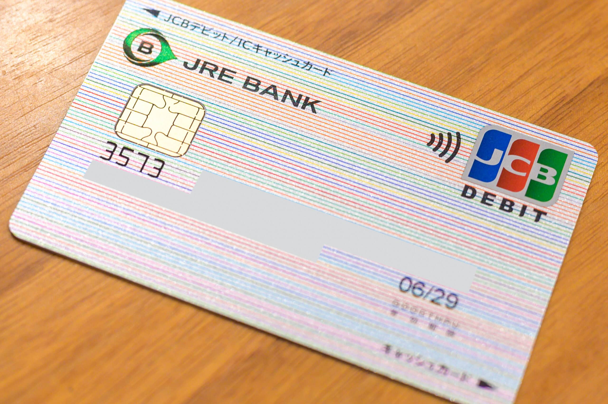

JR東日本が始めた銀行サービスである [JRE BANK](https://www.rakuten-bank.co.jp/jrebank/) を開設しました。JRE BANK は特典が豪華で、JR東日本の片道運賃が4割引になる JRE BANK 優待割引券が年間最大10枚、[どこかにビューーン！](https://dokokani-eki-net.com/)2,000ポイント割引クーポンが年間最大12枚、Suicaグリーン券が年間最大4枚もらえます [1](#b40334a6-78f6-4af2-a318-c89cea0743ad)。私はそれほどJR東日本の新幹線や特急に乗らないのですが、VIEW CARD の一つである [LUMINE CARD](https://www.jreast.co.jp/card/first/lumine.html) を持っているので、ひとまず作ってみることにしました。

VIEW CARD の引落しがない場合、JRE BANK 優待割引券などをもらうには給与受取口座にする必要があります。メインバンクを変えるとなると面倒ですが、毎月おまかせ振込予約という機能で指定した口座に指定金額を毎月自動的に振り込むことができるので、給与を一度 JRE BANK で受け取って、毎月おまかせ振込予約で今のメインバンクに自動で振り込めば、給与受取口座の変更による影響を最小限に抑えることができます。JRE BANK は給与受取口座にすると他行振込手数料が毎月3回無料になるので [2](#5a083883-3bb2-48df-86e3-d3b455499a58)、手数料もかかりません。

人気殺到で現在は手続きに時間が掛かるようです [3](#ff6a40ea-a80f-43fb-9aa2-be38a7d59679)。私は口座開設受付開始日時直後に申し込んだため比較的スムーズに行き、以下のようなスケジュールでキャッシュカードまで受け取りました。

- 5/9 12:00 口座開設申込み開始
- 5/9 12:05 口座開設申込み完了
- 5/9 12:19 本人確認書類の提出に必要な登録番号の書かれたメールを受信
- 5/9 13:01 本人確認書類の提出完了
- 5/10 9:20 本人確認書類受領のメールを受信
- 5/11 3:37 デビット申込み受付のメールを受信
- 5/11 5:04 デビット発送のメールを受信
- 5/11 5:23 口座開設完了のメールを受信
- 5/11 9:03 初回ログイン完了
- 5/17 11:29 デビットカードを簡易書留で受領

なお、銀行代理業者はビューカードですが、所属銀行は楽天銀行になります。そのため、他行から振り込んでもらう場合の銀行名は楽天銀行になり、支店名が〈JREはやぶさ支店〉のように JRE BANK 独自のものになります。

少し気になるのは、オンラインバンキングはモバイルしか想定していない画面幅で設計されているため、デスクトップからアクセスすると使いづらいです。楽天銀行のものをそのまま使ってくれれば良いのに、UIは完全に JRE BANK 独自のものになっています。