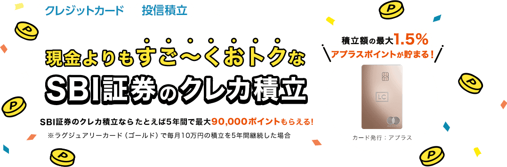

メインで使っているクレジットカードの [Luxury Card](https://www.luxurycard.co.jp/) でメインで使っている証券会社の[SBI証券のクレカ積立](https://www.sbishinseibank.co.jp/lp/creditcard_sbi.html)ができるようになりました。今までは三井住友カード発行の [ANA Super Flyers Gold Card Visa](https://www.ana.co.jp/ja/jp/amc/premium/sfc/) で0.5%ポイント還元だったのですが、Luxury Card Titanium だと1.0%ポイント還元になります。Luxury Card の発行会社であるAPLUSはSBI新生銀行グループなので、SBIグループでのシナジーが出始めました。

Luxury Card でクレカ積立をするためには、SBI証券の金融商品仲介業者を[SBI新生銀行](https://www.sbishinseibank.co.jp/)に設定する必要があります。SBI新生銀行の口座はもともと持っていたのですが、10年ぶりにログインしようとしたらログインできず、コールセンターに問い合わせると10年以上取引がないため休眠口座になっていました。休眠口座になると復活はできず、そのまま解約しかできないとのことでしたが、同時並行して新規口座を開設でき、最大31,000円もらえる新規口座キャンペーンの[ウェルカムプログラム](https://www.sbishinseibank.co.jp/service/welcome/)も適用できるとのことでした。

## キャッシュカード

[SBI新生銀行のキャッシュカード](https://www.sbishinseibank.co.jp/account/cash_card/)は10年前と変わっておらず古さを感じます。国際ブランド付きのデビットカードが最近増えてきましたが、ICチップすら入っていません。また、10年前はPlusマークが付いた国際キャッシュカードだったのですが、今は海外ATMを使用できなくなっています。SBI新生銀行からチャージできたプリペイドカードの[GAICA](https://www.gaica.jp/)経由で海外ATMを使う方法も、GAICAのサービス終了によってできなくなってしまいました。

さまざまな案内が英語でも用意されているSBI新生銀行で海外ATMが使えないというのはちぐはぐな印象なので、ここは近い将来改善されることを期待しています。

## SBI新生コネクト

キャッシュカードに同封されているチラシで気づいたのですが、SBI新生銀行とSBI証券を連携させるサービス、[SBI新生コネクト](https://www.sbishinseibank.co.jp/retail/connect/)を設定すると、それだけで[ステップアッププログラム](https://www.sbishinseibank.co.jp/service/relationship/)がダイヤモンドになり、円普通預金金利が年0.3%になることに気づきました。[あおぞら銀行BANK支店](https://www.aozorabank.co.jp/)の円普通預金の年0.2%を上回りますし、他行の来店不要で少額から預けられる円定期預金も高くて年0.4%程度なので、いつでも出し入れできる普通預金で年0.3%というのは魅力的です。

また、一部のファミリーマートにあるゆうちょATM以外のコンビニATMは入出金共に回数無制限で無料[1](#a8604749-fc0a-4c97-bbf2-73568394fa85)、インターネットによる他行あて振込手数料は月10回まで無料になり、使い勝手が良いです。個人的には外貨送金受取手数料が実質無料になるのも助かります。

なお、SBI新生コネクトは住信SBIネット銀行の[SBIハイブリッド預金](https://www.netbk.co.jp/contents/lineup/yen/hybrid/)と同時には設定できないため、すでにSBIハイブリッド預金を使っている場合はそれを休止して、数日後に設定する必要があります。

私はWebとアプリのできの良さと[目的別口座](https://www.netbk.co.jp/contents/lineup/purpose/)からメインは変わらず住信SBIネット銀行のままにしておきますが、セブン-イレブンとローソンのスマホATM以外では手数料が掛かるようになってしまったので[2](#367b158e-1cb8-4928-a076-4d2f8bdc04f9)、電波が悪いときや近くにファミマしかないときのバックアップ口座をSBI住信銀行にすることにしました。

## まとめ

SBI新生銀行の口座を10年ぶりに復活させ、Luxury Card でSBI証券のクレカ積立をするために必要な金融商品仲介業者の設定を行いました。キャッシュカードは古く、海外ATM利用ができなくなっている点が残念ですが、SBI新生コネクトを設定することで普通預金金利が年0.3%になり、コンビニATMも無料で何度でも使えるため使い勝手が良いです。
