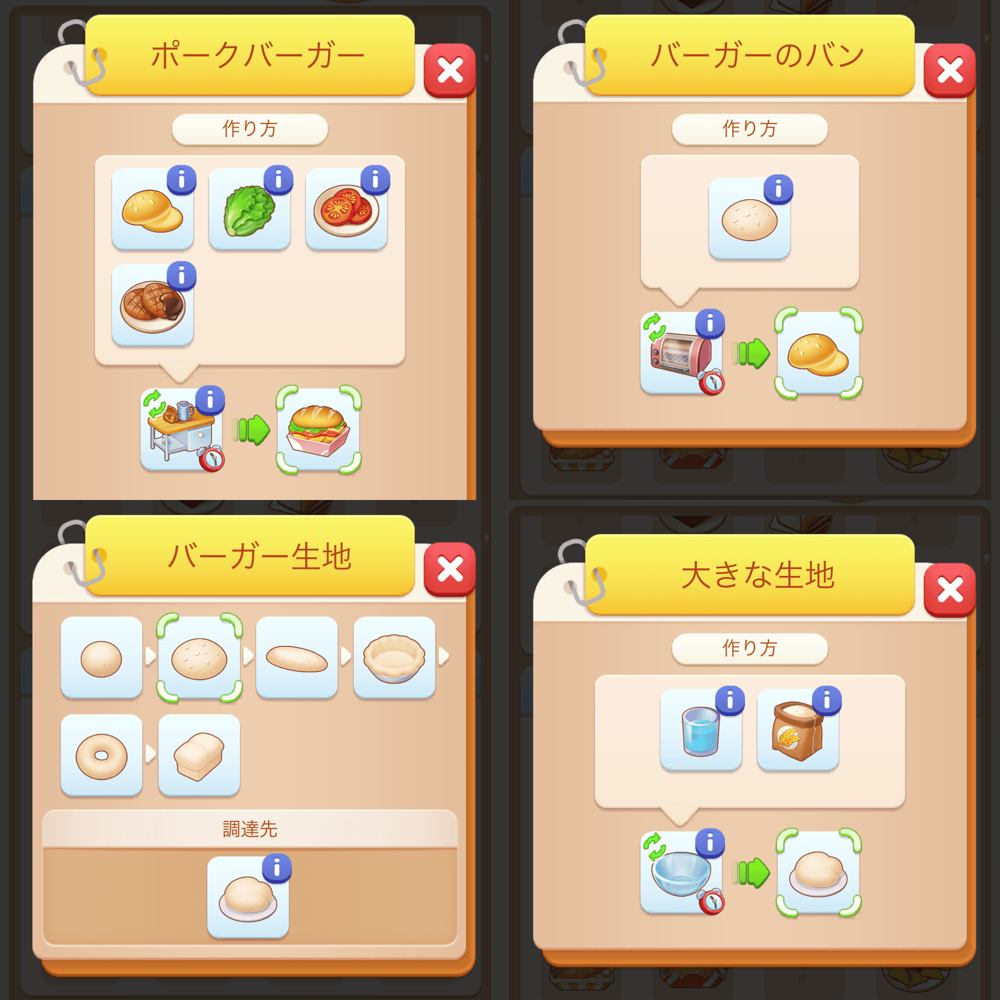
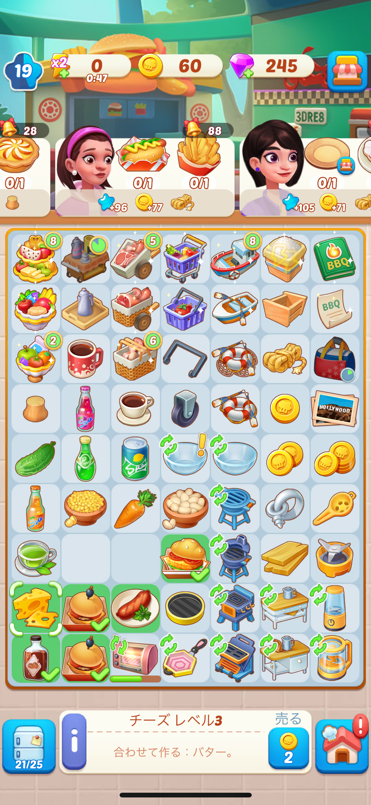

もはやどれがオリジナルなのか分からないくらいクローンがあふれているマージ系ゲームですが、[Merge Mansion](https://mergemansion.jp/) / [Farm Merge Valley](https://www.facebook.com/FarmMergeValley/about) / [Cats Mansion](https://apps.apple.com/jp/app/%E7%8C%AB%E3%81%AE%E8%8D%98%E5%9C%92-%E5%8F%AF%E6%84%9B%E3%81%84-%E3%81%AD%E3%81%93%E3%81%AE%E3%83%9E%E3%83%BC%E3%82%B8%E3%82%B2%E3%83%BC%E3%83%A0/id6470771978) などもプレイしましたが、しっかり続いているのは [Merge Cooking: Theme Restaurant](https://game.happibits.com/) だけです。



上記の他マージ系の基本プレイは以下のようにシンプルです。

1. 一つのジェネレーターから出てくる同一アイテムをマージして新しいアイテムを作る

一方、Merge Cooking は以下のようになります。

1. 一つのジェネレーターから出てくる同一アイテムをマージして新しいアイテムを作る
2. 他のジェネレーターから出てくる同一アイテムをマージして、別の新しいアイテムを作る
3. 上記の二つ以上のアイテムを調理器具に入れて新しいアイテムを作る

例えば、ポークバーガーを作る場合は以下のようになります。

1. 野菜ジェネレーターからトマトとレタスを作る
2. トマトをシェフのカレンターに置き、しばらく時間を掛けてトマトスライスを作る
3. プロテインジェネレーターからパティを作る
4. パティをグリルマシーンに入れて、しばらく時間を掛けてパティのグリルを作る
5. 飲み物ジェネレーターから牛乳を作る
6. 牛乳からガラスの破片を作る（牛乳瓶を割っている）
7. ガラスの破片からガラスボウルを作る
8. 穀物ジェネレーターから小麦粉を作る
9. 飲み物ジェネレーターから水を作る
10. 小麦粉と水をガラスボウルに入れて、しばらく時間を掛けて大きな生地を作る
11. 大きな生地から小さな生地を作る
12. 小さな生地からバーガー生地を作る
13. バーガー生地をオーブンに入れて、しばらく時間を掛けてバーガーのバンを作る
14. トマトスライス / レタス / パティのグリル / バーガーのバンをシェフのカウンターに置き、しばらく時間を掛けてポークバーガーを作る

恐ろしく手間が掛かり、[OVERCOOKED!](https://www.team17.com/games/overcooked)的な面白さがあります。手順は複雑ですが、注文票のアイテムをタップすれば作り方が出てくるので覚える必要はありません。むしろ、理不尽な手順ではないので、大体の手順は覚えてしまうでしょう。この調理したり、違うアイテムを組み合わせたりすることでアイテムのバリエーションが豊富になり、ざっと見た感じでは2500種類くらいの料理が作れます。

また、他マージ系では常設設備がジェネーレーターだけですが、Merge Cooking はジェネレーターと調理器具になるので、常設設備が盤面で場所を取ります。さらに複数のジェネレーターから同時にアイテムを作っていかなければならないので、すぐに盤面が埋まり、盤面の狭さを試行錯誤する難しさがあります。そのため、倉庫の広さが重要になってくるため、ダイヤモンドは倉庫の拡大に優先して使用したほうが良いです。

調理には時間が掛かるので、同じ調理器具を2個併設するのか、その2個をマージして一つ上のレベルの調理器具にするかも悩みどころです。2個併設戦略を取ると、盤面をますます圧迫します。また、マージが進むことで盤面を空けられるジェネレーターや調理器具の部品が報酬の客を優先するか、二つの注文をまとめて作りやすい客を優先するかも悩みます。

他のマージ系がすぐに作業感が出てしまう一方、Merge Cooking が飽きずに続けられる大きな理由が、アイテム生成の複雑さと盤面の狭さによる試行錯誤です。

課金しなくても200分で100エネルギーがもらえ、100エネルギーで10分ほどは遊べるので、ちょっとした空き時間にプレイするには無課金でも大丈夫です。100ダイヤモンド500円から販売しており、100エネルギーを10ダイヤモンド（50円）で買えます。ただし、同日中だと10 → 20 → 40 → 80ダイヤモンドと価格が倍々になっていきます。私はたまにある520ダイヤモンド1,100円というセールのタイミングで購入するときもあります。

広告を見るとエネルギーがもらえるようなのですが、私は[280blocker](https://280blocker.net/)のDNSを使っているためか広告を見るボタンすら表示されず、全く広告なしでプレイしています。

|  |  |
| --- | --- |
| 開発会社 | [Happbits](https://happibits.com/) |
| 商品名 | [Merge Cooking: Theme Restaurant](https://game.happibits.com/) |
| 購入場所 | [App Store](https://apps.apple.com/jp/app/%E3%83%9E%E3%83%BC%E3%82%B8%E3%82%AF%E3%83%83%E3%82%AD%E3%83%B3%E3%82%B0-%E3%83%86%E3%83%BC%E3%83%9E%E3%83%AC%E3%82%B9%E3%83%88%E3%83%A9%E3%83%B3/id1643509748) |
| 購入価格 | 基本プレイ無料 |
| 購入日 | 2024-12-09 |
