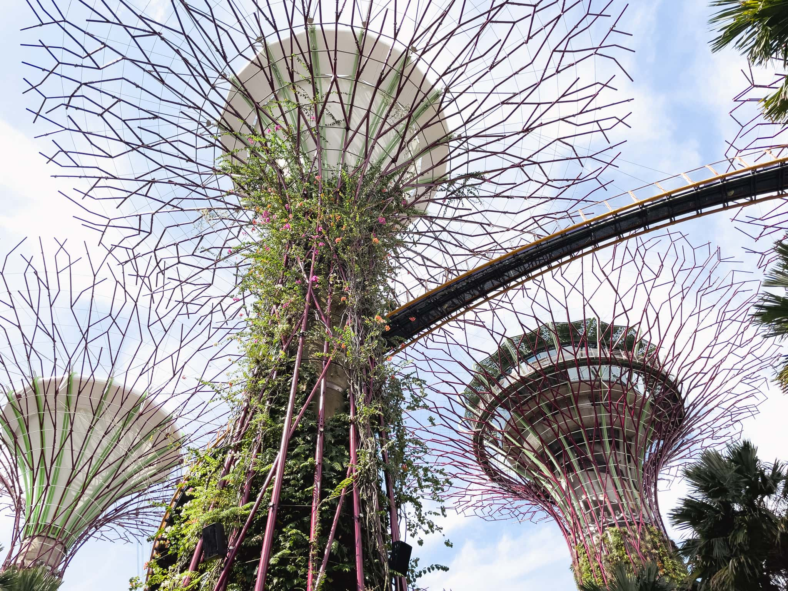

2022年9月にシンガポールに出張してきました。コロナ禍でのシンガポール出張からの日本帰国は、何が一緒で何が違うのかのをまとめておきます。

## 日本入国に必要な書類

以下の情報は2022年9月時点での情報です。必要書類は随時変更されています。また、あなたの国籍や状況などによっては必要な書類が異なるかもしれません。**あなたの書類に不備があっても、このブログは一切責任を負いません。**必ず信用できる情報源を参照してください。

### 信用できる情報源

- [水際対策 | 厚生労働省 | 日本政府](https://www.mhlw.go.jp/stf/seisakunitsuite/bunya/0000121431_00209.html)
- 厚生労働省・入国者健康確認センター 日本へ入国・帰国する皆様へ
- [日本・海外の出入国情報について | ANA Care Promise | ANA](https://www.ana.co.jp/ja/jp/topics/coronavirus-travel-information/immigration/)
- [各国の入国制限や検疫体制について - JAL](https://www.jal.co.jp/jp/ja/info/2020/other/flysafe/flights-service/quarantine-immigration/)

### 日本入国に必要な書類の参考情報

- 3回以上のファイザーまたはモデルナ、アストラゼネカ、ノババックスなどのワクチン接種証明書 **または** シンガポール出国前72時間以内の新型コロナウイルス検査の陰性証明書
  * シンガポール認定クリニックで検査すると Digital PDT Certificate が発行される。日本政府フォーマットでなくても、この証明書で要件が満たせる
  * 核酸増幅検査（NAAT。RT-PCR、LAMP、TMA、TRC、Smart Amp、NEAR、次世代シーケンス法）または抗原**定量**検査
  * 核酸増幅検査 (NAAT) とは、いわゆるPCR検査のこと
  * 抗原**定性**検査は**無効**。Antigen Rapid Test (ART) は一般的には抗原定性検査
  * 核酸増幅検査の中ではRT-PCRが一般的だが、8時間から24時間掛かる
- ファストトラック経由での質問票
- ファストトラック経由での誓約書

2022年9月7日から、3回以上のワクチン接種を行っている場合は陰性証明書が不要になりました。ワクチン接種回数が2回以下の方は引き続き陰性証明書が必要です。

### 私が用意した書類

- [新型コロナワクチン接種証明書アプリ](https://www.digital.go.jp/policies/vaccinecert/)
- ファストトラック経由での質問票
- ファストトラック経由での誓約書

日本入国をワクチン接種証明書で行う場合、シンガポール入国で用意したものをそのまま提示すれば大丈夫です。私は新型コロナウイルスワクチン接種証明書アプリの画面を見せました。

日本入国を陰性証明書で行う場合、上記の通り日本政府フォーマットにこだわる必要がないので、どのクリニックでも大丈夫です。[Raffles Medical Group](https://www.rafflesmedicalgroup.com/covid-19/covid-19-tests/) や [Parkway Shenton](https://www.parkwayshenton.com.sg/services/covid-19) なんかが店舗数が多く、日本からオンラインで予約できて便利だと思います。日本語での対応を希望する場合は [Japan Green Clinic](https://www.japan-green.com.sg/news/detail.php?seq=116) で受けられます。証明書はメール添付で送られてきます。

### 日本入国に必要な書類の事前確認

成田国際空港 / 羽田空港 / 中部国際空港 / 関西国際空港 / 福岡空港から入国する場合は、ファストトラックという事前検疫手続きサービスが使用できます。搭乗便到着予定日時の6時間前までに申請すると、審査結果を通知してくれます。

日本入国をワクチン接種証明書で行う場合、いつでも手続きを行えるので、それこそ日本出国前でも大丈夫です（質問内容的にそれで良いのかという気もしますが）。日本入国を陰性証明書で行う場合は証明書入手次第、ファストトラックの手続きを行えます。

## シンガポールの空港での手続きについて

ワクチン接種証明書または陰性証明書の確認はチェックイン時に行われます。それ以外の書類の確認は日本入国時に行われます。

## 搭乗中

搭乗中はマスクの着用が必要です。7時間近くマスクをしていないといけないため、耳が痛くならないマスクが良いでしょう。

## 日本での空港での手続きについて

成田空港に到着すると、日本入国者または入国せずに乗り継ぎだけの方のどちらが優先的に降機します。これは空港手続きの混雑具合によって決まります。

コロナ禍での空港手続き4回目の私の場合は慣れていることもあって、到着時刻から税関申告通過までは30分程度でした。不慣れな場合は60分程度は見ておいたほうが良いかもしれません。

シンガポールからの入国の場合は到着空港での抗原検査はありません。

## 日本出国からシンガポール入国について

日本出国からシンガポール入国に必要な書類と手続きについては以下の記事を参照してください。

