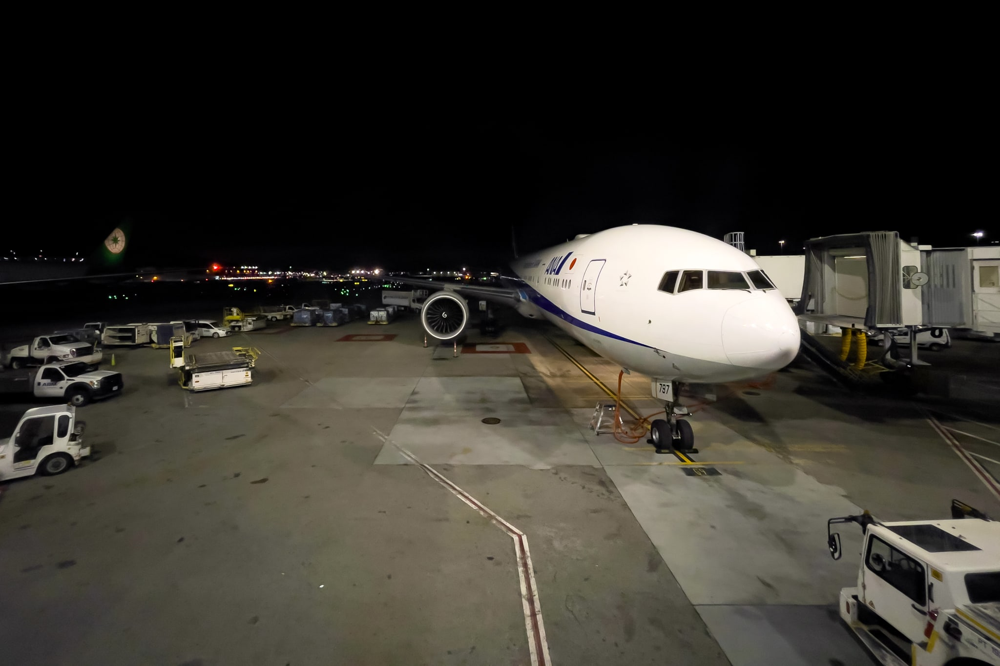
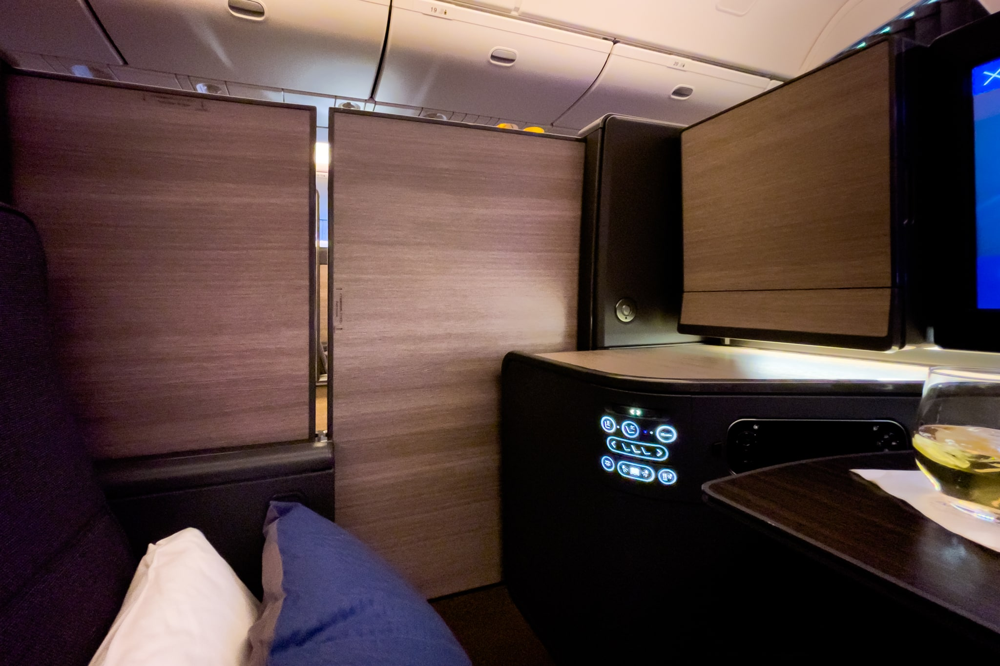
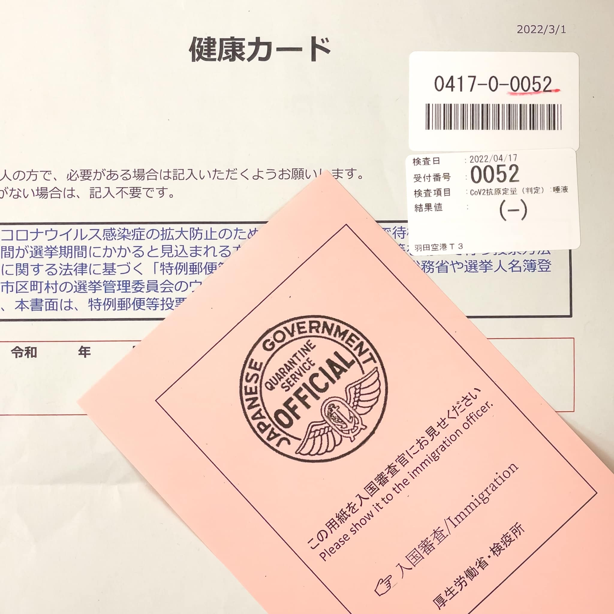

2022年4月に米国シアトルおよびパロアルトに出張してきました。コロナ禍での米国出張からの日本帰国は、何が一緒で何が違うのかのをまとめておきます。

## 日本入国に必要な書類

以下の情報は2022年4月時点での情報です。必要書類は随時変更されています。また、あなたの国籍や状況などによっては必要な書類が異なるかもしれません。**あなたの書類に不備があっても、このブログは一切責任を負いません。**必ず信用できる情報源を参照してください。

### 信用できる情報源

- [水際対策に係る新たな措置について | 厚生労働省](https://www.mhlw.go.jp/stf/seisakunitsuite/bunya/0000121431_00209.html)
- 厚生労働省・入国者健康確認センター 日本へ入国・帰国する皆様へ
- [日本・海外の出入国情報について | ANA Care Promise | ANA](https://www.ana.co.jp/ja/jp/topics/coronavirus-travel-information/immigration/)
- [各国の入国制限や検疫体制について - JAL](https://www.jal.co.jp/jp/ja/info/2020/other/flysafe/flights-service/quarantine-immigration/)

### 日本入国に必要な書類の参考情報

- 3回以上のファイザーまたはモデルナ、アストラゼネカ、ノババックスなどのワクチン接種証明書 **または** 米国出国前72時間以内の新型コロナウイルス検査の陰性証明書
  * （2022年6月11日更新）日本政府フォーマットが安心ではあるが、6月11日に必要項目が大幅に削除され、一般的な陰性証明書でも必須項目を満たせるようになった。ただし、航空会社がチェックイン時に確認するので、航空会社職員は表記揺れなのか異なる手法なのか判断付かないため、厚労省が指定する採取検体と検査法が一字一句合っている必要がある（例: 正: 鼻咽頭ぬぐい液 / 誤: 咽頭ぬぐい液）
    + 参考: [日本帰国・入国時のPCR検査証明フォーマットを更新 7項目削除 - TRAICY（トライシー）](https://www.traicy.com/posts/20220611243053/)
  * ~~日本政府フォーマットを強く推奨。航空会社がチェックイン時に確認するが、航空会社職員は表記揺れなのか異なる手法なのか判断付かないため、厚労省が指定する採取検体と検査法と一字一句合っている必要がある（例: 正: 鼻咽頭ぬぐい液 / 誤: 咽頭ぬぐい液）~~
  * 核酸増幅検査（NAAT。RT-PCR、LAMP、TMA、TRC、Smart Amp、NEAR、次世代シーケンス法）または抗原**定量**検査
    + 核酸増幅検査 (NAAT) とは、いわゆるPCR検査のこと
    + 抗原**定性**検査は**無効**。気軽に受診できる検査場は Rapid Antigen Test である場合が多く、Rapid Antigen Test は一般的には抗原定性検査
    + 核酸増幅検査の中ではRT-PCRが一般的だが、8時間から24時間掛かる。NEARは15分で結果が出る
  * San Francisco / Bay Area（シリコンバレー）周辺で日本政府フォーマットに対応している現地ツアー / クリニック
    + ANA / Veltra (Mountain View)
    + H.I.S. (San Francisco)
    + Kobayashi Medical Clinic (San Francisco, Mountain View)
    + [My Doctor Medical Group (San Francisco)](https://mydoctorsf.com/covid-19-testing-for-travel-to-japan/)
    + [新型コロナウイルス(COVID-19)関連情報 | 在サンフランシスコ日本国総領事館](https://www.sf.us.emb-japan.go.jp/itpr_ja/covid19info.html)
  * Seattle周辺で日本政府フォーマットに対応している現地ツアー / クリニック
    + ANA / Veltra (Bellevue)
    + 日本の要件に対応可能な検査場 | 在シアトル日本国総領事館
- 質問票WEB
- ~~スマートフォンと必要なアプリのインストール~~

（2022年9月10日更新）2022年9月7日から、3回以上のワクチン接種を行っている場合は陰性証明書が不要になりました。ワクチン接種回数が2回以下の方は引き続き陰性証明書が必要です。

### 私が用意した書類

- [Kobayashi Medical Clinic](http://www.kobayashi-naika.com/) 発行の鼻咽頭ぬぐい液 (Nasopharyngeal Swab) による核酸増幅検査（NEAR法）での陰性証明書
- Fast Track 経由での質問票WEB
- 接種証明書アプリ
  * （2022年6月11日更新）米国からの日本入国は、ワクチン接種証明書が不要になりました

### 日本入国に必要な書類の事前確認

成田国際空港 / 羽田空港 / 中部国際空港 / 関西国際空港 / 福岡空港から入国する場合は、Fast Track という事前検疫手続きサービスが使用できます。搭乗便到着予定日時の6時間前までに申請すると、審査結果を通知してくれます。また、質問票WEBとも統合されているので、Fast Track から回答するのが良いでしょう。私の場合、審査は1時間ほどで完了しました。なお、ワクチン接種証明書アプリを証明書としてアップロードする場合はQRコードだけでは無効で、QRコード以下の全ての情報のスクリーンショットが必要です（QRコードに全ての情報が含まれているにも関わらず）。

また、ANAの場合は Fast Track で審査完了済み（緑色の画面）であることをチェックイン時に示すとコロナ禍前と同じ時間で終わります。

## 米国の空港での手続きについて

新型コロナウイルス検査の陰性証明書の確認のみチェックイン時に行われます。それ以外の書類の確認は日本入国時に行われます。陰性証明書の確認以外の手続きはコロナ禍前と同様です。

## 搭乗中

サンフランシスコ⇒羽田便 (NH107) にも関わらず、B777-300ERの新212席に機材変更され、初めての THE Room に！

搭乗中はマスクの着用が必要です。10時間近くマスクをしていないといけないため、耳が痛くならないマスクが良いでしょう。

## 日本での空港での手続きについて

羽田空港に到着すると、国際線で乗り継ぐ人が優先的に降機します。その後、100mほど歩いては書類を確認するという手続きが繰り返されます。Fast Track が審査完了済み（緑色の画面）の人専用レーンはありませんが、それぞれの受付で画面を表示するだけで手続きが完了します。それぞれの受付は40窓口程度あることと、私の便は午前5時着で空いていたこともあって、それほど待たずに進めました。

入国拒否に直結する陰性証明書以外の書類は搭乗前に確認していないため、その場で記入している方も何人かいました。スマートフォン自体も個人負担でレンタルできます。

（2022年6月11日更新）米国からの日本入国では、空港での抗原検査がなくなりました。参考: 厚生労働省・入国者健康確認センター 日本へ入国・帰国する皆様へ

~~書類の確認が終わると、唾液による抗原定量検査を行います。待機場所で15分ほど待つと自分の番号が表示されるので、検査結果を受け取ります。この待機場所は、元同僚の西谷さんの [成田空港での水際対策が凄かったけど体力的にはきつかったので記録しておく - Sweet Escape](https://www.keisuke69.net/entry/2022/02/02/113807) によると2022年2月時点の成田空港では劣悪だったようですが、2022年4月時点の羽田空港では広大な敷地に搭乗口周辺によくあるベンチソファが大量にあり、60インチくらいのディスプレイに自分の番号が表示されるのを待つという常識的な設備でした。~~

陰性結果を入国審査官に提出したら、いつもどおり預け荷物を受け取ったあとに税関申告を終えて完了です。なお、[税関申告アプリ](https://www.customs.go.jp/kaigairyoko/egate.htm)を使ってみましたが、電子申告ゲートが停止していたのであまり意味がありませんでした。

結果、私の場合は到着時刻から税関申告通過までは2時間程度でした。ただし、同じ飛行機に乗っていた同僚は陰性だったにも関わらず、検査結果の受け取りに私より1時間以上長く待たされていました。遅かった原因は不明です。また、他の飛行機と到着時刻が重複したりして混み合うと、もっと時間が掛かるでしょう。

## 公共交通機関の利用について

自宅等での待機期間がある方も、検査から24時間以内の待機場所までの最短経路での公共交通機関は利用可能です。自宅等での待機期間がない方は何の制限もなく公共交通機関が利用可能です。

## 空港検疫で陽性になった場合

万が一、空港での抗原定量検査で陽性になった場合は、病院に入院または宿泊療養施設等での療養となります。[退院基準・宿泊療養解除基準の改定概要 | 厚生労働省](https://www.mhlw.go.jp/content/000639696.pdf) によると、無症状の場合でも7泊以上の療養となるようです。機内での濃厚接触者は同行家族のみが該当します。

## 日本出国から米国入国について

日本出国から米国入国に必要な書類と手続きについては以下の記事を参照してください。

[TEMP DISABLED]
