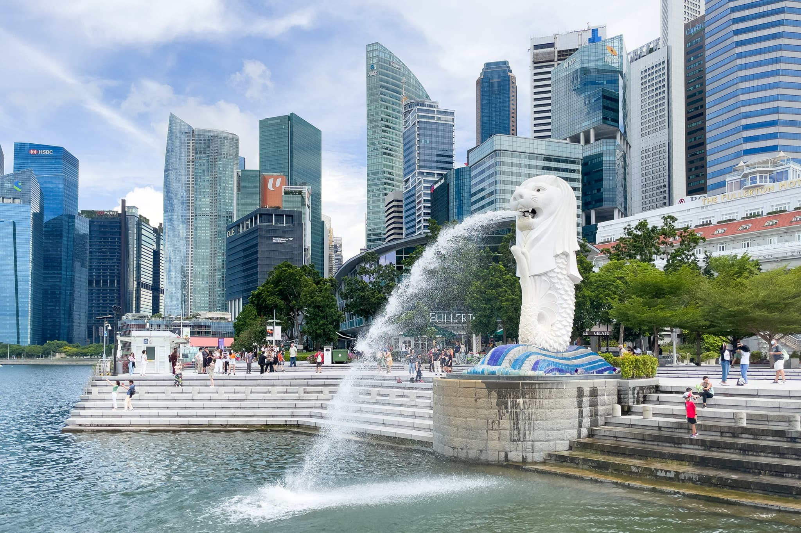

2022年8月にシンガポールに出張してきました。コロナ禍でのシンガポール渡航は、何が一緒で何が違うのかのをまとめておきます。

## シンガポール渡航に必要な書類

以下の情報は2022年8月時点での情報です。必要書類は随時変更されています。また、あなたの国籍や状況などによっては必要な書類が異なるかもしれません。**あなたの書類に不備があっても、このブログは一切責任を負いません。**必ず信用できる情報源を参照してください。

### 信用できる情報源

- [ICA | Entering Singapore](https://www.ica.gov.sg/enter-transit-depart/entering-singapore)
- [外務省 海外安全ホームページ | 新型コロナウイルスに係る日本からの渡航者・日本人に対する各国・地域の入国制限措置及び入国に際しての条件・行動制限措置](https://www.anzen.mofa.go.jp/covid19/pdfhistory_world.html)
- [日本・海外の出入国情報について | ANA Care Promise | ANA](https://www.ana.co.jp/ja/jp/topics/coronavirus-travel-information/immigration/)
- [各国の入国制限や検疫体制について - JAL](https://www.jal.co.jp/jp/ja/info/2020/other/flysafe/flights-service/quarantine-immigration/)

### シンガポール渡航に必要な書類の参考情報

- ワクチン接種証明書
  * 2回以上のファイザーまたはモデルナ、アストラゼネカ、ノババックスなど。いわゆるフルワクチン (Fully Vaccinated) が必要
  * [新型コロナウイルスワクチン接種証明書アプリ](https://www.digital.go.jp/policies/vaccinecert/)または自治体が発行する[海外用接種証明書](https://www.mhlw.go.jp/stf/seisakunitsuite/bunya/vaccine_certificate.html)
    + 接種証明書アプリからは即時発行できるが、一部の自治体は郵送申請 / 郵送発行しか対応していないので、2週間近く掛かることも。今すぐ自治体の手続き方法を確認しておくことを推奨
    + 接種証明書アプリにはマイナンバーカードが必要
- [SG Arrival Card](https://eservices.ica.gov.sg/sgarrivalcard/)
  * 到着の3日前から申請可能。例えば8月29日にシンガポールに到着する場合、8月26日から申請可能
  * シンガポール空港の入国審査前に「SG Arrival Card の入力がまだの人はここで申請して」という看板があったので、直前でも大丈夫かもしれない
- TraceTogetherアプリ
  * 日本のCOCOAに相当する接触確認アプリ。ただし、Apple / Google が開発したAPIではなく、独自方式
  * 入国審査含めて、一度もインストールを確認されることはなかった

### 私が用意した書類

- 接種証明書アプリ
- SG Arrival Card
- TraceTogetherアプリ

## シンガポール渡航に必要な書類の事前確認

ANAの場合、ANA Travel Ready という渡航書類事前確認サービスがあります。出発時刻の12時間前までに必要書類をアップロードすると、出発時刻の6時間前までに十分かどうかを通知してくれます。

JALの場合、VeriFLYという渡航書類事前確認アプリがあるようです。

## 日本の空港での手続きについて

接種証明書の確認はチェックイン時に行われます。それ以外の手続きはコロナ禍前と同じです。

成田空港では、保安検査前の店舗は3割程度しか開いていません。「足りないものを空港で買おう」と思っていると、目当ての店は閉まっているかもしれません。出国後の店舗は8割程度開いています。営業店舗はこちらで確認できます。

成田空港のANAラウンジは第5サテライトと第2サテライトで開いています。ANAラウンジの営業状況については[こちら](https://www.ana.co.jp/ja/jp/topics/coronavirus-travel-information/services/)で確認できます。

## 搭乗中

搭乗中はマスクの着用が必要です。7時間近くマスクをしていないといけないため、耳が痛くならないマスクが良いでしょう。

## シンガポールの空港での手続きについて

シンガポールの空港での手続きはコロナ禍前と同じです。SG Arrival Card の申請状況は入国審査官がオンラインで確認しているようで、提示などは不要でした。

## シンガポール内のマスク着用について

シンガポールでは、ローカルなショッピングモールだと8割程度がマスクをしていますが、観光客の多い場所での屋外は2割程度になります。

## シンガポール出国から日本帰国について

シンガポール出国から日本帰国に必要な書類と手続きについては以下の記事を参照してください。

http://rewse.jp/blog/posts/required-documents-procedures-business-trip-singapore-return-japan/
