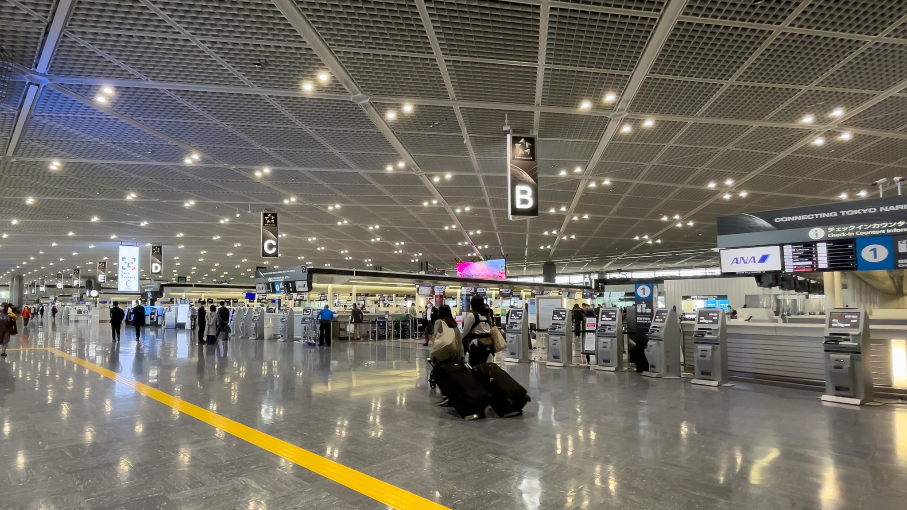
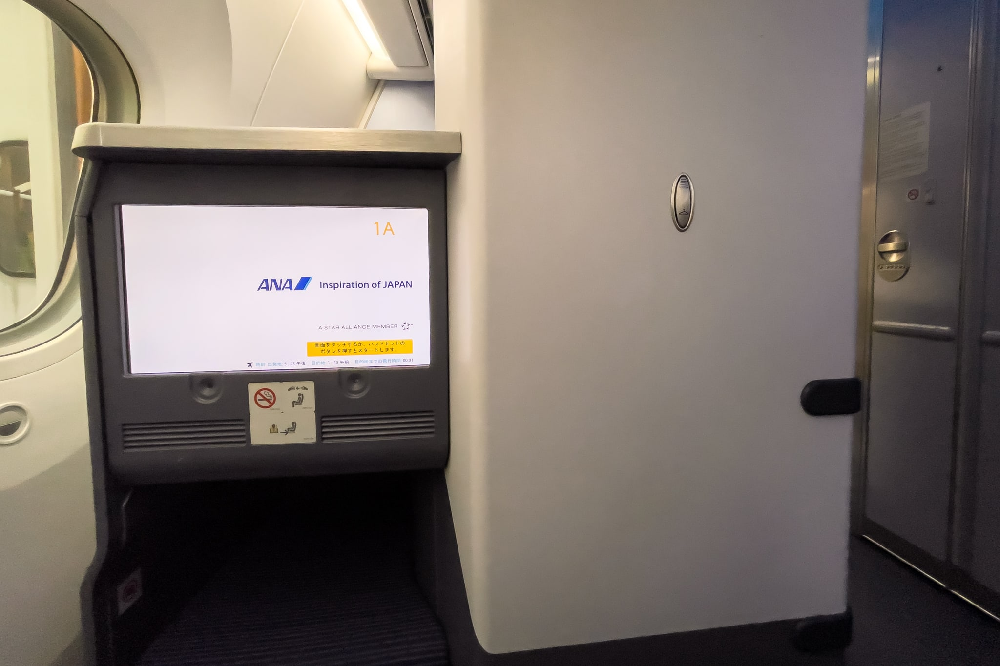

2022年4月に米国シアトルおよびパロアルトに出張してきました。コロナ禍での米国渡航は、何が一緒で何が違うのかのをまとめておきます。

## 米国渡航に必要な書類

以下の情報は2022年4月時点での情報です。必要書類は随時変更されています。また、あなたの国籍や状況などによっては必要な書類が異なるかもしれません。**あなたの書類に不備があっても、このブログは一切責任を負いません。**必ず信用できる情報源を参照してください。

### 信用できる情報源

- [外務省 海外安全ホームページ | 新型コロナウイルスに係る日本からの渡航者・日本人に対する各国・地域の入国制限措置及び入国に際しての条件・行動制限措置](https://www.anzen.mofa.go.jp/covid19/pdfhistory_world.html)
- COVID-19検査及びワクチン接種の要件 - 在日米国大使館と領事館
- Requirement for Proof of COVID-19 Vaccination for Air Passengers | CDC
- Requirement for Proof of Negative COVID-19 Test or Documentation of Recovery from COVID-19 | CDC
- [米国への空路渡航前に求められる検査（よくある質問）- 在アメリカ合衆国日本国大使館](https://www.us.emb-japan.go.jp/j/announcement/cdc-negative-covid-air-passengers.pdf)
- [日本・海外の出入国情報について | ANA Care Promise | ANA](https://www.ana.co.jp/ja/jp/topics/coronavirus-travel-information/immigration/)
- [各国の入国制限や検疫体制について - JAL](https://www.jal.co.jp/jp/ja/info/2020/other/flysafe/flights-service/quarantine-immigration/)

### 米国渡航に必要な書類の参考情報

- ワクチン接種証明書
  * 2回以上のファイザーまたはモデルナ、アストラゼネカなど。いわゆるフルワクチン (Fully Vaccinated) が必要
  * 接種完了から14日以上経過していること
  * [接種証明書アプリ](https://www.digital.go.jp/policies/vaccinecert/)または自治体が発行する[海外用接種証明書](https://www.mhlw.go.jp/stf/seisakunitsuite/bunya/vaccine_certificate.html)
    + 接種証明書アプリからは即時発行できるが、一部の自治体は郵送申請 / 郵送発行しか対応していないので、2週間近く掛かることも。今すぐ自治体の手続き方法を確認しておくことを推奨
    + 接種証明書アプリにはマイナンバーカードが必要
- CDCの宣誓書 (Attestation Form)
- CDCへの連絡先などの情報提供
  * 航空会社がチェックイン時に入力するため、航空会社によって提供方法が異なる
  * [ANA](https://www.ana.co.jp/topics/coronavirus-travel-information/pdf/USA_05_CDC_information.pdf)
  * [JAL](https://www.jal.co.jp/jp/ja/info/2021/inter/211102/)
- [ESTA](https://esta.cbp.dhs.gov/)

（2022年6月11日更新）新型コロナウイルス検査の陰性証明書は6月12日から不要になりました。参考: Rescission: Requirement for Negative Pre-Departure COVID-19 Test Result or Documentation of Recovery from COVID-19 for all Airline or Other Aircraft Passengers Arriving into the United States from Any Foreign Country | Quarantine | CDC

- ~~新型コロナウイルス検査の陰性証明書~~
  * ~~出発の1日前以内。24時間以内ではないため、例えば日曜日出発であれば、土曜日の何時でも有効~~
  * ~~核酸増幅検査（NAAT。リアルタイムPCR、RT-PCR、NEAR、TMA、LAMP、HDA、CRISPR、SDA）または抗原検査（Rapid Antigen Test、Viral Antigen Test）~~
    + ~~核酸増幅検査の中ではリアルタイムPCRが一般的だが、8時間から24時間掛かる。NEARは15分で結果が出る~~
    + ~~抗原検査も15分で結果が出る~~
    + ~~抗**体**検査は**無効**~~
  * ~~指定フォーマットなし。検査方式（リアルタイムPCRや抗原検査など）、検査実施機関、検体採取日、個人を識別できる情報（氏名に加えて生年月日またはパスポート番号）、検査結果が必要~~
    + ~~木下グループなどの一部の検査結果は個人を識別できる情報が氏名しかないため、厳密には**無効**~~
      - ~~参考情報: [3万円と1900円…「海外渡航検査費用」なんでこんなに違うのか | FRIDAYデジタル](https://friday.kodansha.co.jp/article/216968)~~
    + ~~指定フォーマットがないため、渡航実績があるクリニックの証明書が安心~~
  * ~~航空会社がチェックイン時に確認するが、米国内で提示を求められる場合があるため、英語での記述を推奨~~
  * ~~推奨クリニック~~
    + ~~自費検査を提供する検査機関一覧 | 厚生労働省~~
    + ~~COVID-19 Testing Facilities in Japan - U.S. Embassy & Consulates in Japan~~

### 私が用意した書類

- 接種証明書アプリ
- CDCの宣誓書
- ANAフォーマットでのCDCへの連絡先などの情報提供
- ESTA
- [新宿ホームクリニック](https://shinjuku-home-clinic.com/)発行の鼻咽頭ぬぐい液 (Nasopharyngeal Swab) による迅速抗原定性検査 (Rapid Antigen Test) での陰性証明書
  * （2022年6月11日更新）新型コロナウイルス検査の陰性証明書は 6月12日 12:01am ET から不要になりました

## 米国渡航に必要な書類の事前確認

ANAの場合、ANA Travel Ready という渡航書類事前確認サービスがあります。出発時刻の12時間前までに必要書類をアップロードすると、出発時刻の6時間前までに十分かどうかを通知してくれます。なお、ワクチン接種証明書アプリはQRコードだけでは無効で、QRコード以下の全ての情報のスクリーンショットが必要です（QRコードに全ての情報が含まれているにも関わらず）。陰性証明書は指定フォーマットがない分、有効なのかどうか若干不安になりますが、もし無効と通知があっても出発6時間前であれば再検査することができるかもしれません。

また、ANA Travel Ready で「完了済み」ステータスになっておくと、空港でのチェックインがコロナ禍前と同じ時間で終わります。私は ANA Travel Ready の申請番号が記載されているメールの確認だけで済みましたが、書類も必ず持参しましょう。なお、私が見ていた感じでは、ANA Travel Ready を行っていなかったと思われる人は15分程度掛かっていました。

JALの場合、VeriFLYという渡航書類事前確認アプリがあるようです。

## 日本の空港での手続きについて

成田空港 第1ターミナル 南ウイング チェックインカウンター

上記の通り、渡航に必要な書類の確認は全てチェックイン時に行われます。ANA Travel Ready をしている人もしていない人も同じ列なので、していない人が多いとすごく時間が掛かります。私は前に5組程度が行列している状況で30分以上待ちました。それ以外の手続きはコロナ禍前と同じです。

成田空港では、保安検査前の店舗は2割程度しか開いていません。「足りないものを空港で買おう」と思っていると、目当ての店は閉まっているかもしれません。出国後の店舗は8割程度開いています。営業店舗はこちらで確認できます。

成田空港のANAラウンジは第5サテライトしか開いていません。ANAラウンジの営業状況については[こちら](https://www.ana.co.jp/ja/jp/topics/coronavirus-travel-information/services/)で確認できます。

## 搭乗中

がらがらだったので、オンラインチェックイン開始から20分後でも1Aが取れました

搭乗中はマスクの着用が必要です。10時間近くマスクをしていないといけないため、耳が痛くならないマスクが良いでしょう。

## 米国の空港での手続きについて

米国の空港での手続きはコロナ禍前と同じです。私は [Global Entry](https://www.cbp.gov/travel/trusted-traveler-programs/global-entry) を持っているのですが、問題なく使用できました。専用レーンのキオスク端末でパスポートをスキャン、メガネを外さずに顔写真撮影、レシートが発行されるので、それを税関に提出しておしまいです。1分で入国できました。米国永住権を持たない日本人が Global Entry を取るにはプロモーションコードが必要です。私は2019年に運良く入手できました。

通常の入国審査を受けた同僚もコロナ禍前との差はなかったようです。なお、空港内ではマスクの着用が必要です。

## 米国内のマスク着用について

シアトルでは、外を歩いている人の1, 2割程度がマスクをしています。そのため、マスクをしていてもしていなくても、どちらでも違和感はないでしょう。ショッピングセンターやスーパーなどの屋内は、フルワクチンでない人はマスク着用が推奨されていたりして、5割程度の人がマスクをしています。Uber / Lyftを含む公共交通機関ではマスクの着用が必要です。また、Uber / Lyftは助手席を使用できないため、通常のタイプだと定員が3人に減っている点に注意してください。

レストランの店員は全員マスクを着用していますが、客は何も求められません。ただ、接触機会を減らすためか、メニューがQRコードからスマートフォンで見るようになった店が増えているため、インターネットにつながらないとメニューが見られない場合があります。

## 米国出国から日本帰国について

米国出国から日本帰国に必要な書類と手続きについては以下の記事を参照してください。

https://rewse.jp/blog/required-documents-procedures-business-trip-usa-return-japan/
