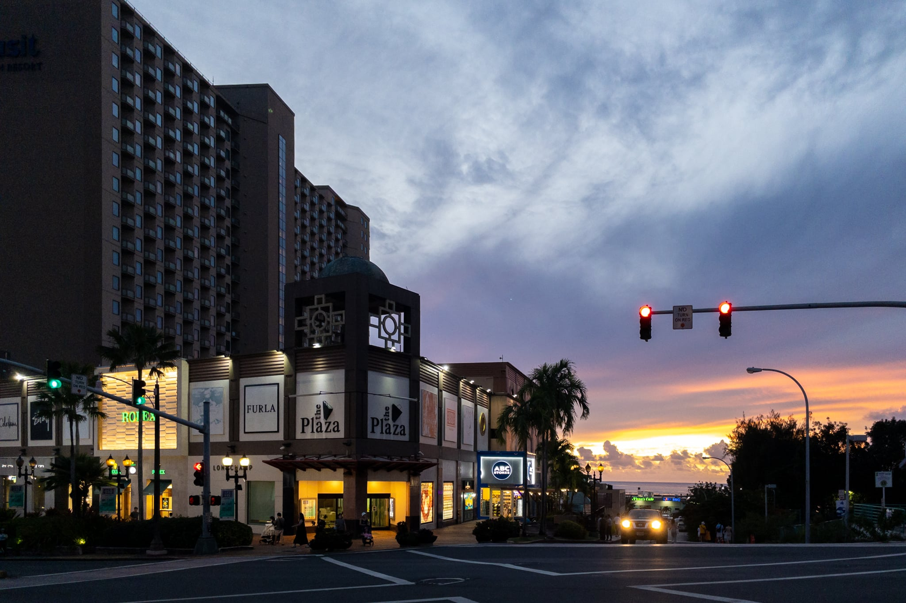

2022年8月にグアムに家族旅行してきました。コロナ禍でのグアム家族旅行からの日本帰国は、何が一緒で何が違うのかのをまとめておきます。

## 日本入国に必要な書類

以下の情報は2022年6月時点での情報です。必要書類は随時変更されています。また、あなたの国籍や状況などによっては必要な書類が異なるかもしれません。**あなたの書類に不備があっても、このブログは一切責任を負いません。**必ず信用できる情報源を参照してください。

### 信用できる情報源

- [水際対策 | 厚生労働省 | 日本政府](https://www.mhlw.go.jp/stf/seisakunitsuite/bunya/0000121431_00209.html)
- 厚生労働省・入国者健康確認センター 日本へ入国・帰国する皆様へ
- [必要な手続き（ファストトラック）と書類 | 水際対策 | 厚生労働省](https://www.mhlw.go.jp/stf/seisakunitsuite/bunya/border_procedure.html)
- [日本・海外の出入国情報について | ANA Care Promise | ANA](https://www.ana.co.jp/ja/jp/topics/coronavirus-travel-information/immigration/)
- [各国の入国制限や検疫体制について - JAL](https://www.jal.co.jp/jp/ja/info/2020/other/flysafe/flights-service/quarantine-immigration/)

### 日本入国に必要な書類の参考情報

- 3回以上のファイザーまたはモデルナ、アストラゼネカ、ノババックスなどのワクチン接種証明書 **または** グアム出国前72時間以内の新型コロナウイルス検査の陰性証明書
  * 日本政府フォーマットが安心ではあるが、2022年6月11日に必要項目が大幅に削除され、一般的な陰性証明書でも必須項目を満たせるようになった
    + 参考: [日本帰国・入国時のPCR検査証明フォーマットを更新 7項目削除 - TRAICY（トライシー）](https://www.traicy.com/posts/20220611243053/)
  * 核酸増幅検査（NAAT。RT-PCR、LAMP、TMA、TRC、Smart Amp、NEAR、次世代シーケンス法）または抗原**定量**検査
  * 核酸増幅検査 (NAAT) とは、いわゆるPCR検査のこと
  * 抗原**定性**検査は**無効**。Antigen Rapid Test (ART) は一般的には抗原定性検査
  * 乳幼児も含めて全員必要
- ファストトラック経由での質問票
- ファストトラック経由での誓約書

（2022年9月10日更新）2022年9月7日から、3回以上のワクチン接種を行っている場合は陰性証明書が不要になりました。ワクチン接種回数が2回以下の方は引き続き陰性証明書が必要です。

### 私が用意した書類

- Guam Public Health Laboartory 発行の鼻咽頭ぬぐい液 (Nasopharyngeal Swab) による核酸増幅検査 (PCR) での陰性証明書
- ファストトラック経由での質問票
- ファストトラック経由での誓約書

グアム政府観光局によって[旅行者向けフリーPCRプログラム](https://www.visitguam.jp/covidtest/)が2022年9月30日まで提供されており、旅行者は無料でPCR検査を受けることができます。なお、予約ができないため、私が受けた Hyatt Regency Guam 会場はいつ行っても大行列でした。ただし、2022年8月のグアムの観光客は9割以上を韓国からの観光客が占めており、韓国入国は抗原検査 (ART) で良いため、大行列なのは抗原検査だけで、PCRのほうは数人でした。行列に並ぶ前に、近くの係員に「PCRなんだけど」と声を掛けたほうが良いでしょう。

検査結果が出るまで48時間近く掛かる点にご注意ください。私は8月2日10時に検査を受けましたが、8月3日17時時点ではまだ結果が出ておらず、帰国日当日の8月4日9時に受け取れました。つまり、72時間以内の陰性証明書を取るのに48時間掛かり、営業時間は9時から12時と14時から16時までなので、検査を受けるべき時間帯は相当限られています。事前に最優先で計画しておいたほうが良いでしょう。

また、検査結果は再度会場に受け取りに行く必要があります。私は8月3日17時に受け取りに行ったときに「氏名と誕生日をここに書いて」と例外対応してもらっています。48時間後にいきなり取りに行って「まだ結果がない」となると帰国がかなり怪しくなるので、面倒でも1.5日後に一度訪問して、そのタイミングで結果がなければ優先対応をお願いしておくのが安心でしょう。

検査前に [COVID-19 渡航者⽤トラベルテストプログラム 同意書](https://assets.simpleviewinc.com/simpleview/image/upload/v1/clients/guam/Japanese_Letter_size_GVB_x_DPHSS_COVID_Test_Request_Form_2022_0628_2_JP_f_d556bb82-9cef-4fd7-8c05-d6b6f76226df.pdf) を記述しておく必要があります。こちらの下半分に検査結果が記述されて戻されますが、何も言わなくても日本政府フォーマットの検査結果も一緒にもらえます。

なお、PCR検査会場では誰も日本語が話せません。日本からの旅行者が少ない現状では、グアム側が日本語を話せることを期待しないほうが良いでしょう。

### 日本入国に必要な書類の事前確認

成田国際空港 / 羽田空港 / 中部国際空港 / 関西国際空港 / 福岡空港から入国する場合は、ファストトラックという事前検疫手続きサービスが使用できます。搭乗便到着予定日時の6時間前までに申請すると、審査結果を通知してくれます。また、質問票WEBや誓約書とも統合されているので、これらはファストトラックから回答するのが良いでしょう。私の場合、審査は1時間ほどで完了しました。

また、ユナイテッド航空の場合、[Travel Ready Center](https://www.united.com/ja/jp/travelreadycenter) という渡航書類事前確認サービスもあります。出発前に必要書類をアップロードすると、その書類の有効性を確認してくれます。ただ、ファストトラックで日本政府が書類の有効性を確認してくれるので Travel Ready Center はやらなくても良い気もします。質問表のアップロードが必要なのですが、いまいち何を提出すればよいのか分からず、ファストトラック完了後に表示される氏名 / パスポート番号 / QRコードのスクリーンショットを提出してみたところ、私は Travel Ready になったももの、娘はRejectされました。手続きとしてはファストトラックが終わっていれば Trave Ready Center でRejectされても問題ありません。

## グアムの空港での手続きについて

チェックイン時に新型コロナウイルス検査の陰性証明書とファストトラックのQRコードの確認が行われました。それ以外の手続きはコロナ禍前と同様です。

United Club は臨時休業しています。oneworld Sapphire / Pirority Pass / Lounge Key のいずれかがあれば Sagon Bisita ラウンジが使えます。

## 搭乗中

ユナイテッド航空の場合、搭乗中のマスクの着用は必須ではありません。

ちなみに、8月4日のフライトを7月3日に予約しましたが、一人あたり15,000マイル + 税金5,390円のセーバー特典で家族3人取れました。ユナイテッド航空は特典航空券で燃油サーチャージを取らないので、国内旅行より安くすみました。機内もガラガラで3席全部空いている列も少なくなかったので、横になって寝られました。日本からの観光客は少ないです。

## 日本での空港での手続きについて

ファストトラックのQRコードを提示するだけで検疫手続きが済むはずなのですが、この日はファストトラックがスローダウンしていて全然QRコードが生成されませんでした。他サイトは問題なく表示されるのでファストトラックサーバー側の問題なのですが、現場の担当者はいろんなWi-Fiにつなげ変えることくらいしかできません。たまたまユナイテッド航空の Travel Ready Center にアップロードするためにQRコードのスクリーンショットを撮っていたので、それで難を逃れられました。QRコードに有効期限が含まれておらず、ファストトラックを使用するためにMySOSアプリをスマホにインストールさせるなら、QRコードをMySOSにローカル保存しておいてもらいたいものですが、旅行中に発行されるいろいろなQRコードは全てスクリーンショットを撮っておいたほうが良いという学びになりました。

現在、グアムからの入国の場合は到着空港での抗原検査はありません。

今回も[税関申告アプリ](https://www.customs.go.jp/kaigairyoko/egate.htm)を使ってみました。ただ、紙の携帯品・別送品申告書と違って「同伴家族登録」をしておかないと本人以外は電子ゲートが使用できませんでした。税関申告アプリはMySOSと違って完全にローカルで動くため機内でも使用できるので、個人的には機内でボールペンを探して紙の携帯品・別送品申告書を書くより、こちらのアプリを使用したほうが便利です。また、氏名 / パスポート番号 / 電話番号 / 住所が前回のものから引用できるので入力項目が2回目からはだいぶ減らせます。

## 日本出国からグアム入国について

日本出国からグアム入国に必要な書類と手続きについては以下の記事を参照してください。

