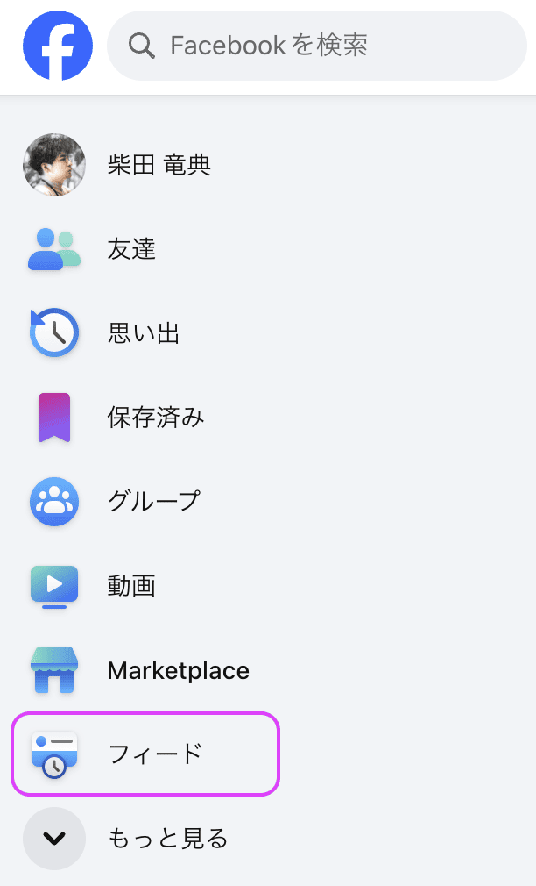
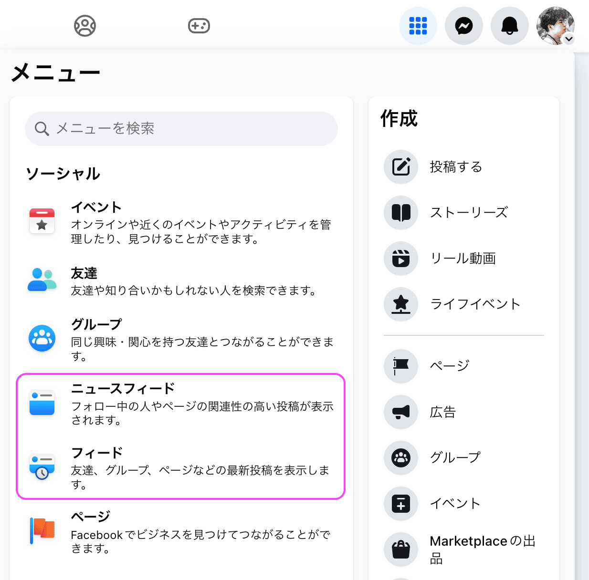
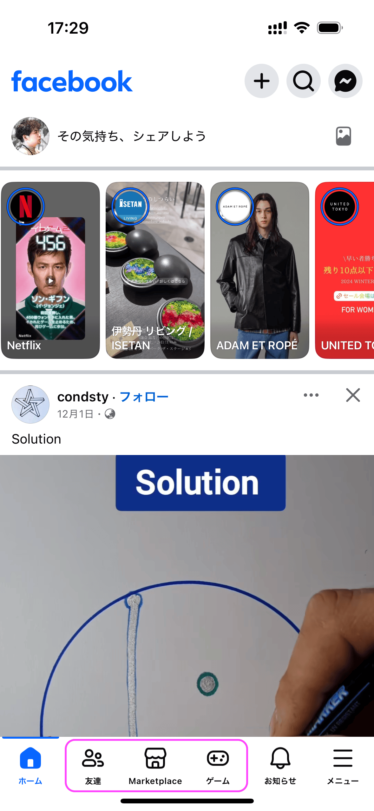
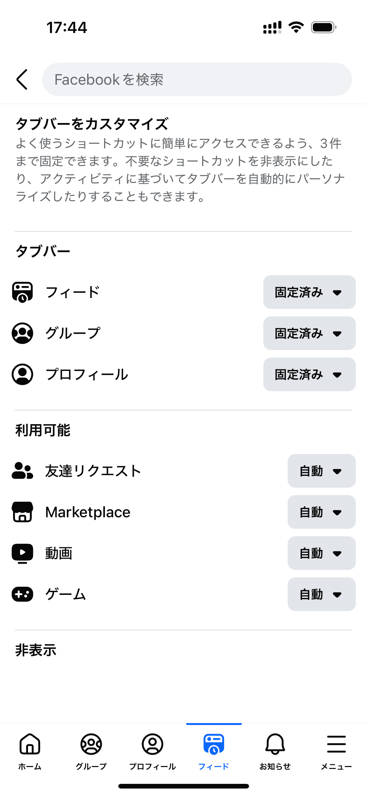
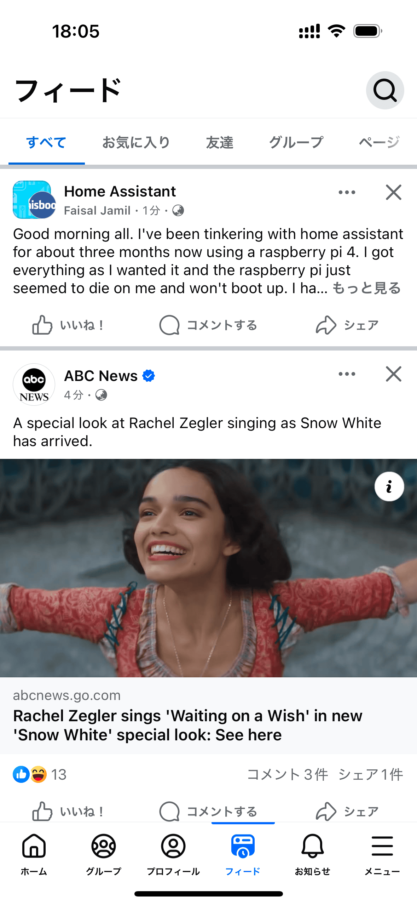

最近のFacebokは自分の友人やフォローしているページとは全く関係ない、興味のないページやグループばかり表示されます。最近の20投稿を調べてみると、以下のような割合でした。


pie  showData
  "友達" : 8
  "フォローしているページ" : 1
  "フォローしていないページ" : 7
  "参加していないコミュニティ" : 3
  "フォローしていないショートビデオ" : 1


過半数が自分の意思とは無関係の投稿でした。これらが自分の興味と合っていればまだ良いのですが、つまらないミームの投稿を繰り返しているのに何万人もフォロワーがいるようなスパムアカウントばかりです。広告のほうがまだ興味のあるレベルで、Facebookがなぜゴミばかり流してくるのかの目的が分かりません。

また、フォローしている友人やページの投稿も全てフィードされているわけではなく、一部のみしか流れていません。特にURLを含む投稿は明らかに表示回数を減らしています。時系列順でもありません。

というわけで、見る価値がないのでFacebookからしばらく離れていたのですが、この興味のないページやグループを表示させない方法が分かりました。

## Web版で興味のないページやグループを表示させない方法

1. 左メニューから〈フィード〉を選択する

左メニューに〈フィード〉という項目があり、これを選ぶと友達 / フォローしているページ / 参加しているグループ / 広告しか流れてこなくなり、昔ながらのFacebookのフィードになります。ほぼ時系列順でもあります。これからはホームではなく、[〈フィード〉](https://www.facebook.com/?filter=all&sk=h_chr)をブックマークしておきましょう。

では、ゴミばかりのホームは〈フィード〉ではなく、一体何なのでしょうか？ これは右メニューを開くとヒントが書いてあります。

〈ニュースフィード〉を押すとホームが表示されます。つまり、ホーム = ニュースフィードです。ニュースフィードは〈関連性の高い投稿〉とあり、要は自分がフォローしていない投稿も流していることを意味しています。本当に関連性が高ければ良いのですが、実態は無関係なのが困ったところなのですが。一方〈フィード〉には〈最新投稿を表示します〉とあり、友達などが時系列順に表示されることを意味しています。

これはXの〈おすすめ〉と〈フォロー中〉の関係と等しいと言えるでしょう。Xの〈おすすめ〉= Facebookの〈ニュースフィード〉、Xの〈フォロー中〉 = Facebookの〈フィード〉です。この問題はmixi2の事業責任者の笠原氏が言及している点そのものです。

> 皆様もご存知の通り、世界的な巨大SNSはこの数年、友だちとのコミュニケーションという立ち位置から、レコメンドを効かせたより面白い、刺激のある、バズっているコンテンツを見せて、滞在時間の最大化を図るように様変わりしてきています。
>
> [SNS『mixi』誕生から20年、MIXIの新しいSNS「mixi2」サービス開始！ | ニュース| 株式会社MIXI](https://mixi.co.jp/news/2024/1223/37672/)

Facebookも同様の方向に変わっているということです。そのレコメンドされた投稿が面白ければまだ良いのですが。また、Xは〈おすすめ〉と〈フォロー中〉という二つが並んでおり、それぞれが何なのかもタイトルからなんとなく分かりますが、Facebookはこの辺をはっきりさせていないという問題があります。

## モバイルアプリで興味のないページやグループを表示させない方法

1. 下タブバーの真ん中のアイコンを長押し
2. 〈タブバーをカスタマイズ〉を選択
3. 〈フィード〉を〈固定済み〉に変更
4. タブバーから〈フィード〉選択

Facebookモバイルアプリのタブバーには〈Marketplace〉とか〈ゲーム〉とか興味のないものが並んでいるかもしれませんが、長押しすることで真ん中の三つはカスタマイズできます。私は〈フィード〉〈グループ〉〈プロフィール〉の三つを固定しています。なお、順序は変更できません。

## 参考

- [FB feed is 98% suggested pages and barely any friend's posts. How do I change this? : r/facebook](https://www.reddit.com/r/facebook/comments/tvqddc/fb_feed_is_98_suggested_pages_and_barely_any/)
