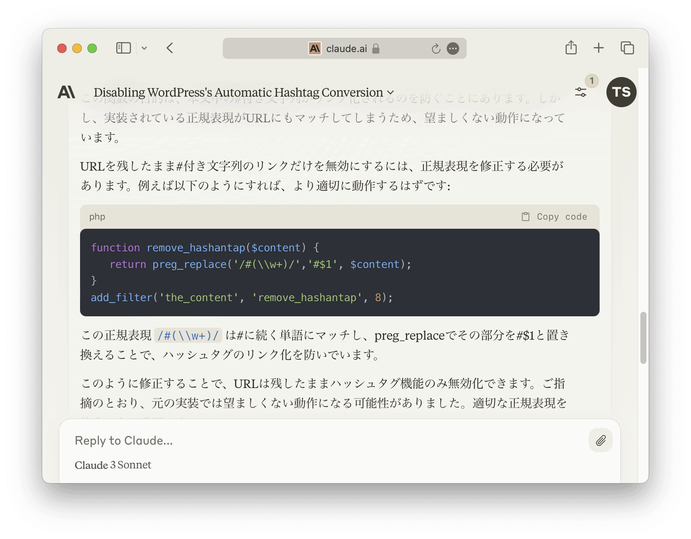

私のWordPressが、いつのまにか以下のような#で始まる文字列をハッシュタグとして認識し、WordPressのタグとしてリンクを自動生成するようになりました。しかし、この場合の〈#1〉はハッシュタグではなく、単なる文字列です。


> 36行目にある IPSec Tunnel #1 の Pre-Shared Key に記載されている32文字を入力


WordPress本体のSettingにこれに関する設定はなく、またプラグインの設定も探しましたが見つかりません。インターネット検索しても同様の事象で困っている人が見当たらず、どの機能でハッシュタグとして認識させているのか不明でした。


どの機能なのかを生成AIの[Claude](https://claude.ai/chat/)に相談しましたが、Claudeも分かりません。しかし、Claudeとのやりとりの中で、ハッシュタグとして認識させないフィルターを作ることができました。





若干修正すると、以下のようになります。


```
/* Remove Hashtag */
if ( ! function_exists('remove_hashtag') ) {
  function remove_hashtag($content) {
    return preg_replace('/#(\\w+)/','#$1', $content);
  }
  add_filter('the_content', 'remove_hashtag', 8);
}
```


これをfunctions.phpに記述すると、#で始まる文字列がハッシュタグとして自動リンクされることがなくなりました。生成AIって便利ですね。
