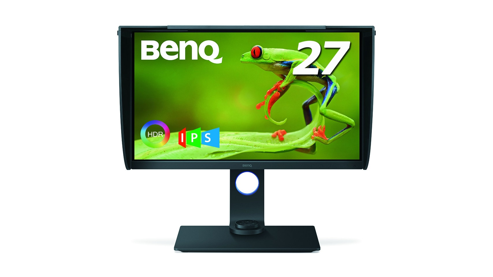
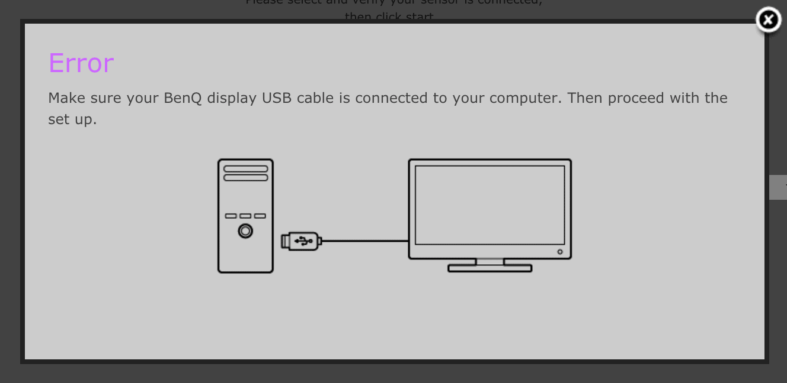

[Palette Master Element](https://www.benq.com/ja-jp/monitor/software/palette-master-element.html) が「BenQディスプレイのUSBケーブルがコンピュータに接続されていることを確認してください」エラーで [BenQ SW271](https://www.benq.com/ja-jp/business/monitor/sw271.html) を認識しない問題が発生していました。この問題は、ほかのMac / PCに接続しても解決せず、USBケーブルを交換しても解決しませんでした。そのため、SW271自体が故障したと判断し、ベンキューサポートセンターに修理依頼を出したところ、まさかの「再現せず」の回答でした。

しかし、ついに原因が判明しました。

## 解決方法

1. SW271のUSB-Cポートに刺さっているUSBケーブルを抜く

私はSW271のDisplayPortとUSB-Bポートから Mac Studio につなぎ、同時にUSB-Cポートから MacBook Pro につないでいました。しかし、どうやらSW271はUSB-Cポートを使用しているとUSB-Bポートは動作しない仕様のようで、USB-Cポートからケーブルを抜いたらUSB-Bポート側を認識するようになりました。

