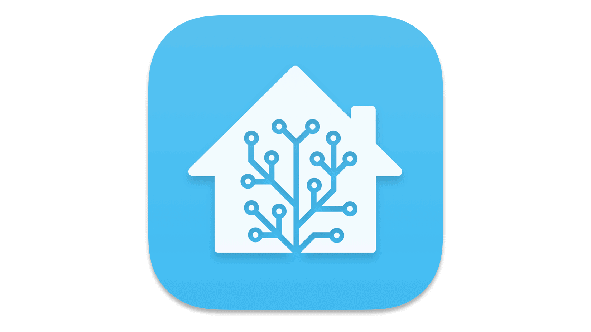
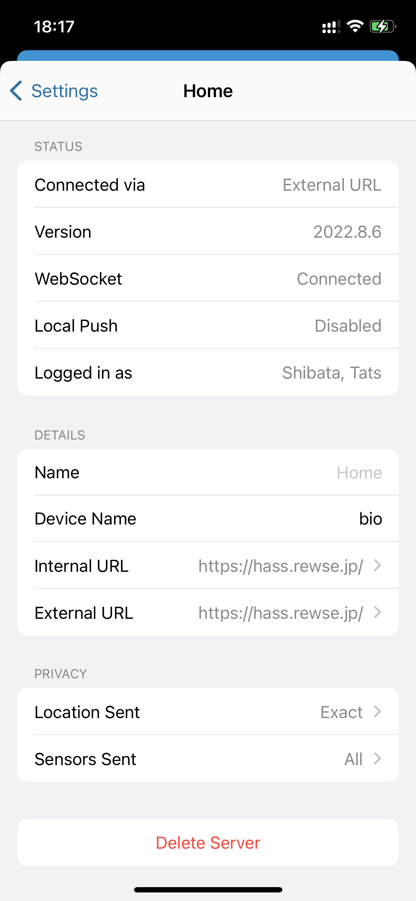

iPhone 12 Pro を iOS 16 にアップグレードしたら Home Assistant からの通知が届かなくなりました。

## 解決方法

1. Home Assistant for iOS を起動
2. Settings > Companion App > 一番上の項目（Add Server の上）を選択
3. Device Name にデバイス名を入力（サーバー側のサービス名が`notify.mobile_app_YOUR_DEVICE_ID`なら、`YOUR_DEVICE_ID`を入力）
4. [アプリを終了](https://support.apple.com/ja-jp/HT201330)させて、再度起動

## 参考

[No notifications available in iOS 16 beta - Mobile Apps / Home Assistant Companion for Apple - Home Assistant Community](https://community.home-assistant.io/t/no-notifications-available-in-ios-16-beta/428728)