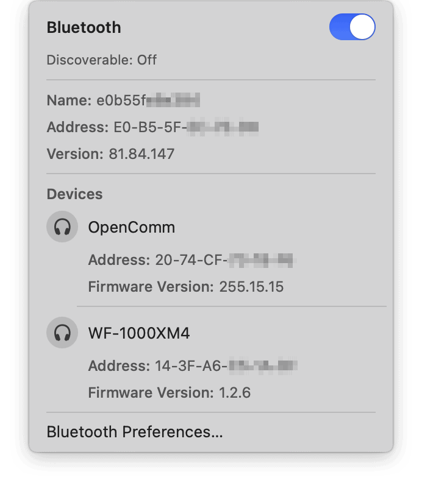

何がきっかけか分からないのですが、突然、以下のようなBluetoothによる接続要求のダイアログが数分間隔で何度も表示されるようになりました。表示されるMACアドレスに心当たりがなく、接続要求元のデバイスが分かりません。また、「このデバイスを無視」をチェックして「キャンセル」を押しても、変わらず数分間隔で何度も表示されつづけます。このダイアログが表示されると日本語入力中の未確定のものが強制的に確定してしまうためイライラしますし、何らかの拍子で接続を押してしまうと不明なデバイスとつながってしまいます。

メニューバーのBluetoothアイコンをOptionキー押しながらクリックすると、詳細が表示できます。しかし、「検出可能にする」はオフになっており、不明なデバイスがどのように接続を試みているのかも分かりません。

## 解決方法

1. /Library/Preferences/com.apple.Bluetooth.plist を削除
2. Macを再起動

Macのファイルを消すと解消するということは、誰も接続要求しておらず、Macがバグって存在しない接続要求のダイアログを出しているのでしょうか。原因は不明ですが、私はこれで直りました。

## 参考

[macos - Constant Bluetooth Connection Request Prompts Between Two Macs - Ask Different](https://apple.stackexchange.com/questions/376496/constant-bluetooth-connection-request-prompts-between-two-macs)
