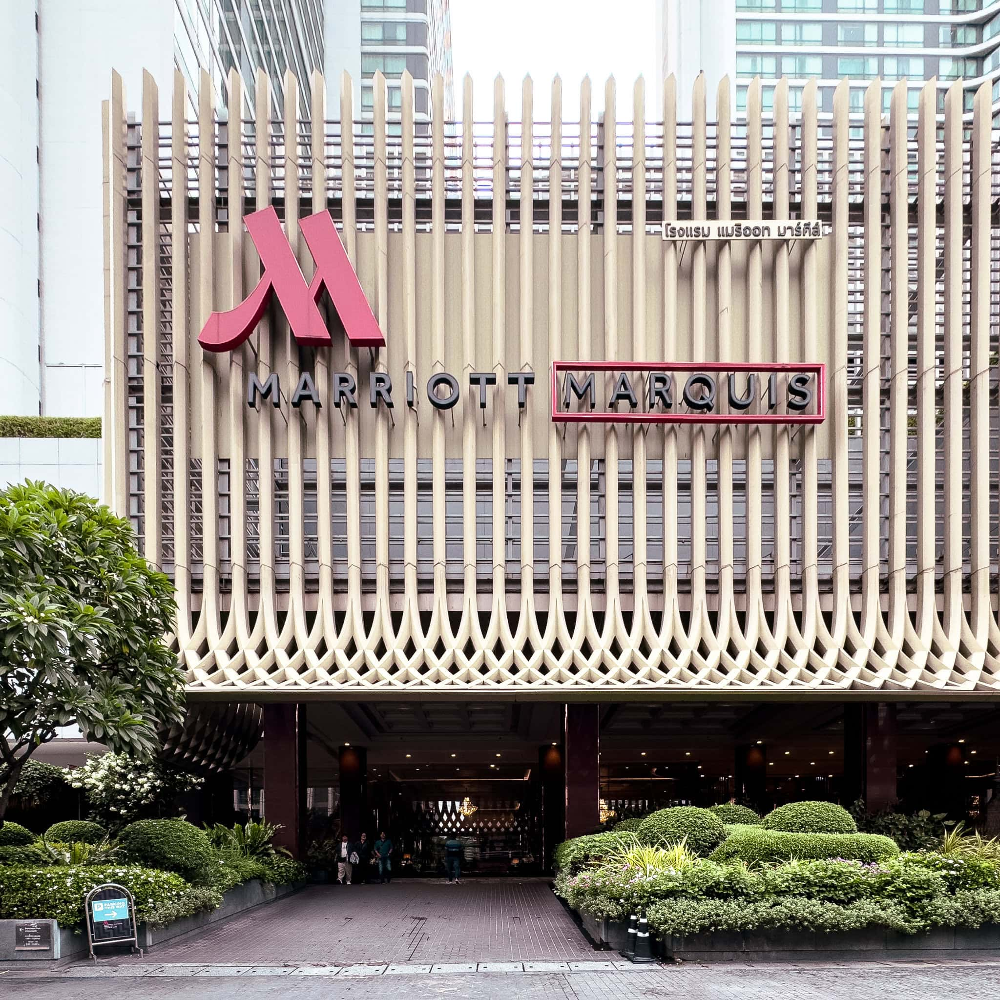
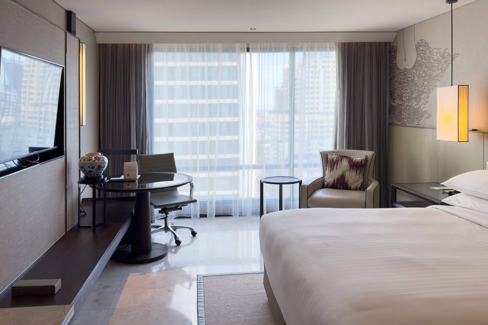
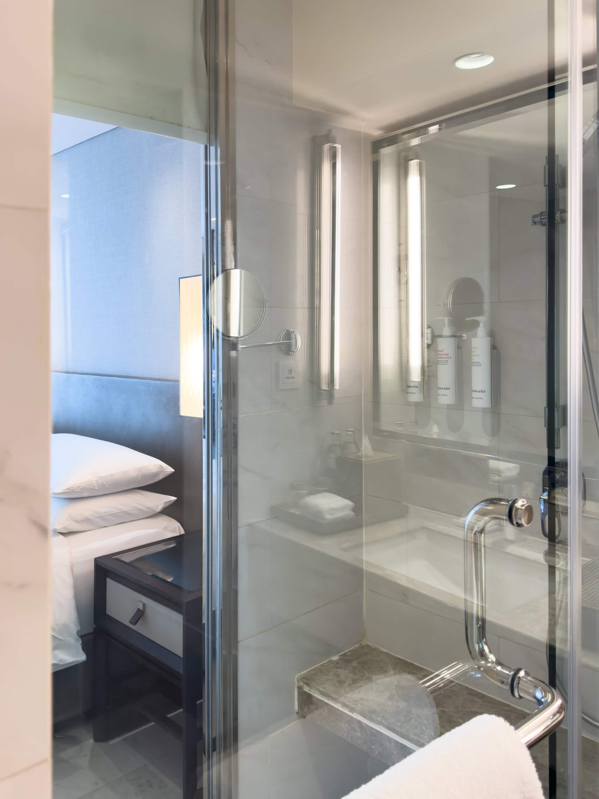
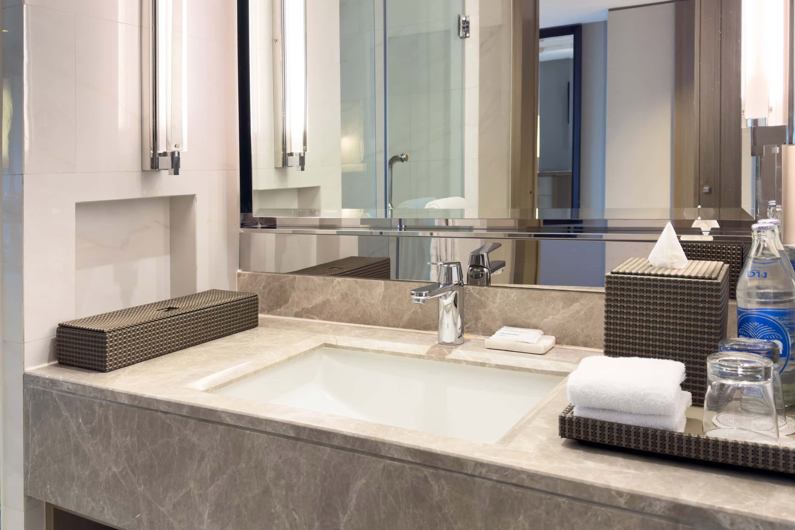

バンコク出張に伴い、[Bangkok Marriott Marquis Queen’s Park](https://www.marriott.com/ja/hotels/bkkqp-bangkok-marriott-marquis-queens-park/overview/) に3泊したので、宿泊記を残しておきます。HyattまたはIHG派なのですが、イベント主催者の推奨ホテルがMariott系列とHilton系列しかなかったので、一番新しいここにしました。

2棟からなる規模と豪華なロビーで5つ星ホテルの貫禄があるホテルですが、面している通りのスクンビットソイ22の雰囲気がだいぶいかがわしいです。昼はまだ良いですが、日が暮れるとマッサージ / 風俗店の客引き、大麻バー、ガールズバーのネオンだらけになるため、ロマンチックな旅行に不向きでしょう。

また、最も近い駅のBTSプロンポン駅まで徒歩13分でやや遠く、バンコクは渋滞がひどいためスクンビットソイ22が全く動かなくなることが多く、そうなるとGrabなどの車での移動も難しくなる点も考慮が必要です。

## 1 King 客室について

32m2あり、十分広いです。やや仕事には不向きではあるもののデスクもあり、一人用ソファもあります。私が泊まった部屋の床は大理石でしたが、公式画像を見るとカーペットとフローリングもあるようです。暑いバンコクでは大理石床はひんやりしていて良い感じです。

バスタブはありませんがホース付きシャワーがあります。このシャワールームは寝室側が見える大きな窓があるので採光は良いですが、二人で泊まるときは注意が必要です。ちょっとしたベンチがあるのも特徴的です。バスアメニティは [This Works](https://www.thisworks.com/) で、脱脂力がやや強めです。

洗面所の左側の箱にはいろいろなアメニティが入っており、歯ブラシや洗口液もあります。飲料水は[Chang](https://www.changbeer.com/)ブランドの瓶で、高級感があります。

## まとめ

バンコク出張で Bangkok Marriott Marquis Queen’s Park に3泊しました。豪華な5つ星ホテルですが、立地するスクンビットソイ22の雰囲気がやや行き過ぎており、最寄り駅までも遠く渋滞もひどいため不便な点がありました。

客室は32m2と広く、バスルームは採光も良好でした。アメニティは高級ブランドの This Works が用意されており、飲料水もChangブランドの瓶入りで、品質が高めでした。

立地の問題を除けば快適で高級感のあるホテルでしたが、旅行の目的によっては不向きな点もあると言えます。

|  |  |
| --- | --- |
| グループ | [Marriott](https://www.marriott.com/ja/default.mi) |
| ホテル名 | [Bangkok Marriott Marquis Queen’s Park](https://www.marriott.com/ja/hotels/bkkqp-bangkok-marriott-marquis-queens-park/overview/) |
| 部屋 | 1 King |
| 宿泊日 | 2024-08-19から2024-08-22 |