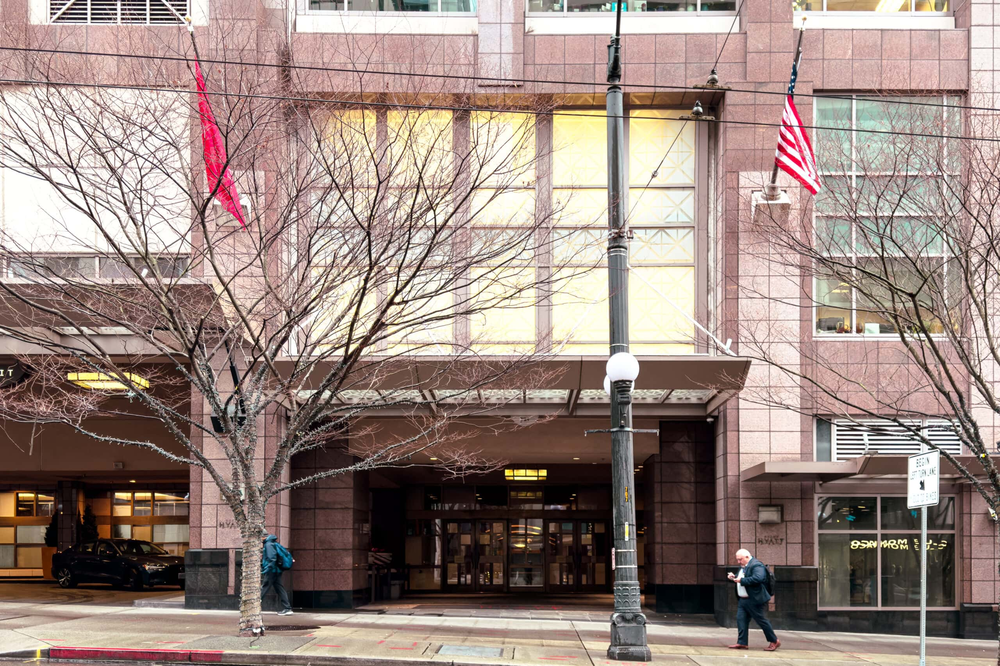
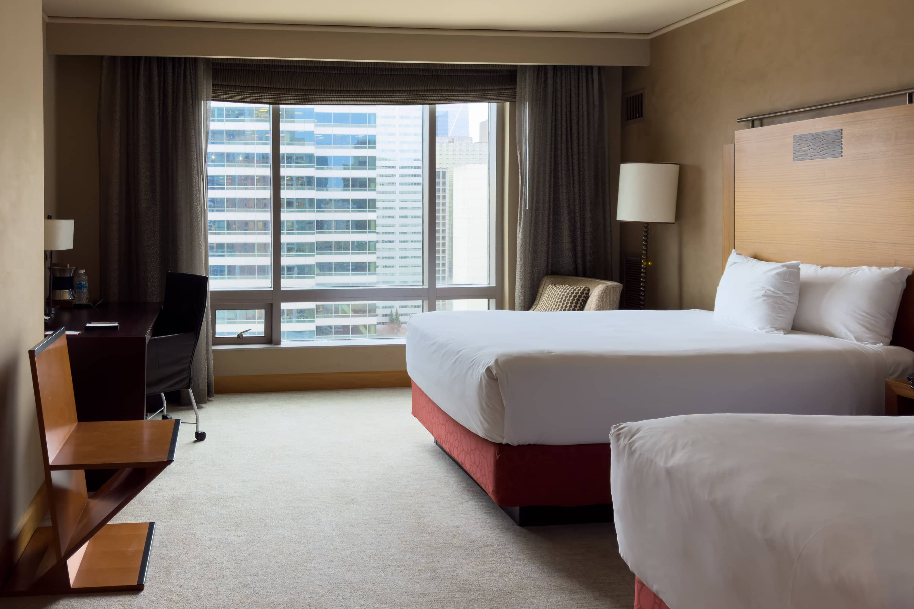
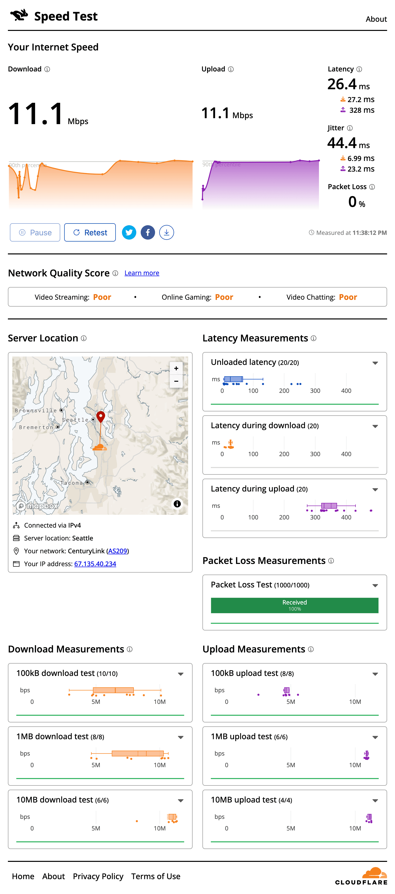
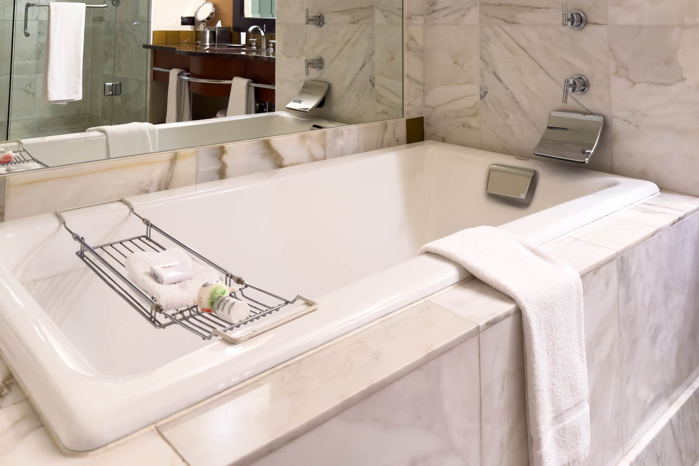
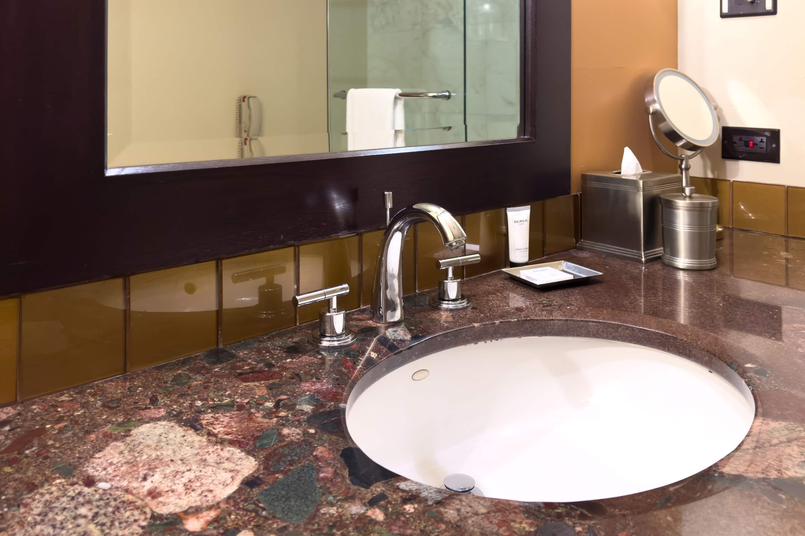
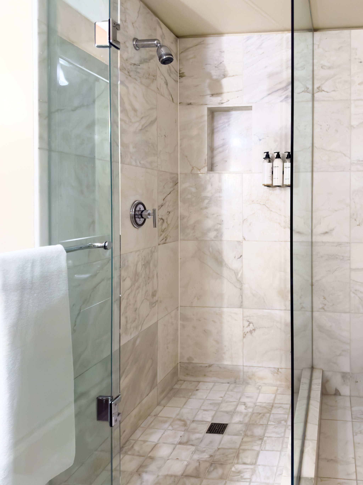

シアトル出張に伴い、今回は [Grand Hyatt Seattle](https://www.hyatt.com/ja-JP/hotel/washington/grand-hyatt-seattle/seagh) に3泊したので、宿泊記を残しておきます。市内中心近くのHyatt系列の4つ星以上のホテルは Grand Hyatt Seattle、[Hyatt at Olive 8](https://www.hyatt.com/ja-JP/hotel/washington/hyatt-at-olive-8/seahs)、[Hyatt Regency Seattle](https://www.hyatt.com/ja-JP/hotel/washington/hyatt-regency-seattle/sears) の3つがあり、ほぼ隣接しています。それぞれの特徴は以下のようになっています。

- **Grand Hyatt Seattle:**Award Category 5。3ホテルの中で最も高額なことが多い。ラグジュアリーな雰囲気。開業は2010年。スパあり
- **Hyatt at Olive 8:**Award Category 5。3ホテルの中間の価格なことが多い。モダンな雰囲気。開業は2010年。他2ホテルよりは小規模。プール（3コース）あり。スパあり
- **Hyatt Regency Seattle:**Award Category 4。3ホテルの中で最も低額なことが多い。モダンな雰囲気。開業は2018年

スタンダードな 1 King Bed の部屋のサイズは Grand Hyatt Seattle が35m2、Hyatt at Olive 8 が33m2、Hyatt Regency Seattle が30m2ですが、体感はほぼ変わりません。Hyatt Regency Seattle のコンベンションセンターが最も大きいため、会議参加者がまとまって予約していていることで日付によっては最も高額だったりすることもあり、今回も Grand Hyatt Seattle が最も安価だったのでこちらを選びました。

この3ホテルの中で Grand Hyatt Seattle の客室が最もラグジュアリーではあるのですが、ロビーのすぐ近くにコンベンションセンターがあるため、ロビーのソファで会議参加者が食事を取っていたり、ロビーはやや雑然とした雰囲気があります。また、[Qiao Lin Hotpot](https://qiaolinhotpot.com/) という火鍋レストランが1階にあり、食欲を誘われるものの全く雰囲気に合っていない香りが充満しています。

## Double Room 客室について

1 King 客室が満室だったので Double Room に宿泊しました。部屋は35m2あり、十分広いデスクがあります。マットレスは [Sealy](https://sealy.com/) Posturepedic Luxury Pillowtop です。ミッドセンチュリーな雰囲気のイスのようなものがありますが、これはラゲッジスペースのような気がします。ラゲッジスペースであるならばもっと幅が欲しいところですが。

インターネットはLANポートがあるものの10Mbpsに制限されていそうです。また、レイテンシやジッターもやや大きめです。

Hyatt at Olive 8 や Hyatt Regency Seattle と Grand Hyatt Seattle の最も違う点は浴室でしょう。全面500角大理石貼りで高級感があり、バスタブがあります。最近は清掃の効率性からバスタブが珍しくなってきましたが、持参した入浴剤を入れたバスタブに漬かると出張の疲れが癒えます。バスタブとは別に、ヘッドが固定ながらもドア付きシャワールームが別にあります。バスアメニティは [ADA Cosmetics Balmain](https://ada-cosmetics.com/brands/balmain/) で、ほぼ無香料です。

## まとめ

Grand Hyatt Seattle の客室は35m2と広く、ラグジュアリーな雰囲気がありましたが、ロビー周辺が多少雑然としていました。インターネットは有線でも10Mbpsに制限があり、やや不便です。一方で、浴室は大理石張りでバスタブとシャワールームが別々に設けられた高級仕様です。

|  |  |
| --- | --- |
| グループ | [Hyatt](https://www.hyatt.com/ja-JP/home) |
| ホテル名 | [Grand Hyatt Seattle](https://www.hyatt.com/ja-JP/hotel/washington/grand-hyatt-seattle/seagh) |
| 部屋 | Double Room |
| 宿泊日 | 2024-02-19から2024-02-22 |