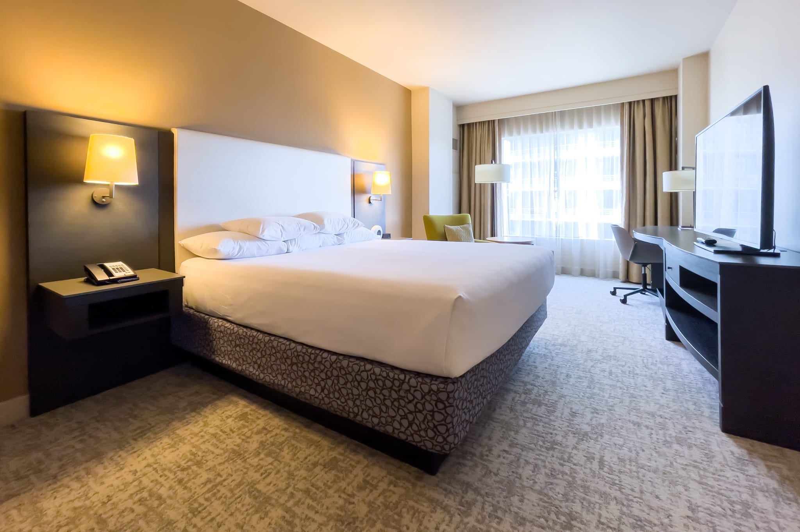
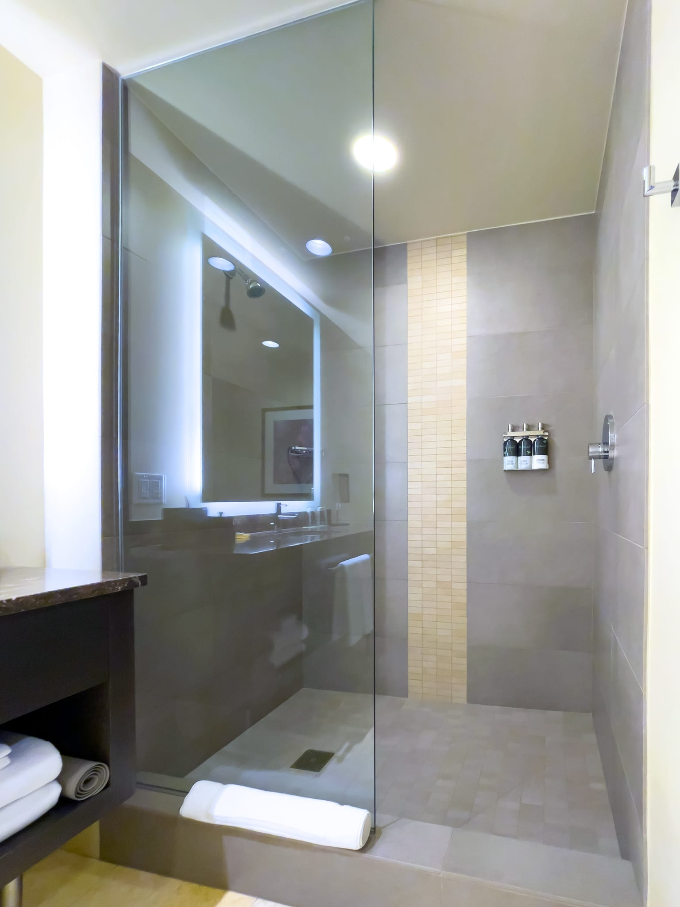

シアトル出張に伴い、今回は [Hyatt at Olive 8](https://www.hyatt.com/ja-JP/hotel/washington/hyatt-at-olive-8/seahs) に4泊したので、宿泊記を残しておきます。Hyatt at Olive 8 はコロナ禍前にも何度か泊まったことがあり、良い印象を持っていました。私はHyatt派なのですが、市内中心近くのHyatt系列の4つ星以上のホテルは [Grand Hyatt Seattle](https://www.hyatt.com/ja-JP/hotel/washington/grand-hyatt-seattle/seagh)、Hyatt at Olive 8、[Hyatt Regency Seattle](https://www.hyatt.com/ja-JP/hotel/washington/hyatt-regency-seattle/sears) の3つがあり、ほぼ隣接しています。それぞれの特徴は以下のようになっています。

- **Grand Hyatt Seattle:** Award Category 5。3ホテルの中で最も高額なことが多い。大理石とマホガニーを使ったラグジュアリーな雰囲気。開業は2010年。スパあり
- **Hyatt at Olive 8:** Award Category 5。3ホテルの中間の価格なことが多い。モダンな雰囲気。開業は2010年。他2ホテルよりは小規模。プール（3コース）あり。スパあり
- **Hyatt Regency Seattle:** Award Category 4。3ホテルの中で最も低額なことが多い。モダンな雰囲気。開業は2018年

Grand Hyatt Seattle は雰囲気が少し異なるので、この雰囲気が好みなら決め手になります。Hyatt Regency Seattle は1カテゴリー低いのですが、プールとスパがないくらいで、客室にそれほど差はありません。よく見ると Hyatt at Olive 8 では大理石な部分が Hyatt Regency Seattle だと違ったりしますが、出張用途で気になることはないでしょう。スタンダードな 1 King Bed の部屋のサイズは Grand Hyatt Seattle が35m2、Hyatt at Olive 8 が33m2、Hyatt Regency Seattle が30m2ですが、体感はほぼ変わりません。Hyatt Regency Seattle には大規模会議室がたくさんあるため、イベント参加者がまとまって予約していていることで、日付によっては最も高額だったりすることもあるので、3ホテルの中で最も安いところという選び方でも良いかもしれません。

または、[Hyatt Brand Explorer Award](https://world.hyatt.com/content/gp/ja/landing/brand-explorer-award.html) 狙いで、過去に泊まったことのないブランドに泊まるという戦略でも良いかもしれません。今からこのアワードを狙うのであれば、狭義のHyattブランドはホテル数が少なくて泊まりにくいので、Hyatt at Olive 8 が良いでしょう。

## 1 King Bed High Floor 客室について

Hyatt Explorist ステータスだったため、1 King Bed から 1 King Bed High Floor に無料アップグレードしてもらえましたが、窓からの見通しが良いわけではないので、それほど意味はありません。ステータスがなくても無料でクリスタルガイザーをもらえます。マットレスは[Sealy](https://sealy-jp.com/)がHyatt専用に製作している Hyatt Grand Bed II Euro Pillowtop でした。自宅で使っているのもSealyだからなのか、このマットレスは私の好みに合いました。広めのデスクもあります。インターネットはWi-Fiのみで、無料だと10Mbps以下に制限されています。アラームクロックとして置いてある [JBL Horizon](https://jp.jbl.com/JBL+HORIZON.html) の音質が悪くはなく、Bluetooth接続で音楽を掛けていました。

浴室はスパ風で、見た目は良いのですが、ドアがないので湯気が充満せず、少し肌寒いのが気になります。シャワーヘッドが固定なので、ドアがなくても湯が外に飛び散ることはないのですが。換気性能も良いので鏡が曇ることもないのですが、その分、肌寒いです。湯気が欲しい……。バスアメニティは [Gilchrist & Soames BeeKind](https://hoteliers.gilchristsoames.com/hotelier-beekind.html) で、Hyattらしい香りで良いです。

## まとめ

Hyatt at Olive 8 は比較的新しく、洗練されており、Hyattらしい体験ができるでしょう。また、市内中心部にあるため、どこに行くにも便利です。一方で、隣の Hyatt Regency Seattle と客室はそれほど変わらないので、金額の差によっては Hyatt Regency Seattle でも良いと思います。

|  |  |
| --- | --- |
| グループ | [Hyatt](https://www.hyatt.com/ja-JP/home) |
| ホテル名 | [Hyatt at Olive 8](https://www.hyatt.com/ja-JP/hotel/washington/hyatt-at-olive-8/seahs) |
| 部屋 | 1 King Bed High Floor |
| 宿泊日 | 2022-04-07から2022-04-11 |
