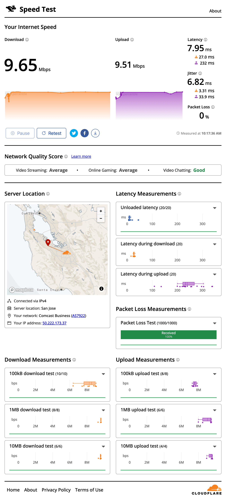
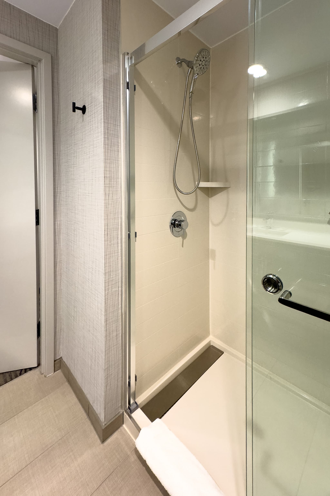
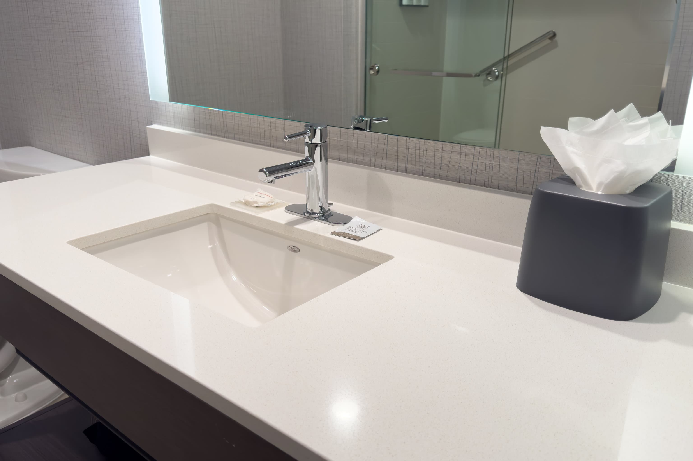

ベイエリア（シリコンバレー）の Palo Alto 出張に伴い、今回は [Hyatt Place San Carlos](https://www.hyatt.com/ja-JP/hotel/california/hyatt-place-san-carlos/sfozc) に4泊したので、宿泊記を残しておきます。

ベイエリアのホテルはいつでも高く、中でも Palo Alto は高いほうではあったのですが、旧正月と重なったからか今回の出張は格別高額でした。また、20年ベイエリアに出張していても、いまだお気に入りのホテルがないため、今回は少し離れた San Carlos なものの2022年にオープンした Hyatt Place にしてみました。Award Category は4です。Hyattチェーンの三つ星ブランドは [Hyatt Place](https://www.hyatt.com/ja-JP/brands/hyatt-place) と [Hyatt House](https://www.hyatt.com/ja-JP/brands/hyatt-house) がありますが、Hyatt Place が短期滞在用、Hyatt House が長期滞在用です。

Hyatt Place San Carlos がある場所は元々 Hotel San Carlos があったところですが、リノベーションではなく新築されていて、とてもきれいです。El Camino Real 沿いですが、うるささを感じることもありません。ただ、周りには何もなく、近くのSafeway El Camino まで徒歩15分のため、レンタカーがないと少々不便かもしれません。

無料の朝食が必ずついていますが、種類はそれほど多くなく、全体的に冷凍食品感が強いので、それほど期待しないでおきましょう。

## 1 King 客室について

このホテルの特徴は全ての部屋に大きなコーナーソファがあることでしょう。宿泊前は「一人でこんなに大きなソファいるのかな」と思っていましたが、ベッドかデスクくらいしか居場所がない他のホテルに比べて、いざ泊まってみると大きなソファという別の居場所があることはとても快適でした。オットマン兼コーヒーテーブルのようなものがあるのも良いです。

カントリー調のホテルが多いベイエリアの三つ星クラスのホテルに比べて、高級感はないもののモダンな雰囲気なのも私の好みです。部屋は30m2で十分な広さがありますし、デスクも広めです。マットレスは [Sealy](https://sealy.com/) Posturepedic Luxury Pillowtop です。Hyatt Place クラスでもSealyなところが、私がHyattチェーンを選ぶ理由の一つです。

気になる点は窓がすりガラスで、5cm程度しか空かないところです。せっかくのカリフォルニアの陽気を楽しむことができません。どうやら Spring Street 側の部屋は透明ガラスで、E Street 側の部屋はすりガラスのようです。次回は Spring Street 側を指定しようと思います。

インターネットはWi-Fiしかなく、10Mbpsで制限されているようです。

浴室はシャワールームのみですが、ホース付シャワーでガラス戸があります。バスアメニティは [Kenet MD Skincare](https://kenetmdskincare.com/) で、ほぼ無香料です。洗面の横にはボディローションが置いてあるのが一般的ですが、メイク落としが置いてありました。

## まとめ

Hyatt Place San Carlosは、新しく清潔感があり、全室に大きなコーナーソファが備え付けられた広々とした客室が特徴的でした。一方で、窓がすりガラスで外の景色を楽しめず、インターネットもWi-Fi のみで10Mbpsに制限があるなど少し不便な点もありました。

|  |  |
| --- | --- |
| グループ | [Hyatt](https://www.hyatt.com/ja-JP/home) |
| ホテル名 | [Hyatt Place San Carlos](https://www.hyatt.com/ja-JP/hotel/california/hyatt-place-san-carlos/sfozc) |
| 部屋 | 1 King |
| 宿泊日 | 2024-02-10から2024-02-14 |
