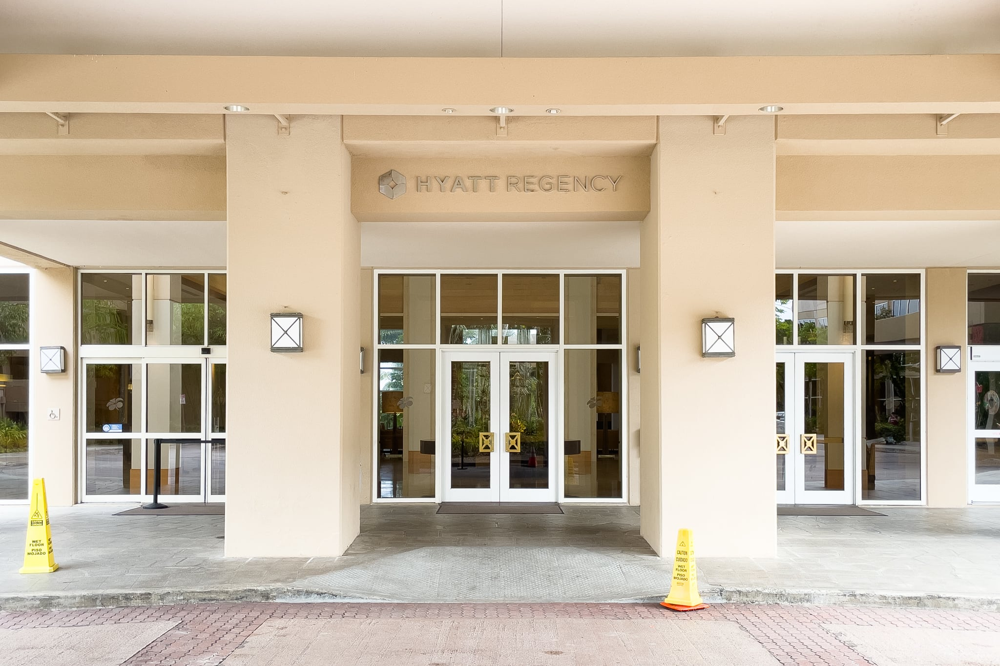
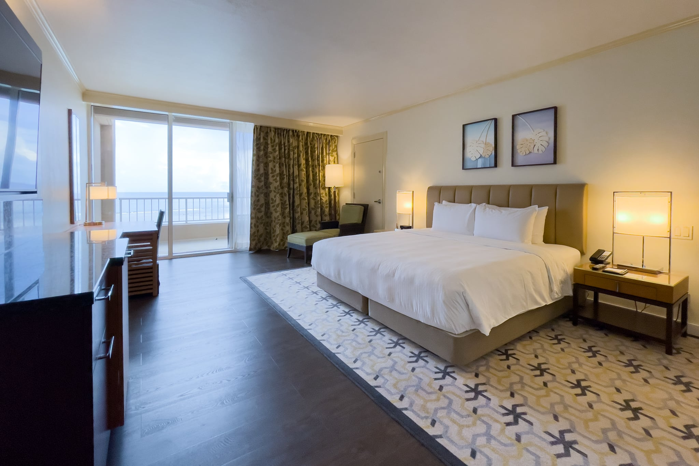
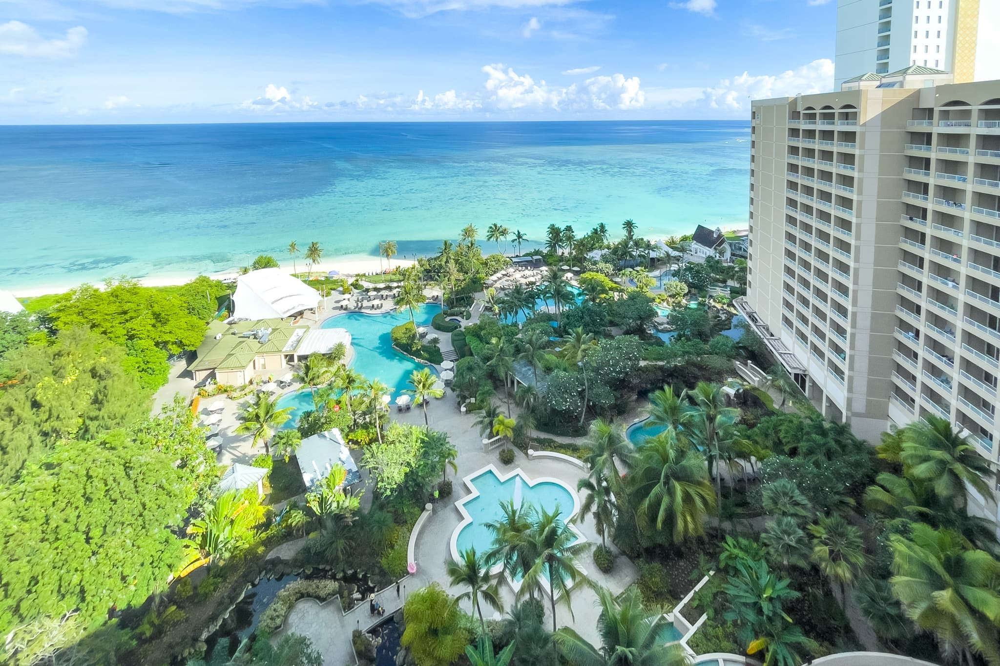
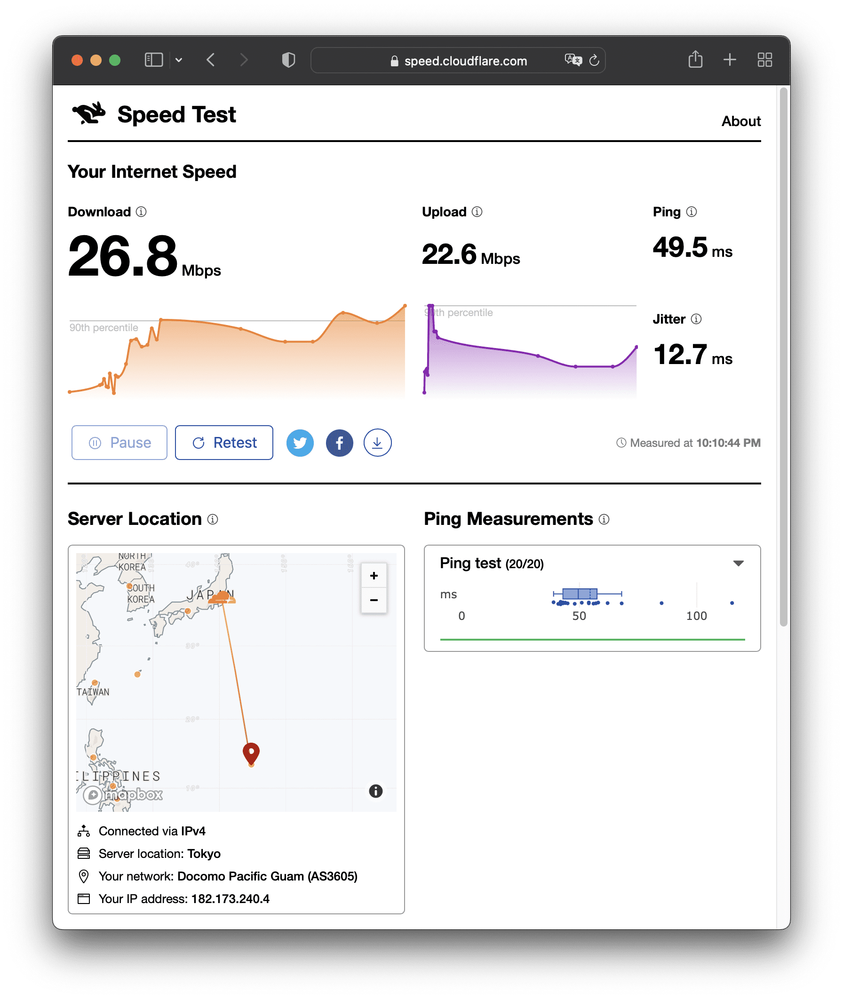
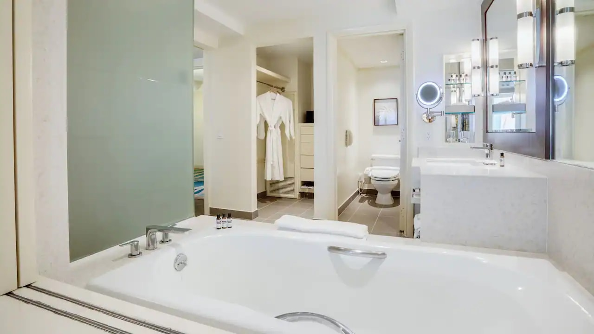

家族旅行で [Hyatt Regency Guam](https://www.hyatt.com/ja-JP/hotel/micronesia/hyatt-regency-guam/guamh) に4泊したので、宿泊記を残しておきます。もともとは、海外だと現地で新型コロナウイルス陽性になって帰国できないリスクを考えると、一度泊まったことのある [Hyatt Regency Seragaki Island, Okinawa](https://www.hyatt.com/ja-JP/hotel/japan/hyatt-regency-seragaki-island-okinawa/okaro)（ハイアットリージェンシー瀬良垣アイランド沖縄）くらいにしておこうかと考えていました。しかし、みんな同じことを考えたようで価格が高騰していたので、沖縄くらいの感覚で行けるグアムにしたという経緯です。結果的に8月の沖縄は医療体制が厳しい状況だったのでグアムで良かったかもしれません。

Hyatt Regency Guam は1993年10月オープンなこともあり、ところどころ古さを感じる点があります。ロビーなどのリノベーションされている部分は高級感がありますが、ファサードなどは少々くたびれています。ただ、私がHyatt派なのと、場所とプールの大きさを優先して Hyatt Regency Guam にしました。

場所はグアムの中心地にあり、徒歩で [JP Superstore](https://jpshoppingguam.com/)、The Plaza、[T Galleria Guam by DFS](https://www.dfs.com/jp/guam)、[Tumon Sands Plaza](https://www.tumonsandsplaza.com/?lang=ja) の4つのショッピングモールに行けます。ただし、どのモールもコロナ禍による観光客の減少によってかなり寂しい状況になっているので、あまり期待しないほうが良いでしょう。私はショッピング目的ではなく、ふらっと入っても大きく失敗しないレストラン街として利用していました。

## Ocean Front Deluxe King 客室について

スイート以外の部屋のサイズは、どのグレードでも51m2のようですが、キングベッドの部屋が Ocean Front Deluxe しか空いていなかったのでここにしました。Deluxeだとリノベーションされているようで、一部のペンキの厚さが歴史を感じさせるものの、十分にきれいです。プールから濡れたまま帰ってくることが多いので、フローリングなのも衛生的です。無料の飲料水は冷蔵庫に入っており、追加でももらえました。ソファは1人用ですが、デスクは広いです。バルコニーにはテーブルと2つのイスがあります。

Ocean Front Deluxe King - Hyatt Regency Guam

Deluxeだからか Hyatt Explorist だからかラッキーだったのか不明ですが、最上階の14階でした。海とプールがよく見えます。

Pool - Hyatt Regency Guam

インターネットは有線LANはなく、Wi-Fiのみです。22時の時点で26.8Mbpsということで、まずまずでしょうか。余談ですが、グアムだとCloudflareのサーバーは東京になるんですね。

Wi-Fi - Hyatt Regency Guam

写真を撮るのを忘れてしまったので、以下は公式サイトからの引用です。浴室には広めのバスタブとシャワールームがあります。シャワールームにホース付きシャワーがあります。また、バスタブ横が鎧戸になっており、そこを開けるとバスルームとベッドルームが完全につながり、バスタブに入りながら外を眺めることができます。以下の写真は鎧戸を開けてバスルーム側から撮ったものですね。上下の角度的に海を見るのは難しいですが、青い空に浮かぶ大きな雲は見えます。バスアメニティは[Pharmacopia](https://pharmacopia.net/)で、ほぼ無香料です。リノベーションされている部屋の洗面台はHyattっぽいモダンな雰囲気になっています。トイレはなんとウォシュレットです！ その横にはオープン型のウォークインクローゼットがあります。

[Bathroom - Ocean Front Deluxe King - Hyatt Regency Guam](https://www.hyatt.com/ja-JP/hotel/micronesia/hyatt-regency-guam/guamh/rooms)

## Club Access について

予約時に1泊1室$30で Club Access を付けられました。カクテルタイムは、毎日メニューは変わるもののホットミールが一品、ライス、メニューが変わらないチーズとハム、クッキーとフルーツといったところで、小腹を満たすには良いですが、夕食には物足りないでしょう。夕食代わりにしている家族連れは少なくなかったですが。飲み物はシャンパン、ワイン、ビール、ソフトドリンクが自由に飲めます。テラス席好きとしては、テラスで夕日を眺めながらビールが毎日飲めるだけで十分でした。

朝食は Regency Club ではなく、1階の Café Kitchen でのビュッフェ提供でした。1泊1室$30しか追加していないのに、大人2人子ども1人の朝食ビュッフェが毎日食べられたのはかなりお得でした。

## プールとビーチについて

プールはメインの1.2mのものの他に、ほぼ同じ規模に木々の中をうねる流れのない川のようなものがついている1.2mのプール、30cm程度の未就学児用プールの3つがあります。2番目のプールには小学生にちょうど良いくらいのウォータースライダーが1つあったり、川のようなところを探検できたり、川のところどころにある滝に打たれたりできるので、子どもに人気です。ジャグジーは常に閉鎖されていました。

なお、プールサイドでWi-Fiに接続はできるのですが、ほとんどデータ送受信できません。仕方がないので4G通信でごろごろすることになり、1日800MBほど使いました。この旅行のために追加費用なしで海外データ通信が20GB/月できるahamoに乗り換えていて正解でした。

プールからビーチにはすぐに出られます。プールが充実しているからか、隣の [Dusit Thani Guam Resort](https://www.dusit.com/dusitthani-guamresort/ja/) や [Dusit Beach Resort Guam](https://www.dusit.com/dusitbeach-resortguam/ja/) （旧 Outrigger Guam Beach Resort）より明らかに空いています。

Beach - Hyatt Regency Guam

## まとめ

Hyatt Regency Guam はところどころ古さを感じる点はありますが、グアムの中心地にあり、充実したプールと良いビーチがあります。Ocean Front Deluxe 客室はリノベーションされており、Hyattらしい雰囲気になっています。

|  |  |
| --- | --- |
| ブランド | [Hyatt](https://www.hyatt.com/ja-JP/home) |
| ホテル名 | [Hyatt Regency Guam](https://www.hyatt.com/ja-JP/hotel/micronesia/hyatt-regency-guam/guamh) |
| 部屋 | Ocean Front Deluxe King |
| 支払金額 | 302米ドル/泊/部屋 + Club Access 30米ドル/泊/部屋 + 宿泊税 36.52米ドル/泊/部屋 |
| 宿泊日 | 2022-07-31から2022-08-04 |