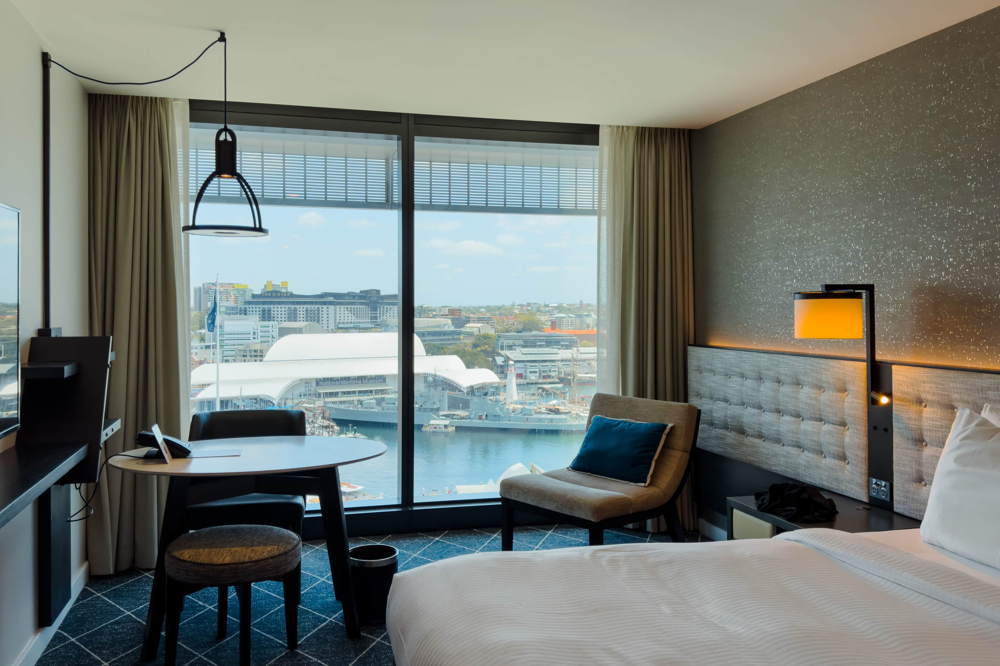
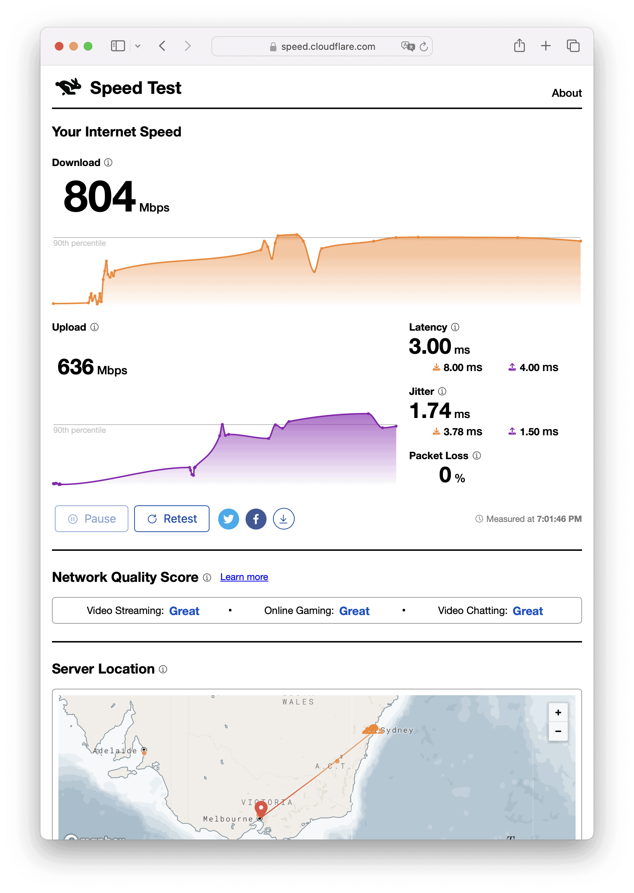
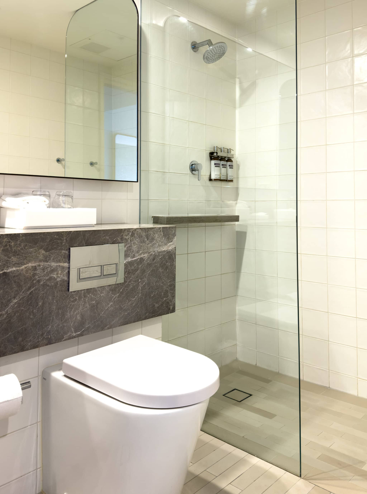

シドニー出張に伴い、今回は [Hyatt Regency Sydney](https://www.hyatt.com/hyatt-regency/ja-JP/sydrs-hyatt-regency-sydney) に4泊したので、宿泊記を残しておきます。Hyatt Regency Sydney はダーリングハーバーに面していて、ハーバービューの部屋を選ぶ価値があります。Award Category は4です。

## 1 King Bed Tower Room with Harbour View 客室について

普通の 1 King Bed で予約していましたが、ステータスがExploristのためか 1 King Bed Tower Room with Harbour View にアップグレードしてもらえました。Tower Room は窓が壁一面に広がっており、そこから見るダーリングハーバーが絵画のようです。デスクがやや頼りないですが、部屋は30m2で十分な広さがあります。マットレスは [Sealy](https://sealy.com/) Performance です。

インターネットはLANポートもあります。非常に高速で、有線で804Mbps、Wi-Fiでも591Mbps出ました。

浴室はシャワールームのみです。ドアがないので湯気が充満せず、少し肌寒いのが気になります。シャワーヘッドが固定なので、ドアがなくても湯が外に飛び散ることはないのですが。バスアメニティは[Pharmacopia](https://pharmacopia.net/)で、ほぼ無香料です。

## まとめ

Hyatt Regency Sydneyはダーリングハーバーに面した景色の良いホテルです。タワールームは壁一面の窓からダーリングハーバーが絵画のように望め、30m2と十分な広さがあります。インターネットにはLANポートがあり、有線もWi-Fiも高速です。浴室はシャワールームのみでドアがなく、やや肌寒さを感じるのと、シャワーヘッドが固定式なのが気になります。

|  |  |
| --- | --- |
| グループ | [Hyatt](https://www.hyatt.com/ja-JP/home/) |
| ホテル名 | [Hyatt Regency Sydney](https://www.hyatt.com/hyatt-regency/ja-JP/sydrs-hyatt-regency-sydney) |
| 部屋 | 1 King Bed Tower Room with Harbour View |
| 宿泊日 | 2024-01-29から2024-02-02 |
