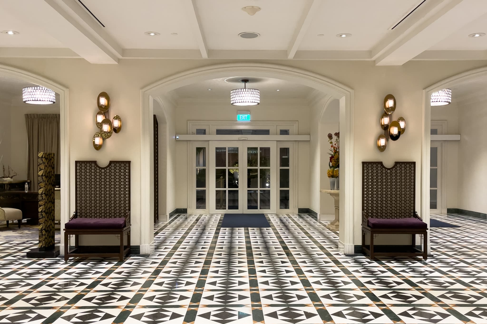
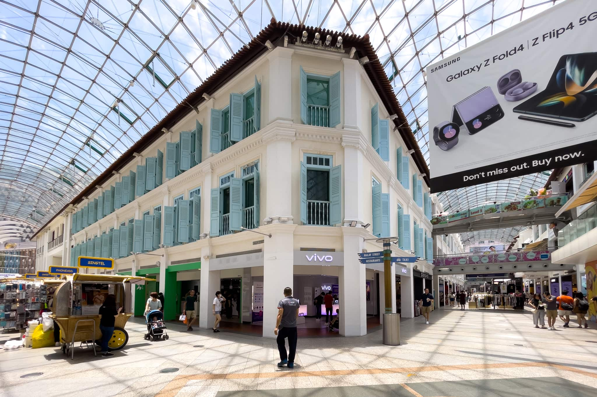
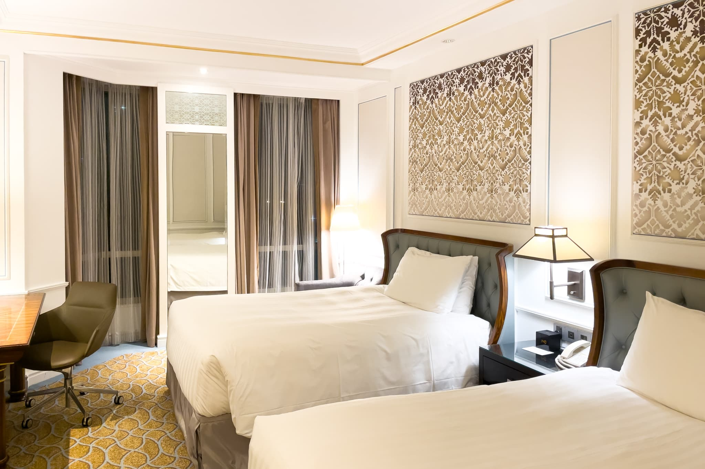
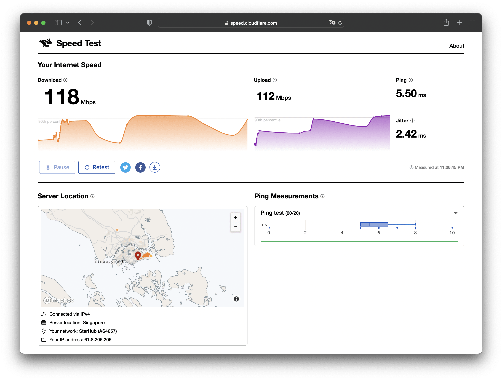
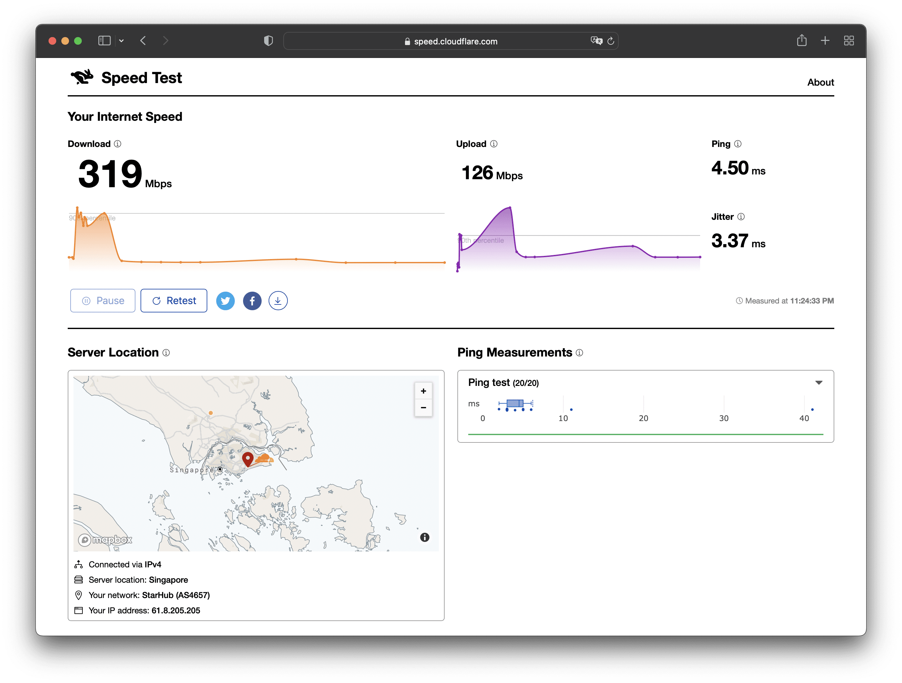
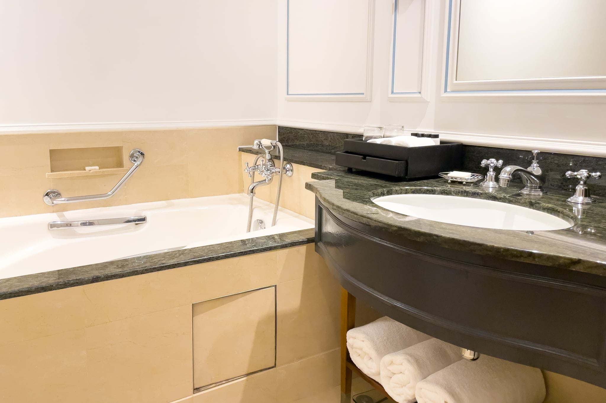
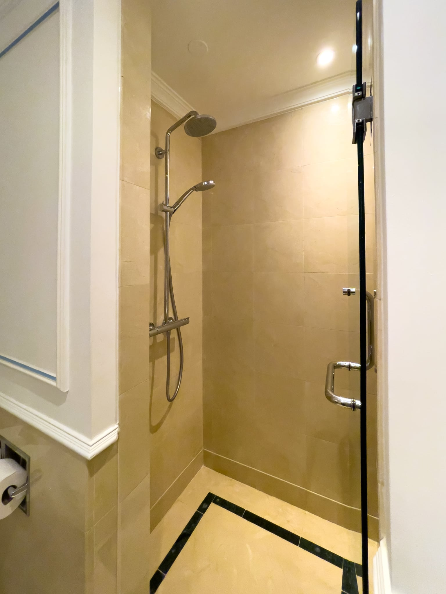
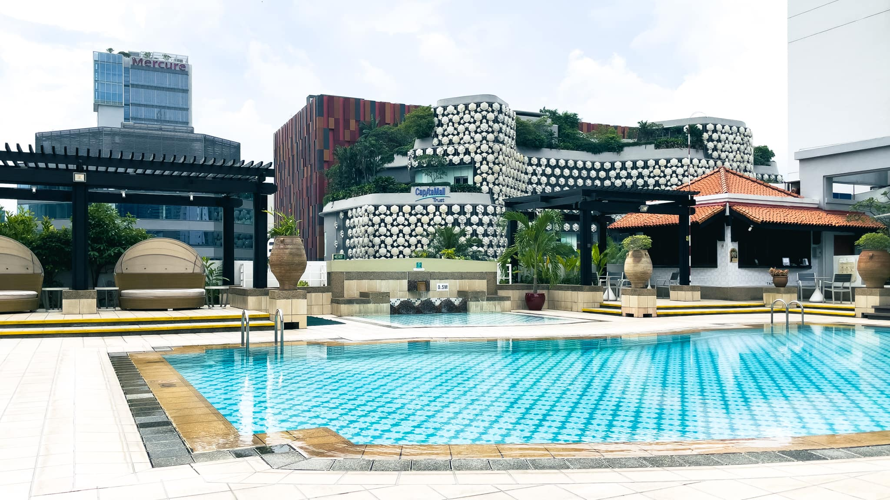
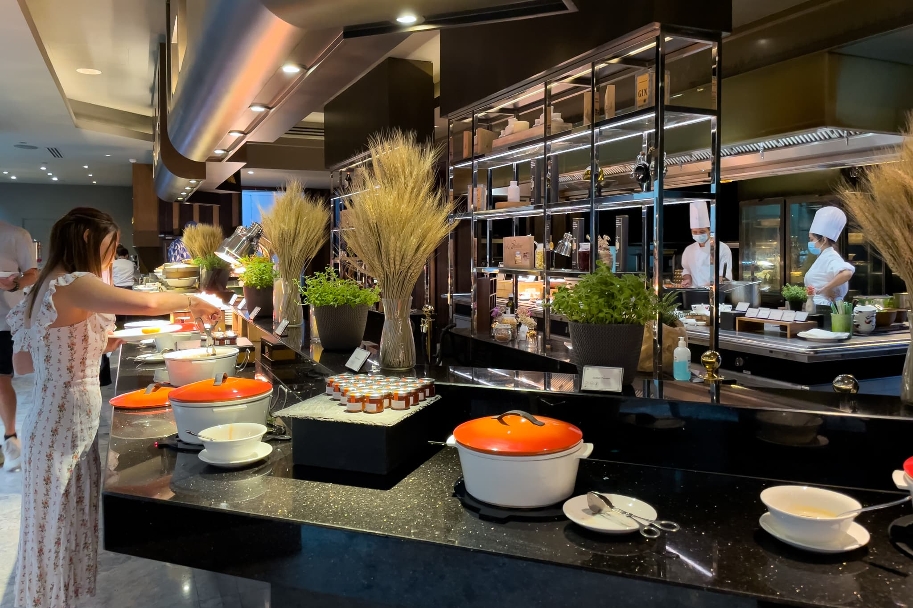
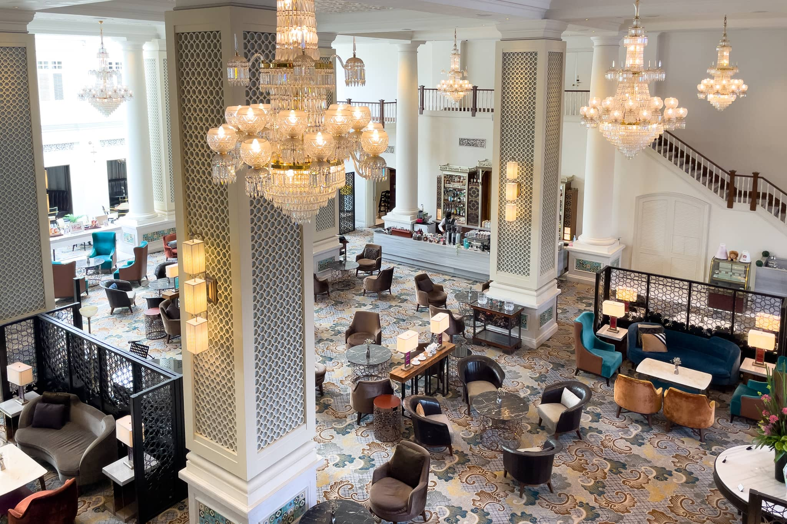

シンガポール出張に伴い、今回は [InterContinental Singapore](https://www.ihg.com/intercontinental/hotels/jp/ja/singapore/sinhb/hoteldetail) に7泊したので、宿泊記を残しておきます。ここは過去に泊まったことのあるホテルの中で、相当上位に入るすばらしい雰囲気でした。クラシックさとモダンさ、プラナカン文化が絶妙に混じり合っており、ここにしかない雰囲気があります。建物自体は少々古そうですが、内装は完全にリノベーションされています。

Entrance - InterContinental Singapore

また、[Bugis Junction](https://www.capitaland.com/sg/malls/bugisjunction/en.html) というショッピングモールに直結しており、非常に便利です。連結している [Bugis+](https://www.capitaland.com/sg/malls/bugisplus/en.html) まで含めると相当な量なお店とレストランがあり困りません。

Bugis Junction

## 2 Twin Beds Classic 客室について

本当は 1 King Bed が良かったのですが、あいにく満室であったため、38m2の 2 Twin Beds に泊まりました。IHG Platinum Elite ステータスにも関わらず特にアップグレードはなかったものの、ステータスがなくても無料で飲料水は何本でももらえます。マットレスは [Sealy](https://sealy-jp.com/) Posturepedic Celestial Pillowtop Unicased でした。自宅で使っているのもSealyだからなのか、このマットレスは私の好みに合いました。かなり厚いピロートップが付いていますが、不必要に沈むこともなく、とても快適です。広めのデスクもあります。テキスタイルやヘッドボードがエレガントです。

少し気になったのは、クローゼット内も含めてほとんど引き出しがないことです。私は7泊程度だとスーツケースの中身を全て引き出しに移すタイプなので、これにはちょっと困りました。

2 Twin Beds Classic - InterContinental Singapore

インターネットはWi-Fiも有線LANもあります。23時とはいえ、Wi-Fiで118Mbps、有線LANでは319Mbpsも出て、かなり快適です。

Wi-Fi - InterContinental Singapore

Ethernet - InterContinental Singapore

浴室には広めのバスタブとシャワールームがあります。シャワールームにホース付きシャワー、レインシャワーがあるだけでなく、バスタブにもホース付きシャワーがあるのが便利です。バスアメニティは [Apotheke Canvas](https://apothekeco.com/collections/canvas) で、ジンジャーリリーの香りです。

Bathroom - 2 Twin Beds Classic - InterContinental Singapore

Shower Room - 2 Twin Beds Classic - InterContinental Singapore

## プールについて

プールは小さな子どもを遊ばせるにはちょうど良いくらいの大きさです。屋外なので、プールサイドで仕事をすると良い気分転換になります。暑いですが。

Pool - InterContinental Singapore

## 朝食について

朝食は一般的なラインナップに加えて、中華とカレーが毎日あります。卵料理と麺料理はシェフが作ってくれます。サラダバーも大きいです。どれも本格的なレストラン級の味で、満足度が高いです。

## ラウンジについて

特筆すべきはラウンジです。とても良い雰囲気です。

## キャンペーンについて

Earn up to 4X キャンペーンによって、100%以上のボーナスポイントがもらえました。また、Status Challenge キャンペーンにより、2023年12月末までの IHG Platinum Elite を確保しました。

## まとめ

InterContinental Singapore はクラシックさとモダンさ、プラナカン文化が絶妙に混じり合っており、ここにしかない雰囲気があります。建物自体は少々古そうですが、内装は完全にリノベーションされています。また、Bugis Junction というショッピングモールに直結しており、非常に便利です。私は次回もここに泊まると思います。

|  |  |
| --- | --- |
| グループ | [IHG](https://www.ihg.com/) |
| ホテル名 | [InterContinental Singapore](https://www.ihg.com/intercontinental/hotels/jp/ja/singapore/sinhb/hoteldetail) |
| 部屋 | 2 Twin Beds Classic |
| 宿泊日 | 2022-06-12から2022-06-19 |
