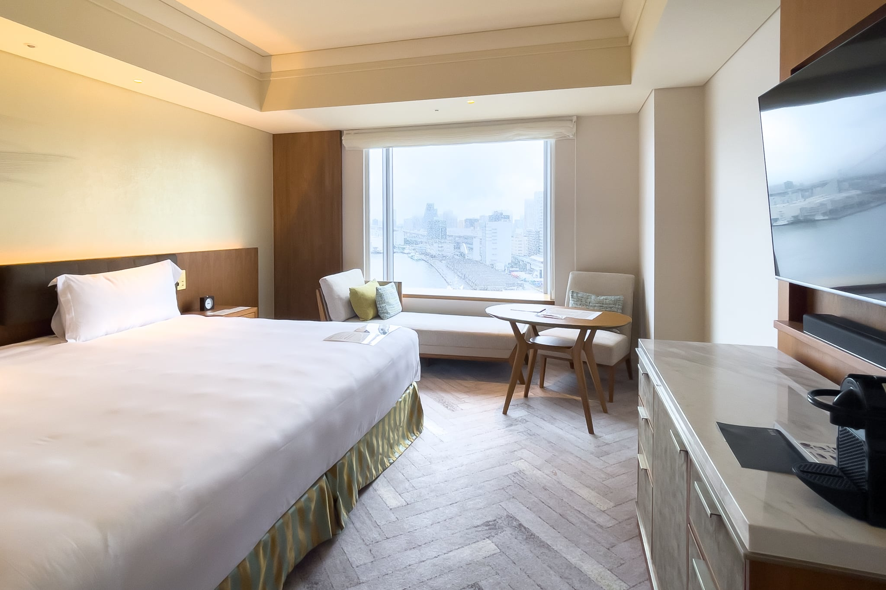
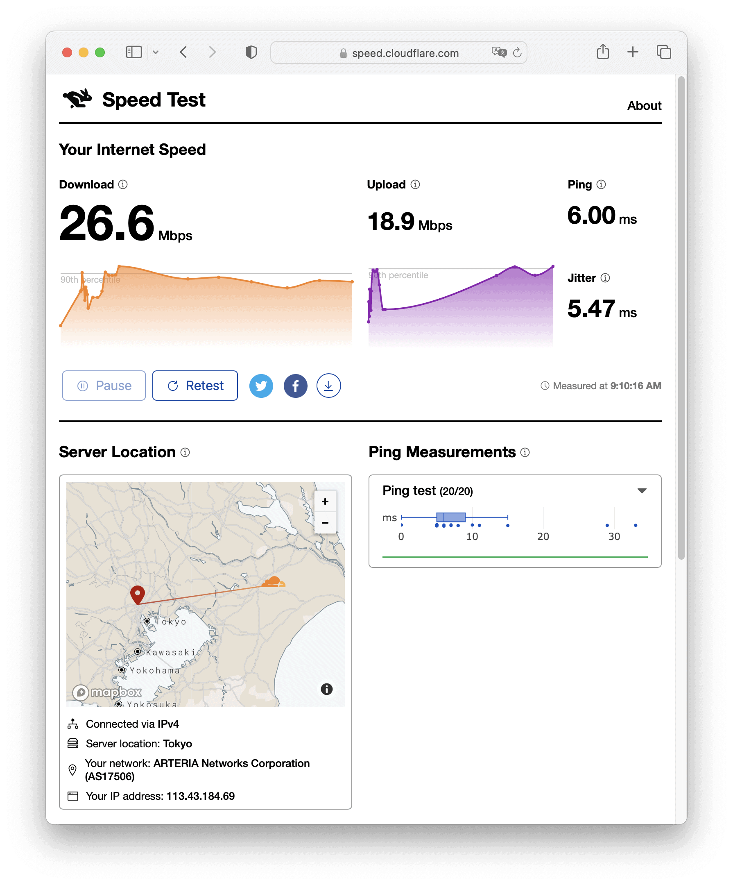
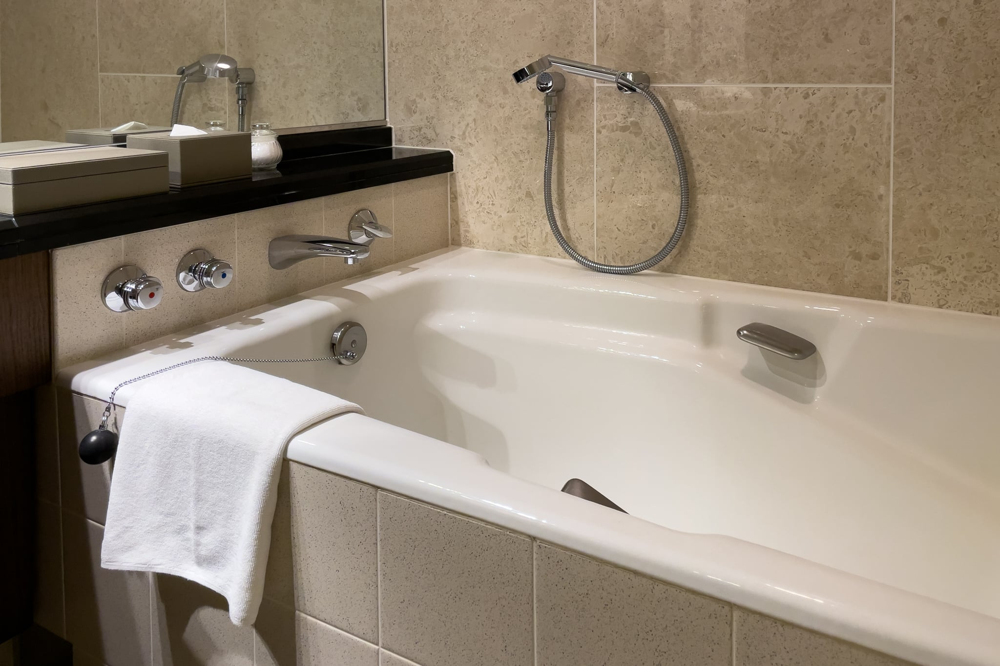
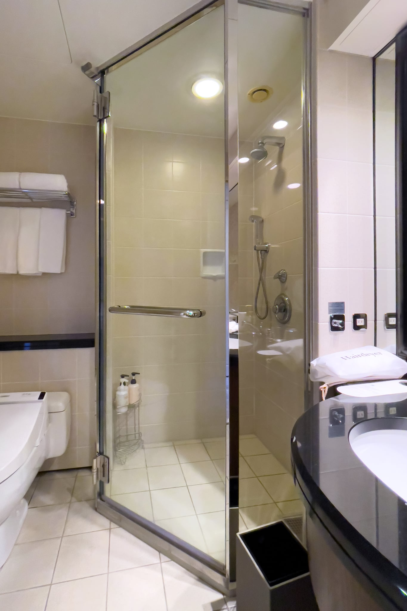

IHGの Status Challenge キャンペーンで、あと1泊すると15泊になって2023年末までの IHG Diamond Elite が取得できるため、InterContinental Tokyo Bay（インターコンチネンタル東京ベイ）で1泊修行することにしたので、宿泊記を残しておきます。

15:15くらいにフロントに向かうと20組以上がチェックインに並んでおり、最後尾が見えない状況でした。一方で優先チェックイン列は誰も並んでおらず、恐る恐る「Platinum会員なのですが」とスタッフに見せると、即座に私の順序になりました。過去のどのホテルでも会員列でメリットを感じたことがなかったのですが、今回は相当効きました。

## Deluxe Floor Superior Bay View Double 客室について

修行なので一番安い部屋に泊まるべきかもしれませんが、リノベーションされていないレギュラーフロアではなく、2020年にリノベーションされたデラックスフロアにしました。さらにその上にエグゼクティブフロア、クラブインターコンチネンタルフロアがあるのですが、Platinum Elite でもアップグレードはされませんでした。

Deluxe Floor Superior Bay View Double は36m2前後で、十分な広さがあります。台風による荒天でしたが、窓際のデイベッド風ソファが良い雰囲気です。ヘリンボーンの床は最近多くなってきたフローリングに見えますが、しっかりカーペットになっている点も良いです。カタログ上のベッド幅は183cmのキングサイズなのですが、この部屋は120cmのセミダブルサイズのマット2つに1枚のシーツが掛かっていて、240cmもあるベッドになっていました。米国でもこのサイズは経験したことありませんでした。マットレスは [BEST BRIDAL](https://www.bestbridal.co.jp/) と[Sealy](https://sealy-jp.com/)のダブルブランドでした。BEST BRIDAL は InterContinental Tokyo Bay を運営している [TSUKADA GLOBAL HOLDINGS](https://www.tsukada-global.holdings/) のグループ会社です。自宅で使っているのもSealyだからなのか、このマットレスは私の好みに合いました。廊下は少し古さを感じましたが、部屋の中のリノベーションは完璧で、デスクがちょっと頼りない以外はすばらしい部屋です。

Deluxe Floor Superior Bay View Double

インターネットはWi-Fiのみです。26.6Mbpsと、速くはないですが十分な性能が出ています。

Wi-Fi - InterContinental Tokyo Bay

浴室にはバスタブとシャワーブースがあります。シャワーブースにホース付きシャワー、レインシャワーがあるだけでなく、バスタブにもホース付きシャワーがあるのが便利です。ただ、バスアメニティは[御木本製薬](https://www.mikimoto-cosme.com/)なのですが、洗い上がりがぬるぬるする感じで、日帰り温泉に設置されているバスアメニティに近い印象を受けました。ホテルのグレードに明らかに合っていません。カタログではバスアメニティは[BYREDO](https://www.byredo.com/ja_jp/)なはずなのですが、ハンドソープのみがBYREDOでした。

Bathroom - InterContinental Tokyo Bay

Shower Booth - InterContinental Tokyo Bay

## ホテル全体の雰囲気について

InterContinental Tokyo Bay を運営している TSUKADA GLOBAL HOLDINGS の主要事業がブライダルなこともあってホテルウェディングに力を入れており、ホテルの共有部は結婚式客だらけで騒々しいです。宿泊施設というよりも結婚式場という印象を受けました。

少し驚いたのは、私が14時にレイトアウトチェックアウトしているときに、他の宿泊客が「早めにチェックインできますか？」と確認したら、予約者名も確認せずに「チェックインは15時からとなっております」と断っていたことです。たとえ断るにしても、ステータスくらいは確認して「あいにく空室が……」と言ったほうが良いのではないでしょうか。また、15:15に大行列を生んでいる原因がこれであることも理解できました。チェックイン体験を相当落としていると思うのですが、15時一斉チェックインにこだわる理由は何なのでしょうか。同じ TSUKADA GLOBAL HOLDINGS が運営している Kimpton Shinjuku Tokyo（キンプトン新宿東京）のスタッフの接客が完璧なのに比べると、だいぶギャップが大きいです。

関連記事: [Kimpton Shinjuku Tokyo に宿泊](https://rewse.jp/blog/stayed-kimpton-shinjuku-tokyo/)

## キャンペーンについて

Status Challenge キャンペーンにより、2023年12月末までの IHG Diamond Elite を確保しました。IHG One Rewards の最上位ステータスを15泊で取得できたので良いキャンペーンでした。レイトチェックアウトが変わらず14時なのはちょっと残念ですが、朝食無料は大きいです。Hyatt派なのですが、2023年末まではIHGを最優先にしたいと思います。

## まとめ

InterContinental Tokyo Bay の Deluxe Floor の部屋は完璧にリノーベーションされており、すばらしい雰囲気です。しかし、共有部は結婚式客だらけで騒々しく、宿泊施設というよりも結婚式場という印象を受けました。また、スタッフの対応やチェックイン体験に、やや疑問があります。

|  |  |
| --- | --- |
| グループ | [IHG](https://www.ihg.com/) |
| ホテル名 | [InterContinental Tokyo Bay](https://www.ihg.com/intercontinental/hotels/jp/ja/tokyo/tyohb/hoteldetail) |
| 部屋 | Deluxe Floor Superior Bay View Double |
| 支払金額 | 35,670円/泊/部屋 |
| 宿泊日 | 2022-09-18 |
