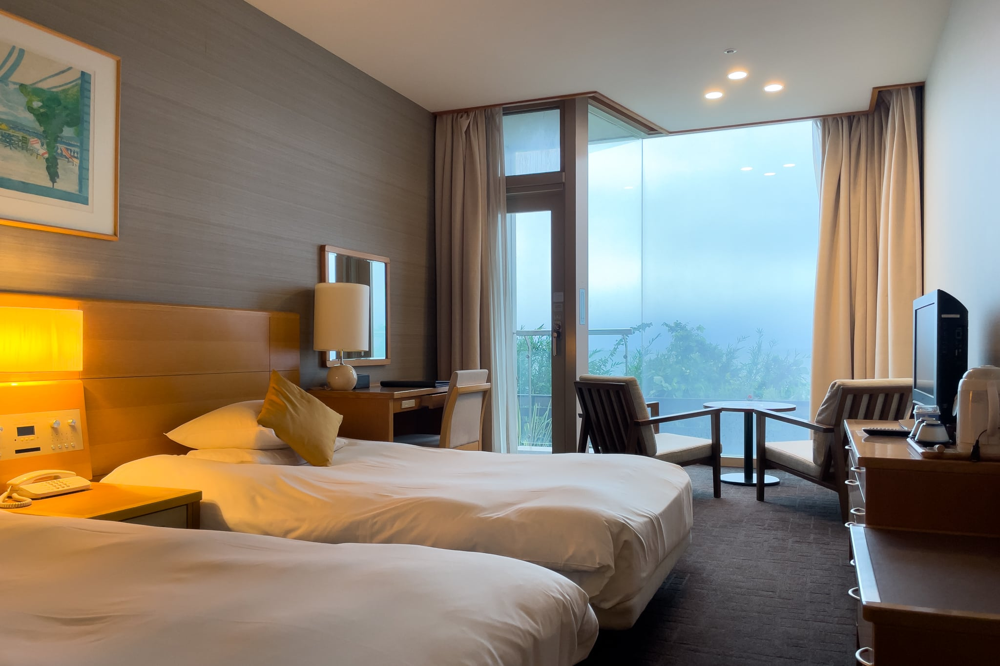
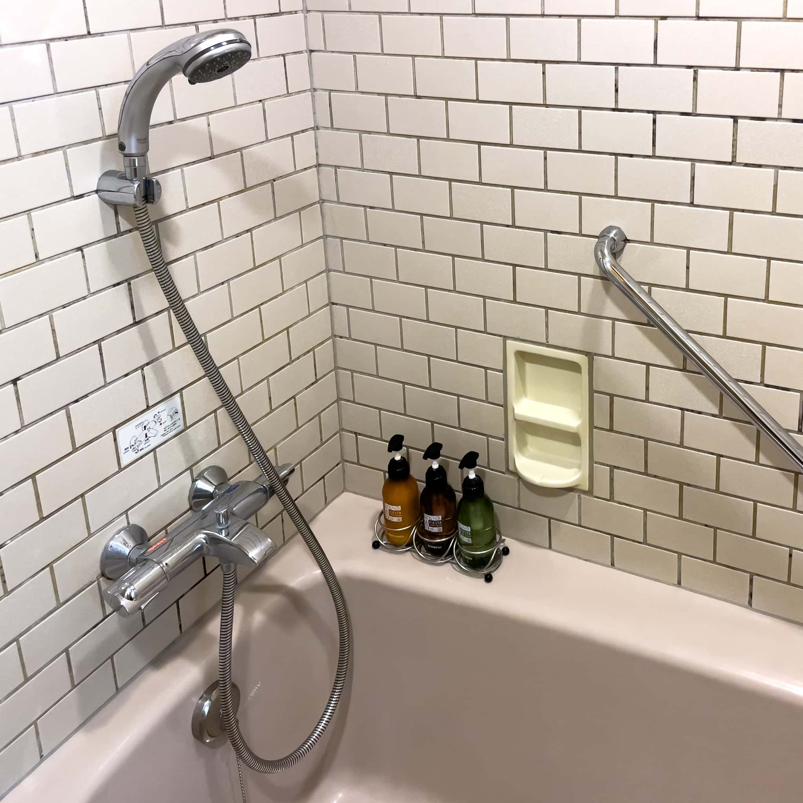

会社のイベント参加に伴い、イベント主催者指定の Kamakura Prince Hotel（鎌倉プリンスホテル） に2泊したので、宿泊記を残しておきます。

鎌倉とは言っても、鎌倉駅から最寄りの七里ヶ浜駅まで江ノ電で14分、七里ヶ浜駅から徒歩8分なので、鎌倉観光には少し遠いです。ただ、相模湾の目の前でリゾート感があります。

## Twin Room B 客室について

28m2の Twin Room B は一面の壁全体ガラスになっており、目の前に相模湾だけが見える眺望の良い部屋です。部屋の内側ではなく窓を向いているソファが良い雰囲気です。ただ、この窓こそが Twin Room B の一番の売りだと思うのですが、窓が潮で白けているのが残念です。海沿いは維持が難しいですね。小さなバルコニーが付いているので、そこに出て海を見ることはできます。私は1階だったので緑が少々邪魔だったので、2階のほうがより良さそうです。

Twin Room B - Kamakura Prince Hotel

マットレスはかなり硬いです。和室の敷き布団のような印象です。ブランドは確認できませんでした。インターネットはWi-Fiのみですが、デスクがあるのは良い点です。

バスルームのタイルはレンガ風で、目地が黒ずんでいて少々気になります。もう少し落ちついたタイルのほうが良かった気がします。バスアメニティは [Kao FIESTA PURE SHINE](https://pro.kao.com/jp/amenity-solution/brand/fiesta/pureshine/) です。高級感はありませんが、悪くありません。

## レストランについて

[Le Trianon](https://www.princehotels.co.jp/kamakura/restaurant/le-trianon/) で1泊目の夕食、2泊目3泊目の朝食、[きよやす邸](https://www.princehotels.co.jp/kamakura/restaurant/kiyoyasutei/)で2泊目の夕食を取ったのですが、どちらも満足度が高いです。雰囲気はきよやす邸のほうが好みでした。

## まとめ

Kamakura Prince Hotel の Twin Room B は一面の壁全体ガラスになっており、目の前に相模湾だけが見える眺望の良い部屋です。少々古いところはありますが、金額次第では満足できると思います。

|  |  |
| --- | --- |
| グループ名 | [Prince](https://www.princehotels.co.jp/) |
| ホテル名 | [Kamakura Prince Hotel](https://www.princehotels.co.jp/kamakura/) |
| 部屋 | Twin Room B |
| 宿泊日 | 2022-09-20から2022-09-22 |
