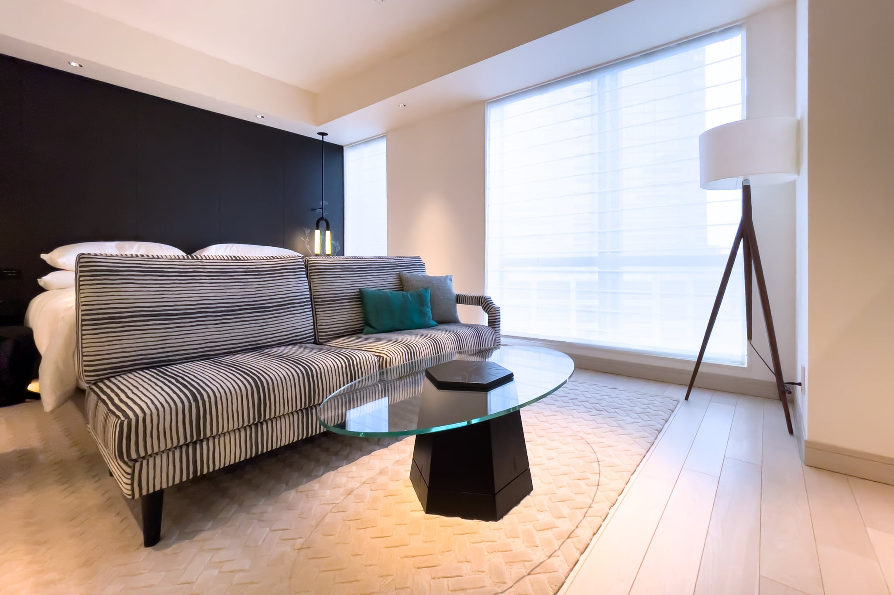
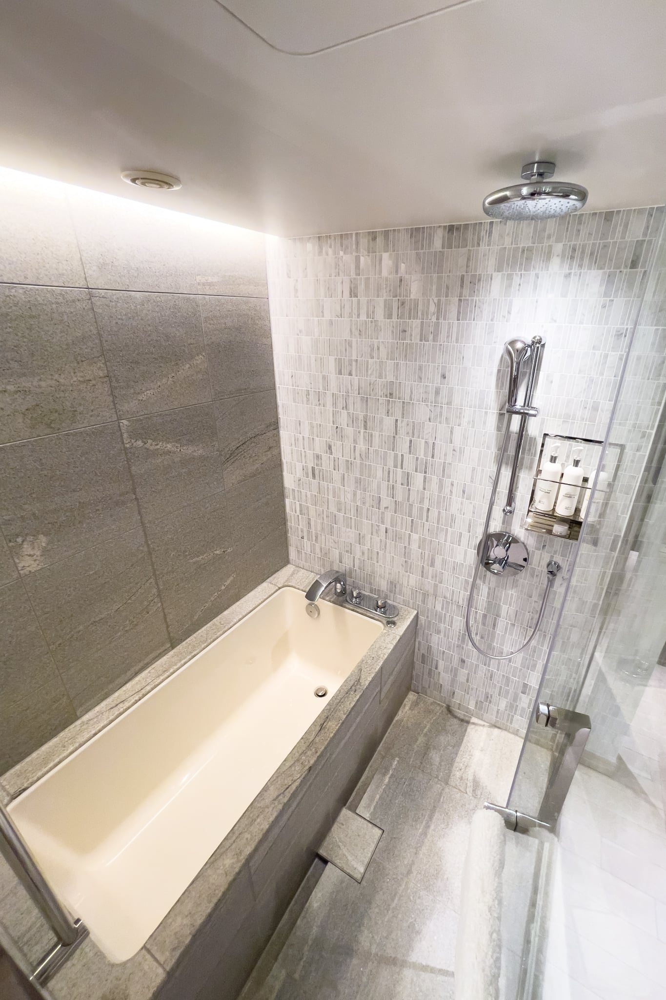
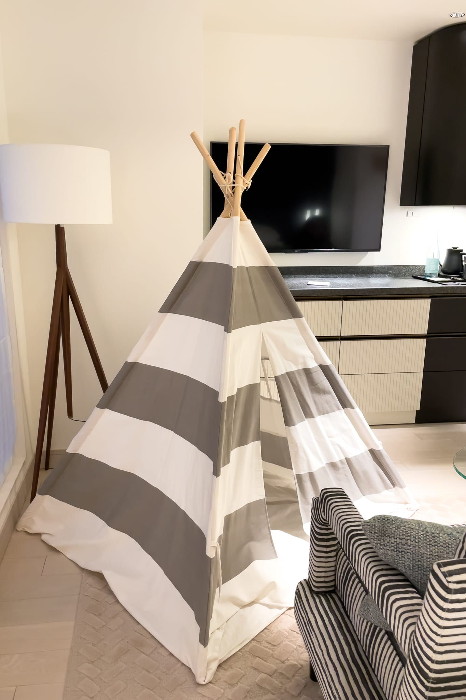

春休み中の娘が昼食中に「ホテルステイしたい」と言い出したので、その日の午後から近所の [Kimpton Shinjuku Tokyo](https://www.ihg.com/kimptonhotels/hotels/jp/ja/shinjuku-hotel-tokyo-japan/tyosj/hoteldetail)（キンプトン新宿東京）に1泊した宿泊記を残しておきます。Kimpton Shinjuku Tokyo は西新宿にあった栗田工業本社の跡地に2020年10月に建てられた新しいホテルです。西新宿エリアの外資系ホテルはどれも古かったので、新しいホテルは貴重でしょう。規模はそれほど大きくなく、近くの [Hyatt Regency Tokyo](https://www.hyatt.com/ja-JP/hotel/japan/hyatt-regency-tokyo/tyoty) や [Hilton Tokyo](https://www.hilton.com/en/hotels/tyohitw-hilton-tokyo/) の5分の1程度の土地面積のため、ロビーやフロント、車寄せは必要最小限のサイズです。

KimptonはIHG系列なので、IHG Rewards Club の23,200ptで1泊することができました。また、IHG Platinum Elite ステータスだったため、ポイント宿泊にもかかわらず、1 King Bed Essential から 1 King Bed Premium に無料アップグレードしてもらえました。同じ 1 King Bed Premium でも内装にはバリエーションがあるようで、この部屋はベッドの足下にソファがある点が特徴的な部屋です。おかげで天井から床まで窓が広がっているため、南西なこともあって明るい部屋でした。マットレスは[Simmons](https://www.simmons.co.jp/)です。33m2の部屋で水回りを大きく取っているため、ベッド周りのスペースはそれほど広くはありません。また、ローテーブルだけでデスクがないので、ビジネス客は少し注意が必要です。

1 King Bed Premium - Kimpton Shinjuku Tokyo

この部屋の浴室には深くて長いバスタブがあります。部屋との境はガラス張りになっていますが、ブラインドを下ろすこともできます。シャワーヘッドは[GROHE](https://www.grohe.co.jp/)で、レインシャワーも備わっています。バスアメニティは [La Bottega](https://www.labottega.com/en/) がKimpton専用に製作している [Atelier Bloem](https://www.kimptonstyle.com/category.aspx?atelier-bloem) です。

Bathroom - 1 King Bed Premium - Kimpton Shinjuku Tokyo

Kimptonの特徴は、宿泊者なら誰でも参加できる毎日夕方に開催されるソーシャルアワーです。16階の The Gallery に行くと、オリジナルカクテルやワイン、カナッペが無料で提供されます。これからの季節はバルコニーで夕涼みができるのも良いです。また、一部の部屋はペットと宿泊でき、リードがついていればどこでも歩かせられるペットフレンドリーになっています。そのため、たくさんの犬がソーシャルアワーにも来るので、犬を介して宿泊者同士でコミニュケーションできると貴重な時間になるでしょう。娘は抱っこさせてもらったり、散歩させてもらったりしていました。

印象に残ったのはスタッフの接客で、カジュアルだけど気が利きます。優れた Apple Store のスタッフのような印象です。ソーシャルアワーに向かう際に1階のフロントで軽く場所を聞いてから向かったところ、16階の会場で「柴田様、いらっしゃいませ」と初対面のスタッフに迎えられました。つまり、1階のフロントのスタッフはチェックインの際に宿泊客の顔と名前を覚えており、私がエレベーターに乗っている間に16階のスタッフとその情報を連携しているのです。素晴らしいオペレーションです。

ソーシャルアワーから戻ると、娘が依頼していたキッズテントが備えられていました。そこそこの広さがあり、娘はかなり気に入っていました。

|  |  |
| --- | --- |
| グループ | [IHG](https://www.ihg.com/) |
| ホテル名 | [Kimpton Shinjuku Tokyo](https://www.ihg.com/kimptonhotels/hotels/jp/ja/shinjuku-hotel-tokyo-japan/tyosj/hoteldetail) |
| 部屋 | 1 King Bed Premium |
| 支払金額 | 23,200 IHGポイント/泊/部屋 |
| 宿泊日 | 2022-03-28 |
