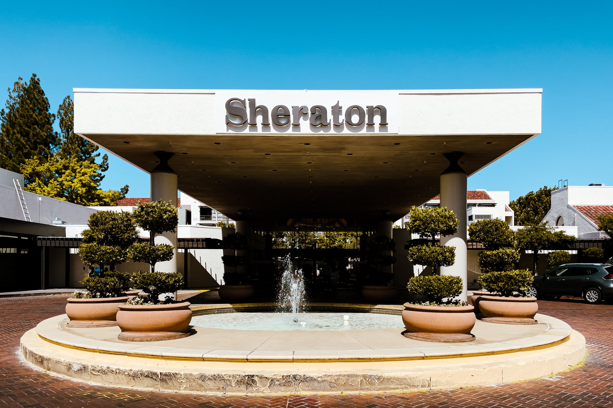
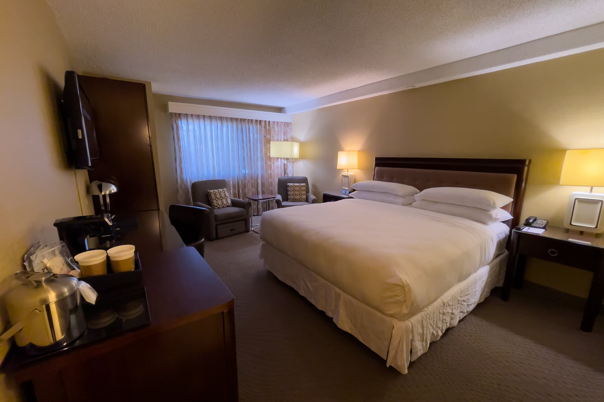
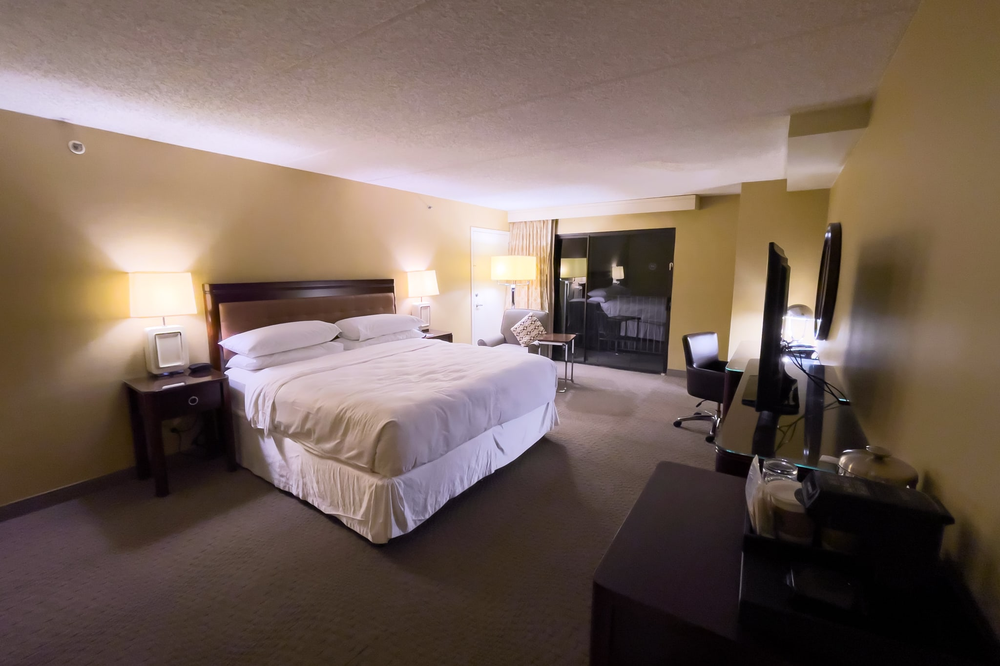
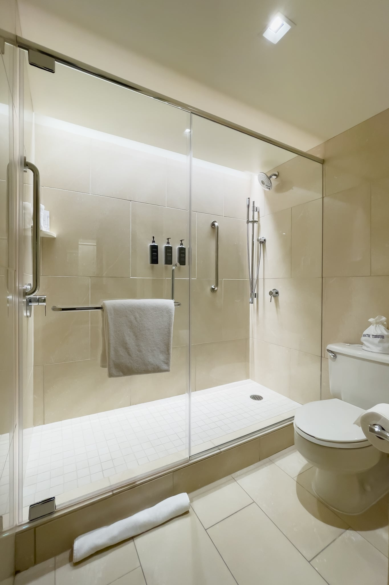

パロアルト出張に伴い、今回は [Sheraton Palo Alto](https://www.marriott.co.jp/hotels/travel/sjcsi-sheraton-palo-alto-hotel/) に4泊したので、宿泊記を残しておきます。Hyatt派なので、少し遠いものの2018年に開業した [Hyatt Centric Mountain View](https://www.hyatt.com/en-US/hotel/california/hyatt-centric-mountain-view/sjcct) が気になったのですが、イベント主催者の推奨ホテルが Sheraton Palo Alto で、同僚全員がここに泊まることにしたので、私も合わせることにしました。

カバー写真に使われていたりするプール周辺は良い雰囲気なのですが、庭やエレベーターホールにオブジェが雑然と置いてあったり、廊下で自販機と製氷機がうなっていたり、日本の疲れた旅館に近い雰囲気があります。Sheraton Palo Alto は2009年開業ですが、それ以前は Holiday Inn Palo Alto で、1980年代から営業していたようです。そのため、Sheratonだと思って泊まるとだいぶギャップがあり、築40年前後の Holiday Inn だと思ったほうが良いです。

29m2の Traditional, Guest room, 1 King の雰囲気も、Sheratonというよりも Holiday Inn でしょう。天井が吹き付け塗装だったりします。

最も困ったことは、Wi-Fiがたびたび無応答になり、つながっても64kbps程度しか出なかったことです。LANケーブルがデスクに来ていたので、一部の同僚は有線LANに切り替えることで回避したようですが、私の部屋のLANケーブルはリンクアップしません。机の下のケーブルをたどってキャビネット脇のローゼットを見つけたので、私物のLANケーブルに交換してみたものの、やはりつながりません。これでは部屋から仕事ができないので、フロントに行って部屋の交換をリクエストしました。しかし、「その他の部屋は満室である」との返答だったため、明日にはWi-Fiの調子が戻っていることを期待して引き下がることにしました。

部屋に戻ると、キャビネット内の金庫が私が使う前から閉まっていることに気づきました。おそらく前の客が操作を誤ったのでしょう。フロントに解錠をリクエストする電話を掛けようとしましたが、電話機は電源が入るものの、ワイヤレスの受話器からはツー音も何も聞こえません。仕方がないのでスピーカーフォンにしてフロントに状況を伝えました。

技術者が来て金庫はすぐに開けてくれ、電話の受話器はバッテリーをあとで交換してくれるそうです。LANケーブルは彼のPCで試してみてもリンクアップしないことが確認できました。しかし、ローゼットより裏の配線の問題なので、修理には数日掛かるという返答でした。

このWi-Fiを我慢して使おうとしますが、やはり使いものになりません。部屋を交換してもらえない場合は、そのままチェックアウトして他のホテル移動するつもりで再度フロントで交渉します。その結果、グレードが上の部屋に交換してもらえることになりました。Shearton Palo Alto は複数の建物で構成されているのですが、新しい部屋は異なる棟なので、きっとWi-Fiもつながるだろうということでした。

そのような経緯なので、新しい部屋のタイプは不明なのですが、ダブルボウルの洗面台なのと、道路に面している部屋だったので、45m2の Premium, Guest room, 1 King, Sofa bed, City view だと思われます。ただ、ソファベッドがないので、部屋のサイズは Premium Guest room だけど、グレードはもっと低い部屋なのかもしれません。そのためか、Traditional, Guest room, 1 King には2脚あった1人掛けソファが1脚しかなかったり、部屋のサイズに対して家具が不足している印象です。洗面台がダブルボウルで2名の利用を想定しているのに、ソファが1名分しかないというちぐはぐさも気になりました。

ただ、最も懸念だったWi-FiもLANケーブルも80Mbps以上出て、ホテルとしてはかなり速いです。ひとまずホテルを変える必要はなくなりました。

マットレスは Sheraton | Simmons Beautyrest でした。しかし、これが過去経験したことがないレベルで柔らかく、膝立ちすると10cm以上沈みます。寝ると体が水平を保てず、くの字に落ち込んでいることが分かります。私の知っているSimmonsとだいぶ異なり、「[Yogibo](https://yogibo.jp/)かな？」という柔らかさでした。

浴室の雰囲気は良いです。広いシャワールームの壁が間接照明で照らされており、壁に取り付けられたバスアメニティが浮かんで見えます。シャワーヘッドは[GROHE](https://www.grohe.co.jp/)で2つ備えてあり、その内1つは米国ではないことが多いホース付きなのがうれしいです。浴室はリノベーションしたのでしょう。ただ、バスアメニティの [Gilchrist & Soames Warm Oak](https://www.gilchristsoames.com/collections/warm-oak.html) はおっさんっぽい香りで、私はおっさんなので許容して使いましたが、女性には厳しそうだと感じました。

翌日、業務を終えて部屋に戻るとハウスキーピングが行われていません。部屋を交換してもらったことで対象リストから漏れているのかなと思いつつ、タオルは4組ずつあったのでハウスキーピングなしで過ごすことにしました。しかし、同僚とこの話になったときに、一人は「ハウスキーピングされておらず、依頼をしたのに来なかった」、もう一人は「何も言ってないけど毎日来る」とのことで、何が通常サービスの範囲なのか不明でした。

そのようなわけで、Sheratonのグレードを期待していはいけません。せめて廉価ブランドの [Four Points by Sheraton](https://four-points.marriott.com/ja-JP/) だったら、それなりの期待値にとどめておいたのですが。カテゴリー表示を廃止したMariottで、ブランドと品質が一致しないとなると、初めて泊まるホテルのグレードが想像しづらいです。なお、私がたまたま運が悪いだけならまだしも、同様の指摘が公式レビューにいくつも上がっています。

> Hotel is old and tired. The furniture, inside and out is poor quality and carpets are in serious need of replacing.  
> ホテルは古く、くたびれています。ホテル内外の家具の品質は低く、カーペットの張り替えが深刻に必要です。
>
> Cawineo - [GUEST REVIEWS - Sheraton Palo Alto](https://www.marriott.com/en-us/hotels/sjcsi-sheraton-palo-alto-hotel/reviews/)

> For all four days I experienced non functioning wifi.  
> 4日間ずっとWi-Fiが使えませんでした。
>
> Lipsi - GUEST REVIEWS - Sheraton Palo Alto

> Perhaps it would be ok for 1-2 nights, but 4 nights with no housekeeping, no clean towels or trash removal, no cleaning supplies to wipe things down… was not great.  
> 1-2泊なら良いのかもしれませんが、4泊でハウスキーピングがなく、タオル交換やゴミ捨てもなく、物を拭くための掃除用具もなく……というのは、あまりよろしくないです。
>
> Jamie - GUEST REVIEWS - Sheraton Palo Alto

> The toiletries (shampoo, conditioner, soap) are definitely targeted toward a male guest.  
> バスアメニティ（シャンプー、コンディショナー、石鹸）は間違いなく男性客をターゲットにしたものです。
>
> Becca - GUEST REVIEWS - Sheraton Palo Alto

次回は Sheraton Palo Alto の隣の [Westin Palo Alto](https://www.marriott.co.jp/hotels/travel/sjcwp-the-westin-palo-alto/) という選択肢もなくはないですが、どうせ East Palo Alto にある会社のオフィスまで徒歩では行けないので、Hyatt Centrice Mountain View にしてみようかと思います。

|  |  |
| --- | --- |
| グループ | [Marriot](https://www.marriott.co.jp/) |
| ホテル名 | [Sheraton Palo Alto](https://www.marriott.co.jp/hotels/travel/sjcsi-sheraton-palo-alto-hotel/) |
| 部屋 | Premium, Guest room, 1 King, Sofa bed, City view ? |
| 宿泊日 | 2022-04-11から2022-04-15 |