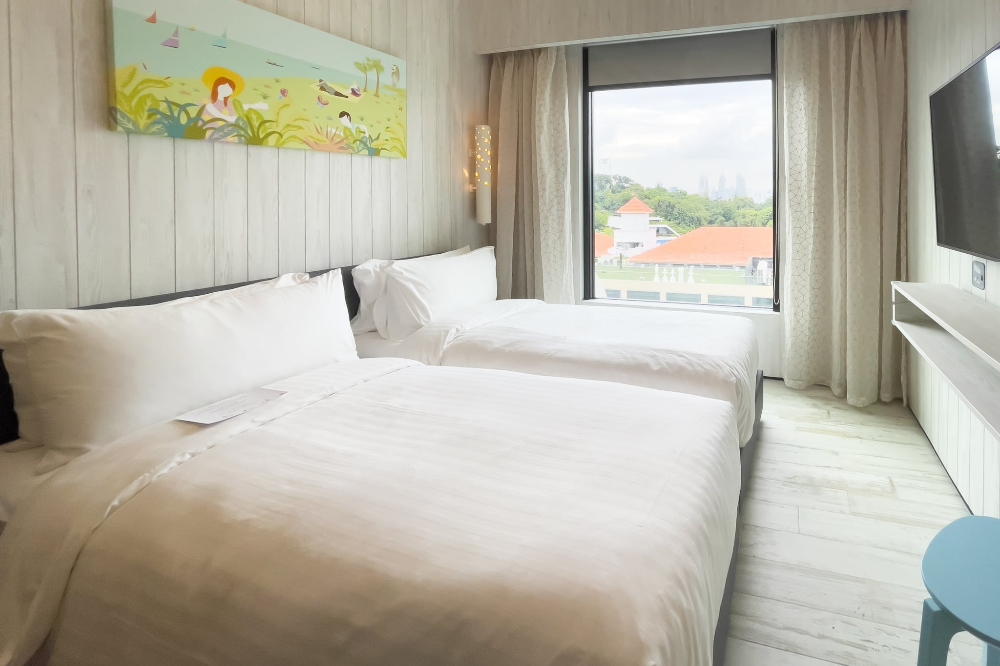
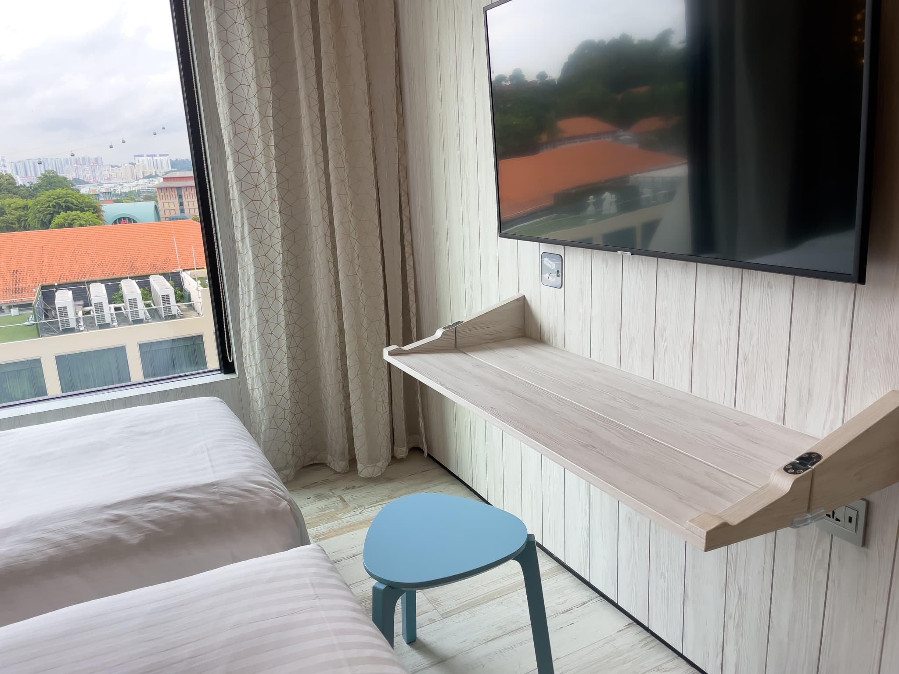
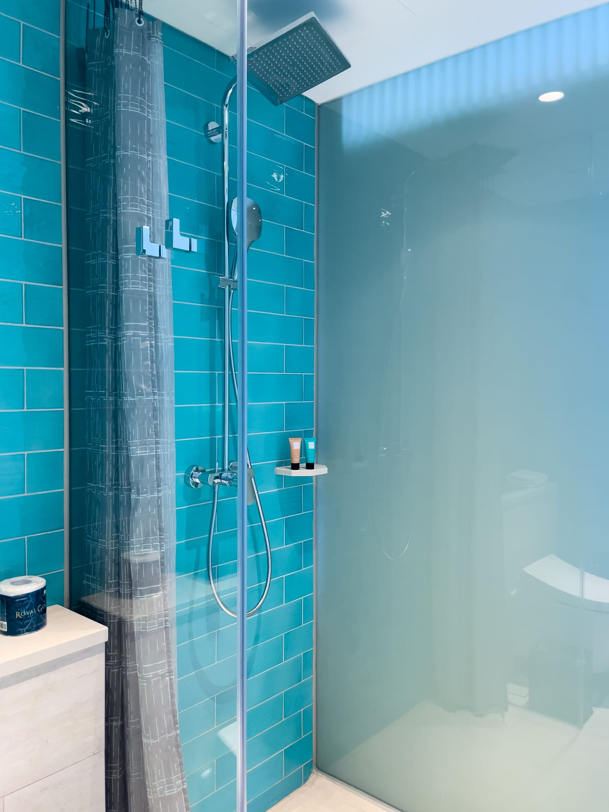
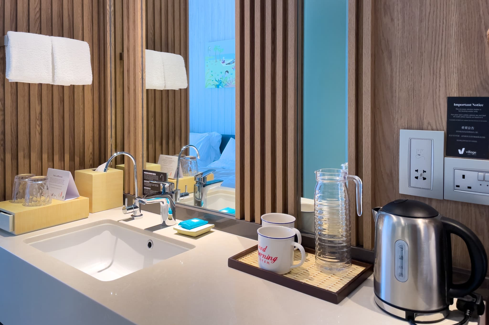
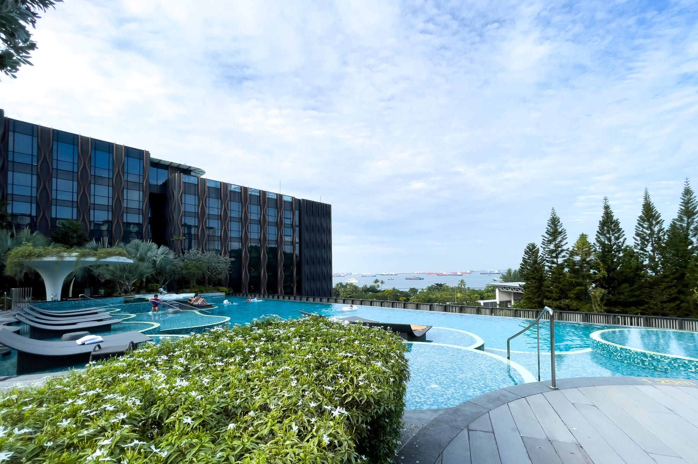

シンガポールでのイベント参加に伴い、イベント主催者指定の [Village Hotel Sentosa](https://www.fareasthospitality.com/ja-jp/hotels/village-hotel-sentosa) に5泊したので、宿泊記を残しておきます。2019年4月にオープンした新しいホテルで、Village（村）ということでカジュアルな雰囲気なものの、安っぽさはありません。

セントーサ島の中心地であるカジノ周辺までは徒歩10分程度と、歩ける距離にあります。また、目の前に[7-Eleven](https://goo.gl/maps/PEu1Y5hWMJcAkT6J9)があり、店舗の少ないセントーサ島の中では、これがけっこう便利です。

## Deluxe Room 客室について

2人以下の部屋は Deluxe Room しかないのですが、海外では狭い部類の22m2です。閉じたスーツケースを置けるラゲッジスペースはありますが、床にスーツケースを開けっぱなしにするスペースはありません。ハンガーは掛けられるものの、引き出しはほとんどありません。セントーサ島では [Equarius Hotel](https://www.rwsentosa.com/en/stay/equarius-hotel) に泊まったことがあり、そこは51m2あったので、だいぶ差があります。

ベッドはシングルサイズが2台でしたが、簡単に動くのでハリウッドツインにはできます。マットレスは [King Koil](https://www.kingkoil.com/) です。少し硬めですが、硬めが好きな私には悪くなかったです。

Deluxe Room - Village Hotel Sentosa

デスクはなんとテレビの下に折り畳まれています！ 開いたままでも人が通れるスペースはあるし、デスクが不要な人は畳んでおけば良いので、これはこれでありかもしれません。ただし、椅子がただの板なので、座っているとお尻が痛くなります。私はバスタオルを敷いて座っていました。テレビのHDMIポートが使えるので、HDMIケーブルを持ち込めば外部4Kモニターとして使えます。画面サイズに対してちょっと近すぎますが。

Desk - Deluxe Room - Village Hotel Sentosa

インターネットはWi-Fiのみなのですが、滞在中ずっとIPアドレスが取得できず、使えませんでした。同僚は問題なく使えたとのことなので、おそらく私の部屋の近くのWi-Fiアクセスポイントがおかしくなっています。仕方がないので、近くのオープンWi-Fiを使用しました。

バスタブがある部屋とない部屋があるようですが、私の部屋はバスタブがありませんでした。その分、シャワールームとしてはやや広いです。バスアメニティは Quality Amenities Supply です。シャンプーとコンディショナーはコンディショニングシャンプーになっています。トイレはTOTOのウォシュレットが付いています。

Shower Room - Deluxe Room - Village Hotel Sentosa

洗面台は廊下を挟んでトイレの向かいにあります。ペットボトルの水はありませんが、飲料用の蛇口が別に用意されています。

Vanity - Deluxe Room - Village Hotel Sentosa

## プールについて

プールは広めのインフィニティプールになっています。ウォータースライダーはありませんが、未就学児用の滑り台と流れるプールがあります。大人のためにはプールバーがあります。ただ、セントーサ島にいるなら [Adventure Cove Waterpark](https://www.rwsentosa.com/en/play/adventure-cove-waterpark) に行ったほうが良い気もします。Adoventure Cove Waterpark では広すぎる未就学児や、ただゆっくりしたい大人向けでしょうか。

Pool - Deluxe Room - Village Hotel Sentosa

## 朝食について

朝食は冷凍食品が多いです。卵料理はシェフが作ってくれますが、向かいの [Le Fauborg](https://le-faubourg-sentosa.com/) に行ったほうが満足度が高いでしょう。

## まとめ

Village Hotel Sentosa はカジュアルな雰囲気なものの安っぽくはない、新しいホテルです。Deluxe Room はやや狭いですが、折りたたまれたデスクがあります。また、プールは広めのインフィニティプールになっており、Adoventure Cove Waterpark では広すぎる未就学児や、ただゆっくりしたい大人には良いでしょう。

|  |  |
| --- | --- |
| グループ | [Far East Hospitality](https://www.fareasthospitality.com/ja-jp/) |
| ホテル名 | [Village Hotel Sentosa](https://www.fareasthospitality.com/ja-jp/hotels/village-hotel-sentosa) |
| 部屋 | Deluxe Room |
| 宿泊日 | 2022-09-04から2022-09-09 |
