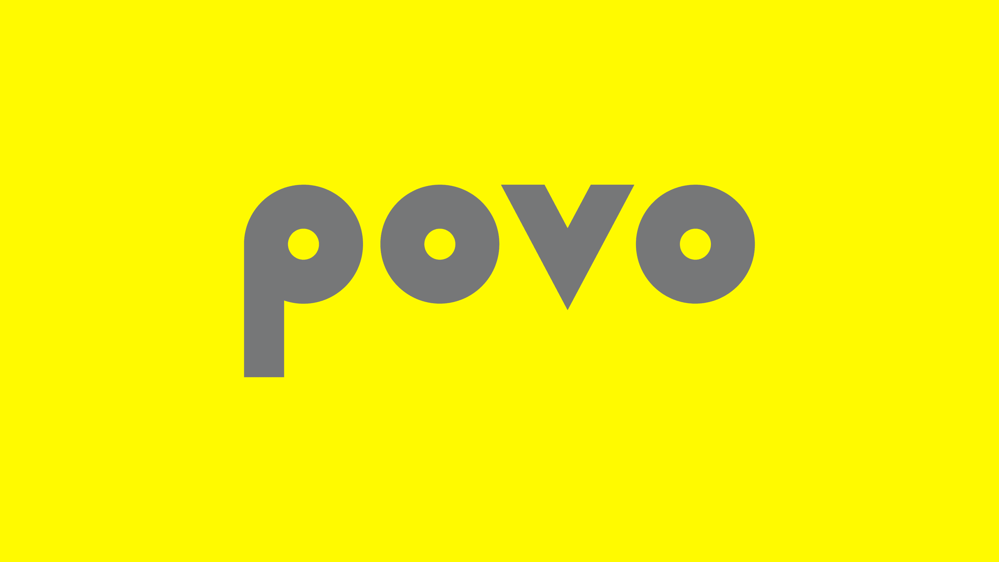

楽天モバイルの新しい料金プラン、Rakuten UN-LIMIT VII では無料で使うことができず、月額980円からになってしまいました。残念ながら会社のオフィス内で圏外だったり屋内で圏外なことが多くて月額980円で維持することは困難だったため、サブ回線をpovo2.0に切り替えました。

povo2.0ではauと同じ回線なのでエリアに関する心配はまったくなく、180日に1回220円のトッピングをすれば回線を維持できるので、サブ回線として優秀です。メイン回線がahamoで使い放題ではないため、大量にテザリングしたいときは、povo2.0の「データ使い放題（24時間）」トッピングが1回330円というのも使い勝手が良さそうです。