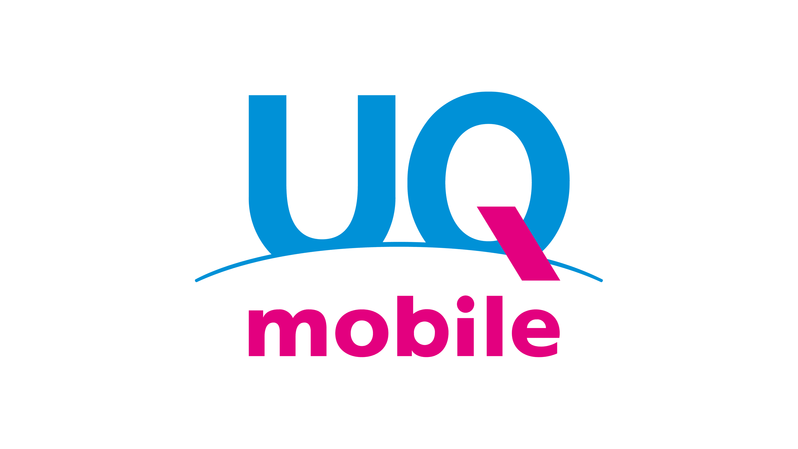

2022年8月からahamoを使っていましたが、JR山手線で通勤中に渋谷駅に着くと必ずデータ通信できなかったり、最寄りのスーパーやレストランでもアンテナピクトは立つものの通信できなかったりという状況が頻繁にありました。そのたびに副回線のpovoに切り替えていたのですが、それが改善するどころか徐々に悪くなっていき、2022年9月にはいよいよ我慢できなくなって [UQ mobile](https://www.uqwimax.jp/) に乗り換えました。今どき三大キャリアでそこまで品質は変わらないだろうと思っていたのですが、まさかDocomo回線が耐えられないほど低品質だとは思っていませんでした。

[ahamoに乗り換え](/blog/posts/transfer-ahamo/)

乗り換え先はau回線かSoftBank回線のMNOならどれでも良かったのですが、1カ月15GBもあれば十分なのと、自宅のインターネット回線は[auひかり](https://www.au.com/internet/)で、品質にとても満足していて乗り換える予定がないため、[自宅セット割](https://www.uqwimax.jp/mobile/newplan/setwari/jitaku/)が効く UQ mobile の[トクトクプラン](https://www.uqwimax.jp/mobile/plan/tokutoku/)がちょうど良かったのでこれにしました。15GB/月で2,365円で、7カ月間は [増量オプションII 無料キャンペーン](https://www.uqwimax.jp/mobile/plan/option/zouryo/) によって20GB/月が2,365円です。eSIMなので郵送を待たず、本人確認に12時間待つだけで乗り換えられました。