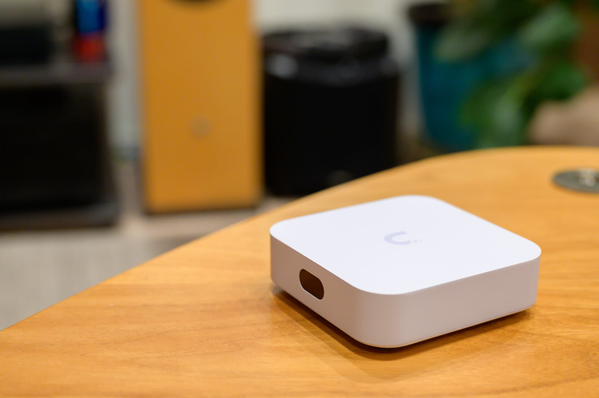

[Ubiquiti UniFi Express](https://ui.com/us/ja/cloud-gateways/express) (UX) はVPNとDPI (Deep Packet Inspection) を備えたWi-Fiメッシュルーターです。UniFiの中では最小の[ゲートウェイ](https://ui.com/us/ja/cloud-gateways)となっており、以下のとおり、通常の家庭利用には十分な性能となっています。UniFiは法人用Wi-Fiシステムとして有名ですが、UniFi Express によって小規模環境にもさらに気軽に導入できるようになりました。


|  |  |  |  |  |
| --- | --- | --- | --- | --- |
|  | WAN速度 | クライアント数 | UniFiデバイス数 | Wi-Fi内蔵 |
| [UniFi Express](https://ui.com/us/ja/cloud-gateways/express) | 1Gbps | 60以上 | 4 | ✓ |
| [UniFi Dream Router](https://ui.com/us/ja/cloud-gateways/dream-router) | 1Gbps | 150以上 | 20以上 | ✓ |
| [UniFi Dream Machine](https://ui.com/us/ja/cloud-gateways/dream-machine) | 10Gbps | 1,000以上 | 100以上 |  |


上記のUniFiゲートウェイは[UniFiスイッチ](https://ui.com/us/ja/switching)や[UniFiアクセスポイント](https://ui.com/us/ja/wifi)などのUniFiデバイスを一元管理できます。UniFi Express では最大4台まで管理できます。UniFi Express のWi-Fiは Wi-Fi 6 対応で、5GHzが2.4Gbps (2x2 160MHz)、2.4GHzが574Mbps (2x2 40MHz) の、いわゆるAX3000です。


ソフトウェアについては、UniFi Dream Router (UDR) や UniFi Dream Machine (UDM) はネットワークだけでなく、[監視カメラ](https://ui.com/us/ja/camera-security)や[入退室アクセスリーダー](https://ui.com/us/ja/door-access)などの管理もできますが、UniFi Express はネットワークのみに対応しています。ネットワークを管理する UniFi Network アプリケーション自体にはほとんど違いがなく、IDS/IPS（侵入検知防御システム）のみが省略されています。


## ハードウェア


ハードウェアは一辺10cm / 厚さ3cmと、かなり小さい部類です。特徴的なのは小さいながらもカラー液晶ディスプレイが付いているところで、LEDの状態で状況を把握しなければならないルーターに比べると分かりやすくなっています。


背面にはWANとLAN用に1ポートずつ、それにACアダプター用のUSB-Cポートがあります。5V/3AのACアダプターと短いLANケーブル1本は付属しています。


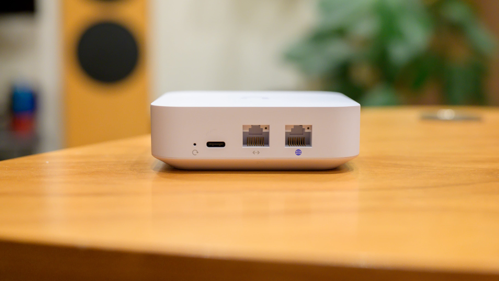


## セットアップ


詳しいマニュアルは付属していませんが、電源を入れると液晶ディスプレイで起動進行バーと共にモバイルアプリのインストールが促されます。


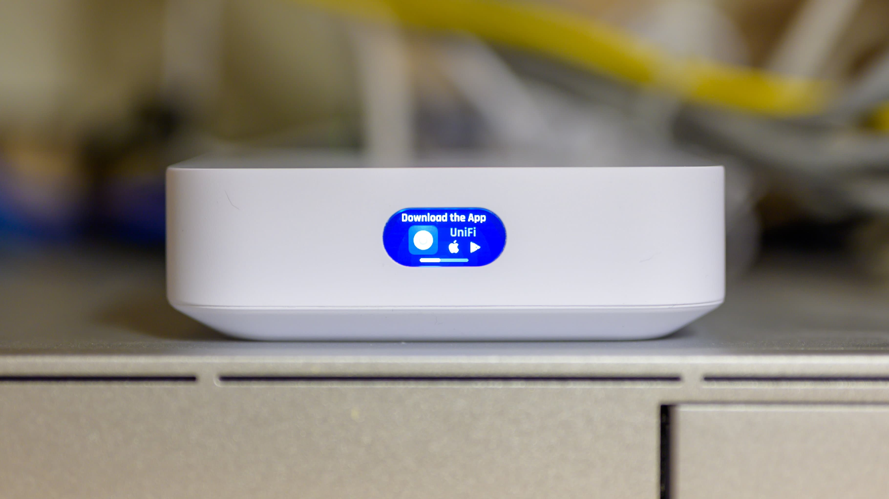


[UniFi](https://apps.apple.com/us/app/unifi-network/id1057750338)モバイルアプリをスマートフォンで起動するだけで UniFi Express を認識します。Bluetooth接続のため、最初に割り当てられたIPアドレスや初期 Wi-Fi SSID なしでセットアップできます。


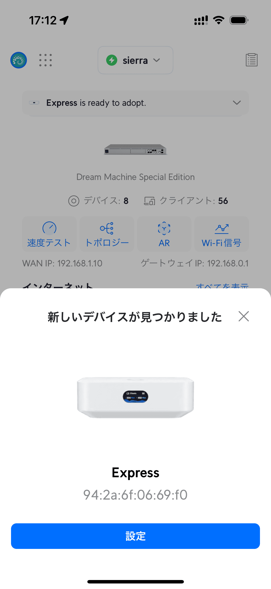


まずは1台目の UniFi Express なのか、既存のUniFiネットワークに追加するかを選びます。今回は「新しいシステムを設定」で進めます。


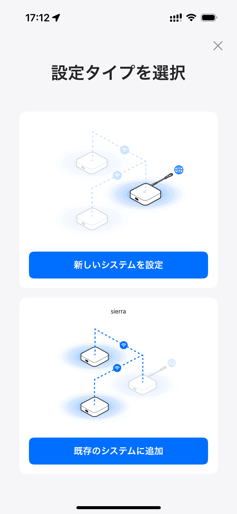


続いて UniFi Express の名前とWi-FiのSSIDとパスワードを設定します。初期設定項目はこれだけです。


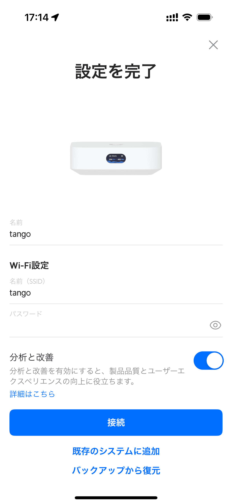


UniFi OS の使い方動画を見ている間にセットアップが終わります。


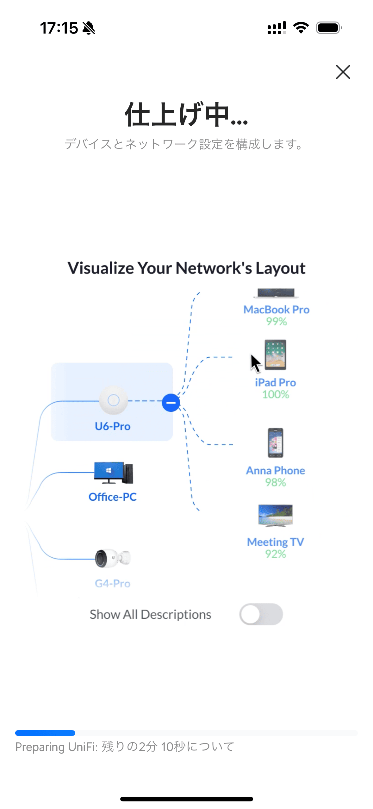


10分以下で初期設定が完了しました。


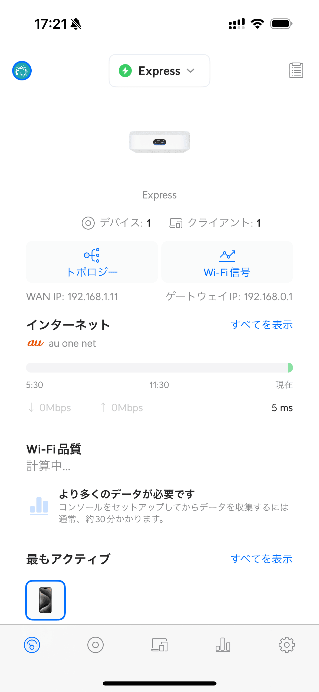


本体の液晶ディスプレイにも接続クライアント数とスループットが表示されるようになります。


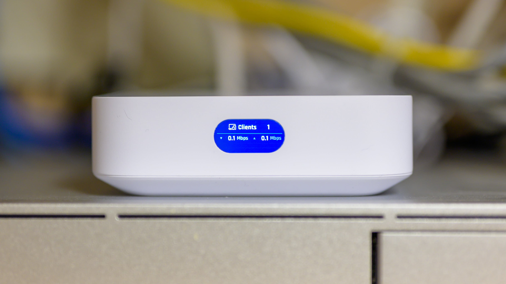


## UniFi OS


このままスマートフォンで設定することもできますが、PC/Macから <https://unifi.ui.com/> にログインして設定することもできます。他社だとクラウド管理はサブスクリプションが必要だったりしますが、UniFiは無料です。また、他社のクラウド管理だと、レスポンスが悪くてイライラしたりしますが、UniFiの場合はローカルとの違いを感じません。


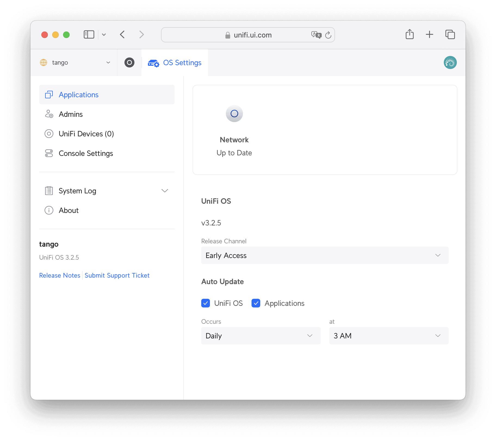


クラウド管理の良い点は、UniFi Express の設置してある拠点に行かなくてもインターネット経由で設定変更や監視、再起動などが行えることです。法人利用であれば、例えば本社から各店舗に設置した UniFi Express のリモート一括管理が行えたりします。私は[国別制限機能](https://help.ui.com/hc/en-us/articles/12567758783383-UniFi-Gateway-Country-Restriction)で通常は日本からしか自宅内のサーバーにアクセスできないようにしているのですが、そのまま海外出張してしまって自宅内のサーバーにアクセスできなくなってしまったときに、クラウド管理経由で渡航先の国の追加ができて救われました。[Ubiquiti Account](https://account.ui.com/) から [UniFi Verify](https://apps.apple.com/jp/app/unifi-verify/id1499320261) モバイルアプリやメールによる二要素認証をログインには必須にできます。


Release Channel がOfficialのままでは UniFi OS のバージョンが3.2.5未満の場合、Early Access に変更して UniFi OS を3.2.5以上にアップデートすることでtransix回線 (DS-Lite) を利用した IPv4 over IPv6 IPoE（ネイティブ方式）に対応します。フレッツ光でこの機能が必要な方も多いため、以下ではこのバージョンで進めます。


Console Settings では、初期セットアップで設定した名前の変更、システム構成情報クラウドへの自動バックアップとリストア、タイムゾーンの設定、LEDスクリーンをオフにする時間帯などの基本的な設定が行えます。


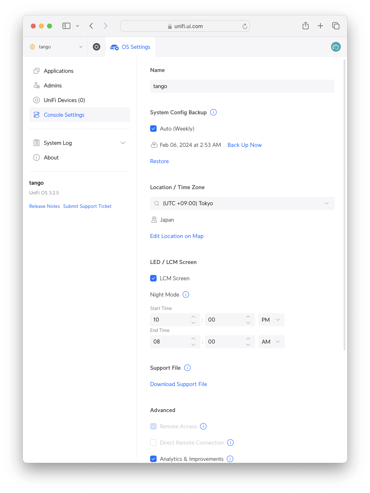


Wi-Fiを含めた UniFi Network の設定と監視は UniFi Network アプリケーションで行います。こちらについては以下を参照してください。


https://rewse.jp/blog/ubiquiti-unifi-express-review-network-config


https://rewse.jp/blog/ubiquiti-unifi-express-review-monitoring


Aboutを見ると、WANに割り当てられたIPアドレスだけでなく、メモリーやストレージの使用量が分かります。


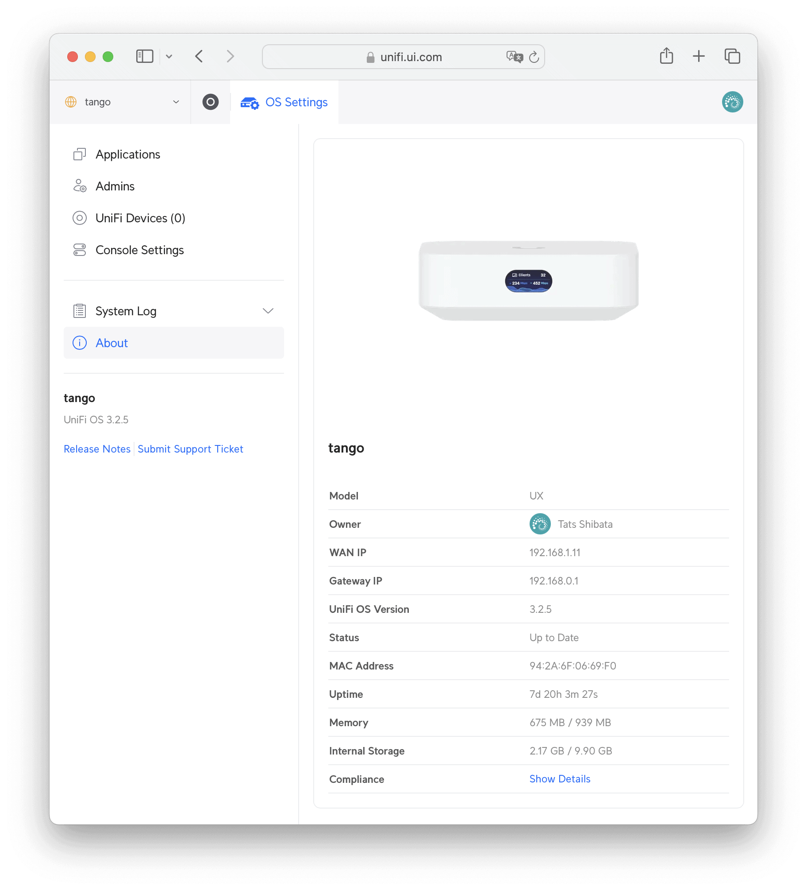


Show Details を押すと技適マークが表示されます。


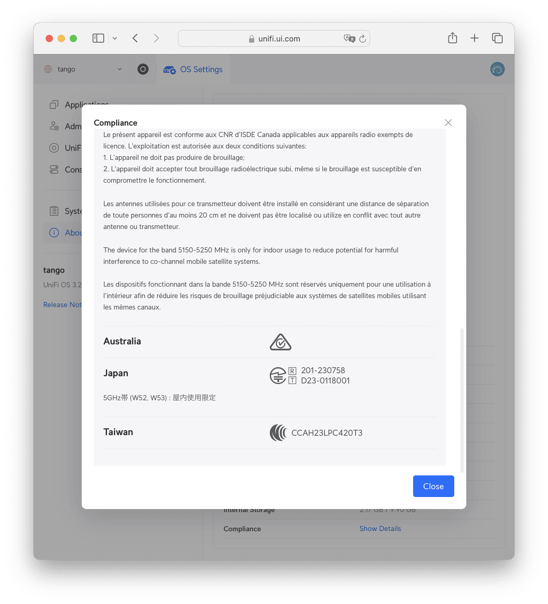


なお、設定を間違えて UniFi Express がインターネットにつながらなくなると https://unifi.ui.com/ から設定変更できなくなります。その場合は https://`<lan_ip_address>`/ でローカルアクセスすることもできます。


## ネットワーク拡張方法


UniFi Express 1台のWi-Fiだけではカバーできない場合、拡張方法は2通りあります。一つ目は UniFi Express を複数台購入してメッシュを作成する方法です。例えば1階と2階の間にLANケーブルが通っていない場合は、この方式になります。



flowchart TD
    Internet --- UX1[UniFi Express 1]
    UX1 -.- UX2[UniFi Express 2]
    UX1 -.- CLI1[Clients]
    UX2 -.- CLI2[Clients]



もう一つの方法は[UniFiアクセスポイント](https://ui.com/us/ja/wifi)を追加する方法です。例えば1階と2階の間にLANケーブルが通っている場合、1階に UniFi Express、2階にUniFiアクセスポイントを設置します。この場合、2階のアクセスポイントまで有線でつながるので安定させやすくなるのと、Ubiquiti UniFi U6 Lite であれば UniFi Express を追加するより安く済みます。U6 Lite はいわゆるAX1500ですが、対応クライアント数が300以上です。また、Wi-Fi 6E 対応の [U6 Enterprise](https://jp.store.ui.com/collections/unifi-network-wireless/products/u6-enterprise) (AXE16000)、AX5400の [U6 Pro](https://jp.store.ui.com/collections/unifi-network-wireless/products/unifi-ap6-professional)、長距離に対応した [U6 Long-Range](https://jp.store.ui.com/collections/unifi-network-wireless/products/unifi-6-long-range-access-point) (AX3000)、AX3000の[U6+](https://jp.store.ui.com/collections/unifi-network-wireless/products/u6-plus)などの選択肢もあります。UniFiアクセスポイントではなく、2台目の UniFi Expess をアクセスポイントとして使うこともできます。



flowchart TD
    Internet --- UX[UniFi Express]
    UX --- AP[UniFi Access Point]
    UX -.- CLI1[Clients]
    AP -.- CLI2[Clients]



なお、UniFi Express で管理できるUniFiデバイス（他 UniFi Express / UniFiアクセスポイント / UniFiスイッチなど）は最大4台ですので、そこの考慮が必要です。UniFi Express にはLANポートが1個しかないため、PCなどの一部のクライアントを有線接続したいために[UniFiスイッチ](https://ui.com/us/ja/switching)を導入する場合は上限に注意してください。UniFiスイッチでない他社のスイッチはこの制限数に含まれず、通信自体は問題なく行えますが、UniFiの一体化したネットワーク管理からは外れます。


すでにUniFiネットワークを構築している場合、UniFi Express を有線または無線で接続してアクセスポイントにすることもできます。将来的に UniFi Dream Router (UDR) のような、より大きなUniFiゲートウェイに置き換えた場合でも UniFi Express の活躍の道があります。



flowchart TD
    Internet  --- UDR[UniFi Dream Router]
    UDR --- UX1[UniFi Express 1]
    UDR -.- UX2[UniFi Express 2]



UniFi Express のWi-Fiで設置場所のどれくらいをカバーできるのかどうかは [UniFi Design Center](https://design.ui.com/) からシミュレーションすることができます。左上の Use a template からOfficeを選んで、下に表示された View Project on Floor Plan を選びます。


https://youtu.be/\_o0FsuCVlpg?feature=shared


UniFi Express 設置後であれば、[Ubiquiti WiFiman](https://apps.apple.com/jp/app/ubiquiti-wifiman/id1385561119) モバイルアプリでリアルタイムに計測しながらヒートマップを作成できます。このアプリはそれだけでなく、ARで壁や大型家具を認識して間取り図も自動生成します。また、どのアクセスポイントにつながっているのかもリアルタイムに表示されるので、アクセスポイントの切り替え（ローミング）が想定通りかの調査もできて便利です。





## ホームゲートウェイとの接続


### フレッツ光の場合


フレッツ光でtransix回線 (DS-Lite) を利用した IPv4 over IPv6 IPoE（ネイティブ方式）を使用したい場合でも、UniFi OS を3.2.5以上にアップデートすることでONUに直接接属できます。PPPoEにも対応しています。



flowchart TD
    Internet --- ONU
    ONU --- UX[UniFi Express]



### auひかりの場合


auひかりでは貸与されたホームゲートウェイ (HGW) なしではグローバルIPが割り当てられません。そのため、以下のような接続になります。



flowchart TD
    Internet --- ONU
    ONU --- HGW
    HGW --- UX[UniFi Express]



そのままだと二重ルーターになってしまいますが、HGWのDMZホスト機能を有効にして、DMZホストのIPアドレスに UniFi Express のWAN側のIPアドレスを指定することでHGWのルーターをバイパスできるようになり、二重ルーターでなくなります。


## SSHログイン


Console Settings でSSHを有効にすると、rootでSSHログインできるようになります。


```
[tats@zoom ~]% ssh root@192.168.0.1
root@192.168.0.1's password:

Linux tango 4.4.60-ui-qcom #1 SMP PREEMPT Tue Jan 9 10:51:16 CST 2024 aarch64

Firmware version: v3.2.5

  ___ ___      .__________.__
 |   |   |____ |__\_  ____/__|
 |   |   /    \|  ||  __) |  |   (c) 2010-2023
 |   |  |   |  \  ||  \   |  |   Ubiquiti Inc.
 |______|___|  /__||__/   |__|
            |_/                  https://www.ui.com

      Welcome to UniFi Express!

********************************* NOTICE **********************************
* By logging in to, accessing, or using any Ubiquiti product, you are     *
* signifying that you have read our Terms of Service (ToS) and End User   *
* License Agreement (EULA), understand their terms, and agree to be       *
* fully bound to them. The use of CLI (Command Line Interface) can        *
* potentially harm Ubiquiti devices and result in lost access to them and *
* their data. By proceeding, you acknowledge that the use of CLI to       *
* modify device(s) outside of their normal operational scope, or in any   *
* manner inconsistent with the ToS or EULA, will permanently and          *
* irrevocably void any applicable warranty.                               *
***************************************************************************

root@tango:~#
```


GUIからはパスワード認証しか設定できませんが、SSHログインしてSSHの設定を変更すれば鍵認証に変更できます。なお、設定に失敗してログインできなくなるとファクトリーリセットしか修正方法がなくなるので、問題なく鍵認証できることを確認するまでは、ログインしたままの別の1セッションを維持しておいたほうが良いでしょう。


```
root@tango:~# echo 'ssh-rsa xxxxxxxxxxxxxxxxxxxxxxxxxxxxxxxxxxxxxxxxxxxxxxxxxxxxxxxxxxxxxxxxxxxxxxxxxxxxxxxxxxxxxxxxxxxxxxxxxxxxxxxxxxxxxxxxxxxxxxxxxxxxxxxxxxxxxxxxxxxxxxxxxxxxxxxxxxxxxxxxxxxxxxxxxxxxxxxxxxxxxxxxxxxxxxxxxxxxxxxxxxxxxxxxxxxxxxxxxxxxxxxxxxxxxxxxxxxxxxxxxxxxxxxxxxxxxxxxxxxxxxxxxxxxxxxxxxxxxxxxxxxxxxxxxxxxxxxxxxxxxxxxxxxxxxxxxxxxxxxxxxxxxxxxxxxxxxxxxxxxxxxxxxxxxxxxxxxxxxxxxxxxxxxxxxxxxxxxxxxxxxxxxxxxxxxx tats@example.com' > .ssh/authorized_keys
root@tango:~# chmod 600 .ssh/authorized_keys
root@tango:~# sed -i 's/#PasswordAuthentication yes/PasswordAuthentication no/' /etc/ssh/sshd_config
root@tango:~# sed -i 's/#PermitEmptyPasswords no/PermitEmptyPasswords no/' /etc/ssh/sshd_config
root@tango:~# systemctl restart sshd
```


OSはDebianベースのようです。


```
root@tango:~# cat /etc/os-release
PRETTY_NAME="Debian GNU/Linux 11 (bullseye)"
NAME="Debian GNU/Linux"
VERSION_ID="11"
VERSION="11 (bullseye)"
VERSION_CODENAME=bullseye
ID=debian
HOME_URL="https://www.debian.org/"
SUPPORT_URL="https://www.debian.org/support"
BUG_REPORT_URL="https://bugs.debian.org/"
```


cpuinfoを見ると2コアなことが分かるだけでなく、Qualcomm IPQ5018 と表示されました。[Wireless CAT](https://wikidevi.wi-cat.ru/Qualcomm) によると、ARM Cortex-A53 2-Core 1.0GHz の [Qualcomm Immersive Home 216](https://www.qualcomm.com/products/internet-of-things/networking/wi-fi-networks/immersive-home-platforms/immersive-home-216-platform) プラットフォームのようです。


```
root@tango:~# cat /proc/cpuinfo
processor       : 0
BogoMIPS        : 48.00
Features        : fp asimd evtstrm aes pmull sha1 sha2 crc32
CPU implementer : 0x51
CPU architecture: 8
CPU variant     : 0xa
CPU part        : 0x801
CPU revision    : 4

processor       : 1
BogoMIPS        : 48.00
Features        : fp asimd evtstrm aes pmull sha1 sha2 crc32
CPU implementer : 0x51
CPU architecture: 8
CPU variant     : 0xa
CPU part        : 0x801
CPU revision    : 4

Hardware        : Qualcomm Technologies, Inc. IPQ5018/AP-MP03.5-C2
```


dmesgでも同様に表示されました。


```
root@tango:~# dmesg | head
[    0.000000] Booting Linux on physical CPU 0x0
[    0.000000] Initializing cgroup subsys cpuset
[    0.000000] Initializing cgroup subsys cpu
[    0.000000] Initializing cgroup subsys cpuacct
[    0.000000] Linux version 4.4.60-ui-qcom (bdd@builder) (gcc version 10.2.1 20210110 (Debian 10.2.1-6) ) #1 SMP PREEMPT Mon Oct 16 14:59:23 CST 2023
[    0.000000] Boot CPU: AArch64 Processor [51af8014]
[    0.000000] Ignoring memory range 0x40000000 - 0x41000000
[    0.000000] Machine: Qualcomm Technologies, Inc. IPQ5018/AP-MP03.5-C2
[    0.000000] efi: Getting EFI parameters from FDT:
[    0.000000] efi: UEFI not found.
```


## まとめ


Ubiquiti UniFi Express (UX) は、2個の 1Gbps Ethernetポートと Wi-Fi 6 を搭載したWi-Fiメッシュルーターです。0.96インチのカラー液晶ディスプレイとBluetoothが付いているため、セットアップはスマートフォンから10分掛からずに終えられます。ネットワーク拡張方法にはメッシュとアクセスポイントの追加の2通りがあります。フレッツ光の DS-Lite IPv4 over IPv6 IPoE に対応しており、auひかりでもDMZホストに設定することで二重ルーターを回避できます。SSHログインすることができ、鍵認証に変更することもできます。


|  |  |
| --- | --- |
| ブランド | [Ubiquiti](https://ui.com/us/ja) |
| 製品名 | [UniFi Express](https://ui.com/us/ja/cloud-gateways/express) |
| 型番 | UX |