UniFi OS コンソールの最上位機種 [Ubiquiti UniFi Dream Machine](https://ui.com/us/ja/cloud-gateways/dream-machine) Special Edition (UDM-SE) を使用する機会を得たので、現在使っている [YAMAHA RTX1200](https://network.yamaha.com/products/routers/rtx1200/) をUDM-SEに置き換えてみようと思います。


UDM-SEはVPN, DPI (Deep Packet Inspection), IDS/IPS（侵入検知防御システム）をそなえた10Gbps対応エンタープライズグレードルーターです。Special Edition とは Dream Machine Pro (UDM-Pro) から一部が強化されていることを意味しており、RJ45 WAN ポートが1Gbpsから2.5Gbps、1Gbps RJ45 LAN ポートが PoE+ (IEEE 802.3at) / PoE (IEEE 802.3af) 対応になっています。また、Special Edition は 16GB eMMC だけでなく、128GB SSD も内蔵しています。


## ハードウェア


ハードウェアを詳しく見てみましょう。まずはネットワークインターフェースです。ポート10と11は 10Gbps SFP+ で、WANとLAN用にそれぞれ1ポートずつあります。ここに [SFP+ MM Module (UM-MM-10G)](https://jp.store.ui.com/collections/unifi-accessories/products/sfp-modules-1) や RJ45 10G Module (UF-RJ45-10G) などを挿せば10Gbpsで通信できます。10Gbpsのインターネット接続が家庭でも導入できるようになっている今、候補に入ってくる10Gbpsルーターでしょう。ポート9は 2.5Gbps RJ45 WAN です。ポート1, 2はPoE+対応 1Gbps RJ45 LAN、ポート3から8はPoE対応 1Gbps RJ45 LAN です。ポート8はWANに変更することもできるので、2.5Gbps以下で良ければSFP+モジュールを購入しなくてもWANを冗長構成にすることもできます。


正面左には1.3インチのタッチ対応フルカラー液晶ディスプレイが付いています。これが小さいながらも便利で、起動シーケンスや割り当てられたIPアドレスを確認できたり、再起動やシャットダウンを実行できます。他社ルーターだと、ちょっとしたことを見たいためだけにシリアル接続する必要があって、トラブっているときに限ってシリアル接続も確立できない！みたいなことが起きがちですが、UDM-SEは、ある程度のことはこのディスプレイで分かります。


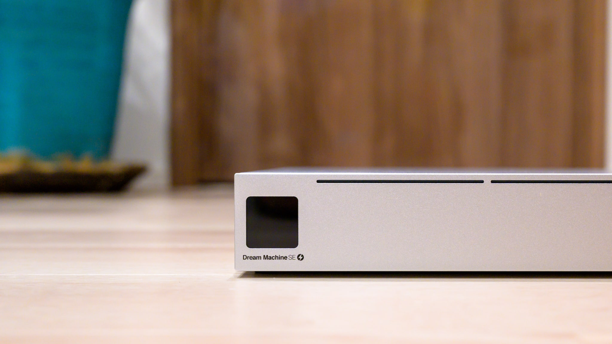


背面右側は電源で、C14です。脱落防止ロックがあります。なお、付属の電源ケーブルのオス側も3ピンなので、家庭で2ピンのコンセントにつなぎたい場合はアダプターを別途用意する必要があります。


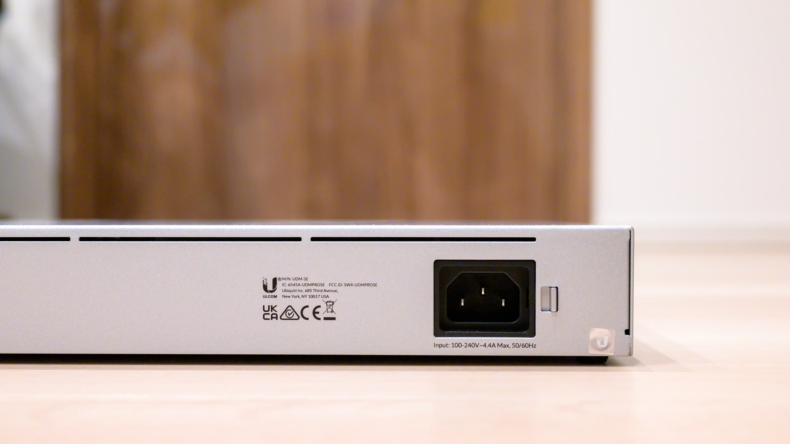


背面左側は日本未発売の [Power Backup (USP-RPS)](https://store.ui.com/collections/unifi-network-smartpower/products/usp-rps) を接続できるコネクターです。これをつなぐと電源を冗長化することができます。


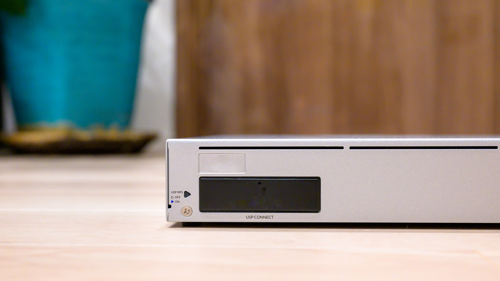


NVR (Network Video Recorder) 用のHDDベイは3.5インチと2.5インチの両方に対応しています。監視カメラである [UniFi Protect](https://ui.com/jp/ja/camera-security) をつなげれば、ここに録画を保存できます。内蔵されている 128GB SSD にユーザーはアクセスできません。


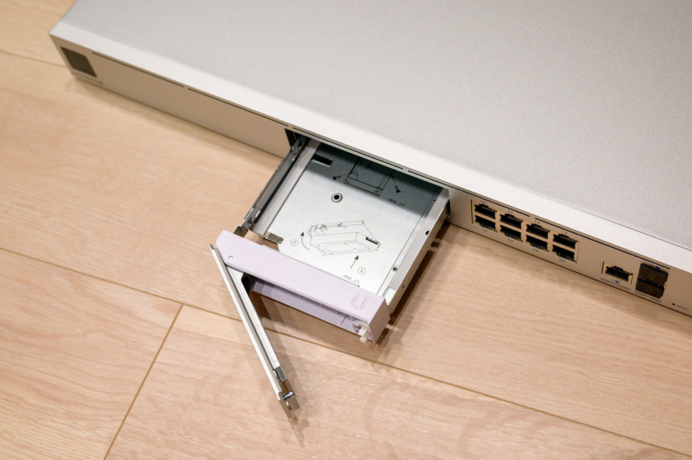


アクセサリにはラックマウントキットのほか、ゴム足（写真では貼付済み）も付属しています。我が家ではゴム足設置しました。


筐体の高さと奥行きはRTX1200とほぼ同じで、幅がちょうどRTX1200の2倍です。重量はRTX1200が1.5kgなのに対してUDM-SEは4.96kgもあるので、かなり違います。


室内が23℃程度だと内部温度は60℃程度で、ファンは1300rpmで回っていました。この程度だと無音です。最大7200rpmまで上げられますが、さすがに7200rpmだとデータセンター内のような爆音です。


## セットアップ


マニュアルは入っておらず、QRコードを読むとIKEAのような[設置ガイド](http://dl-origin.ubnt.com/qig/udm-se/)が表示できます。ただ、ビスの話がほとんどで、あまり頼りになりません。頼りになるのは液晶ディスプレイで、ここに表示されるとおりに進めます。なお、インターネット接続が必須そうな雰囲気です。





液晶ディスプレイの指示どおりWANにケーブルをつないで [UniFi Network](https://apps.apple.com/us/app/unifi-network/id1057750338) アプリをスマートフォンで起動すると、BluetoothによってUDM-SEを、まるでAppleのアクセサリーのように認識します！ このためだけにBluetoothを積んでいます！ Bluetooth接続のため、最初に割り当てられたIPアドレスが不明でもセットアップできるので便利です。


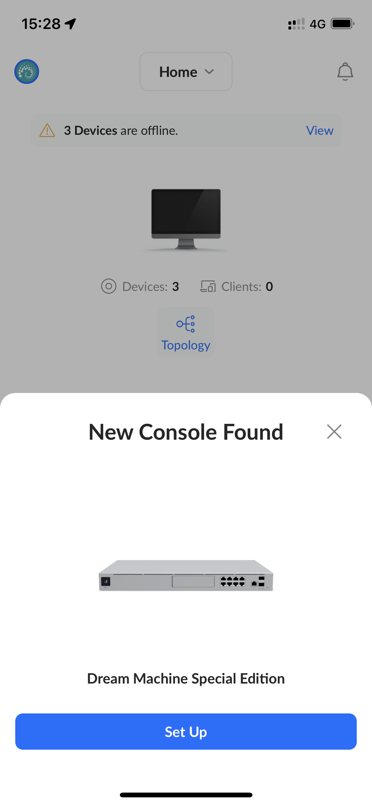


UDM-SEに名前をつけます。ちなみにこのUDM-SE本体の画像のEthernetケーブルは、実際に挿さっているポートが反映されている芸の細かさです。


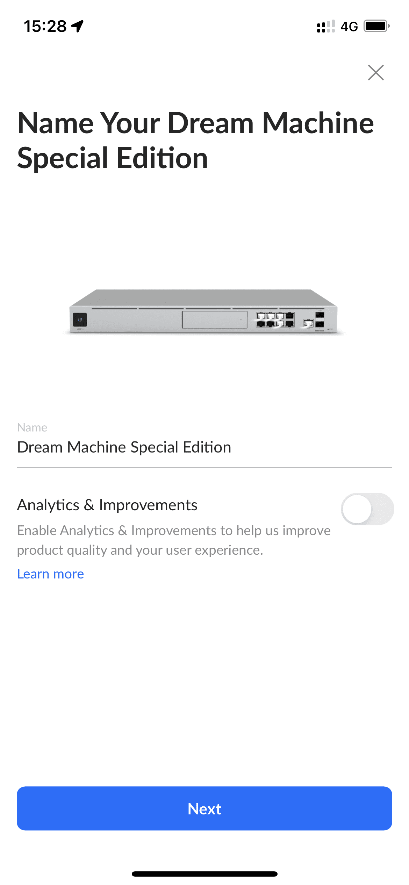


インターネットの速度計測が始まります。この値はインターネット通信が飽和していないかどうかの監視に使われます。また、毎日自動で計測し直すこともできます。


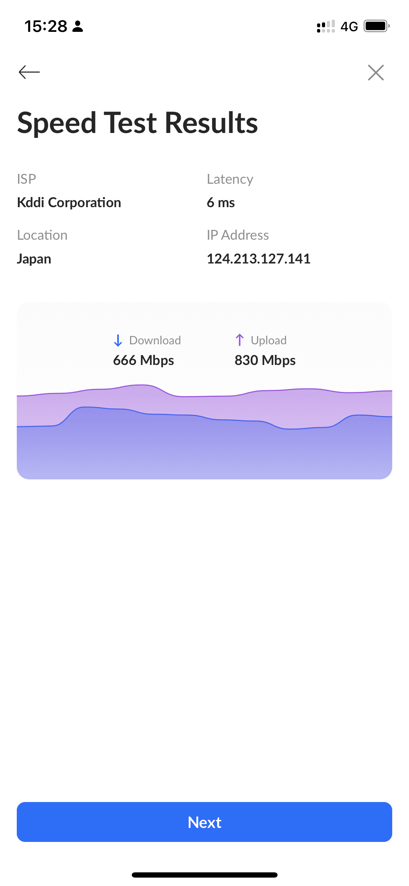


30秒ほどの UniFi OS の使い方動画を見ている間にセットアップが終わります。


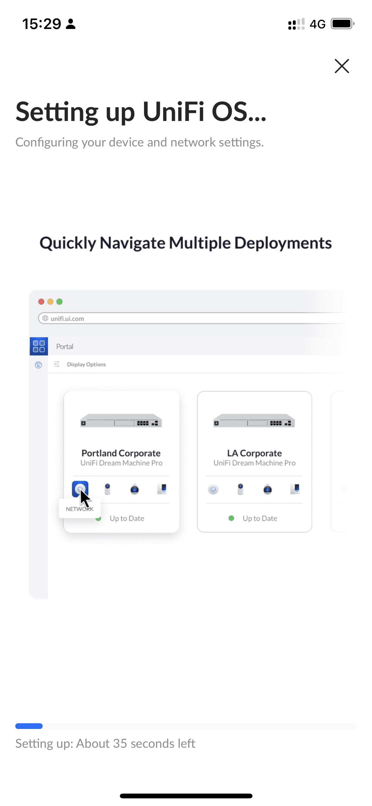


初期設定が完了しました。ここまで1分です。


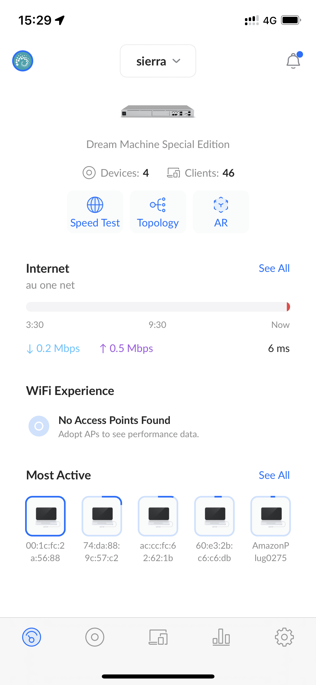


## UniFi OS


このままスマートフォンで設定することもできますが、PC/Macから <https://unifi.ui.com/> にログインして設定することもできます。他社だとクラウド管理はサブスクリプションが必要だったりしますが、UniFiは無料です。また、他社のクラウド管理だと、レスポンスが悪くてイライラしたりしますが、UniFiの場合はローカルとの違いを感じません。


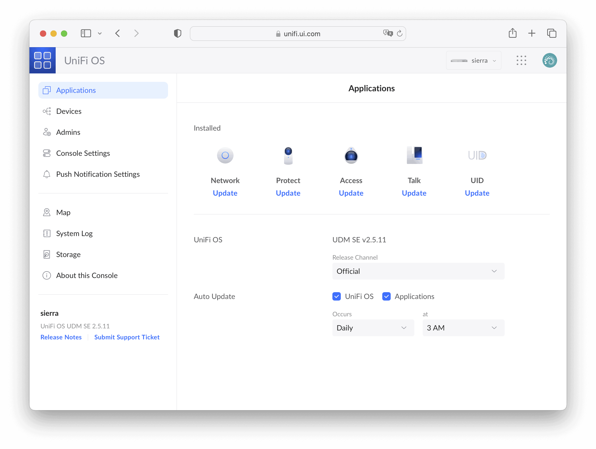


About this Console を見てみましょう。CPUはカタログによると ARM Cortex-A57 4-Core 1.7GHz です。


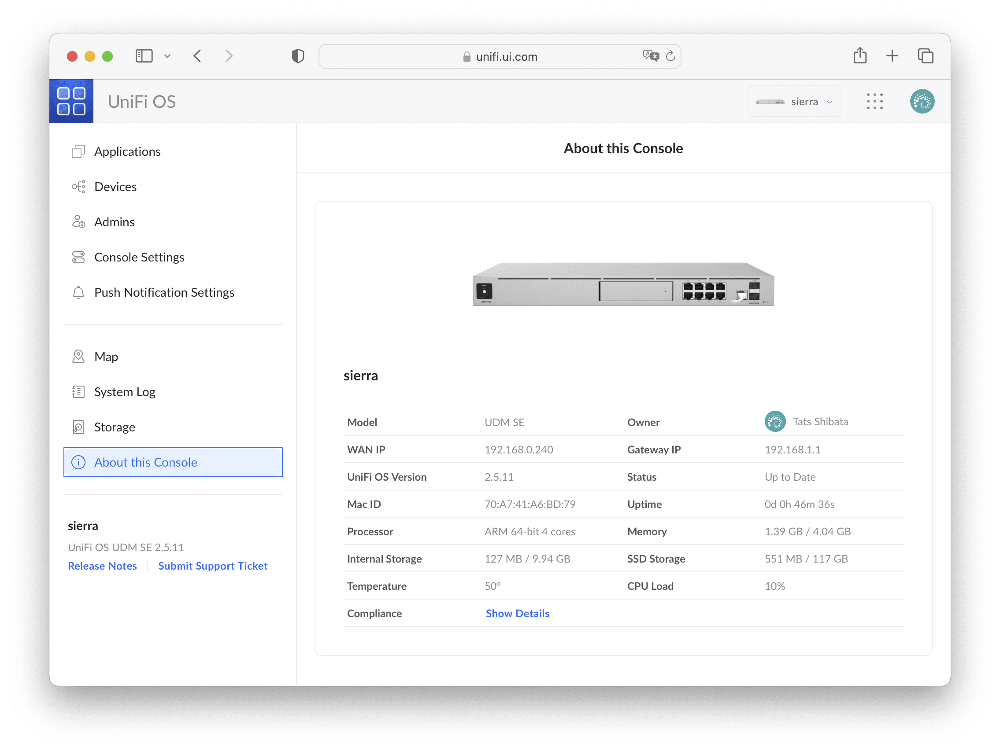


Show Details を押すと技適マークが表示されます。


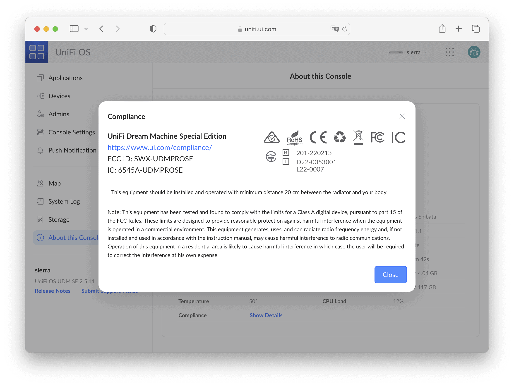


なお、設定を間違えてUDM-SEがインターネットにつながらなくなると、当然ながら https://unifi.ui.com/ から設定変更できなくなります。その場合は https://`<ip_address>`/ でローカルアクセスすることもできます。


## SSHログイン


Console Settings でSSHを有効にすると、rootでSSHログインできるようになります。Firmware Version が2.5.11になっていますが、UDM-SEと日本未発売の [Dream Router (UDR)](https://ui.com/us/ja/cloud-gateways/wifi-integrated/dream-router) は2系、UDM-Proと [Dream Machine (UDM)](https://jp.store.ui.com/products/unifi-dream-machine) は1系というメジャーバージョンの違いがあります。SSHした時の中身が少し違うので、以下も含めて、ブログの記事などを参照するときは注意する必要があります。


```
[tats@zoom ~]% ssh root@sierra
root@sierra's password:
Linux sierra 4.19.152-ui-alpine #4.19.152 SMP Mon Aug 1 14:24:56 CST 2022 aarch64

Firmware version: v2.5.11

  ___ ___      .__________.__


 |   |   |____ |__\_  ____/__|
 |   |   /    \|  ||  __) |  |   (c) 2010-2022
 |   |  |   |  \  ||  \   |  |   Ubiquiti Inc.
 |______|___|  /__||__/   |__|
            |_/                  https://www.ui.com

      Welcome to UniFi Dream Machine SE!

********************************* NOTICE **********************************
* By logging in to, accessing, or using any Ubiquiti product, you are     *
* signifying that you have read our Terms of Service (ToS) and End User   *
* License Agreement (EULA), understand their terms, and agree to be       *
* fully bound to them. The use of CLI (Command Line Interface) can        *
* potentially harm Ubiquiti devices and result in lost access to them and *
* their data. By proceeding, you acknowledge that the use of CLI to       *
* modify device(s) outside of their normal operational scope, or in any   *
* manner inconsistent with the ToS or EULA, will permanently and          *
* irrevocably void any applicable warranty.                               *
***************************************************************************

Last login: Fri Nov  4 20:14:11 2022 from 192.168.0.216
root@sierra:~#
```


GUIからはパスワード認証しか設定できませんが、SSHログインしてSSHの設定を変更すれば鍵認証に変更できます。なお、設定に失敗してログインできなくなるとファクトリーリセットしか修正方法がなくなるので、問題なく鍵認証できることを確認するまでは、ログインしたままの別の1セッションを維持しておいたほうが良いです。


```
root@sierra:~# mkdir .ssh
root@sierra:~# chmod 700 .ssh
root@sierra:~# echo 'ssh-rsa xxxxxxxxxxxxxxxxxxxxxxxxxxxxxxxxxxxxxxxxxxxxxxxxxxxxxxxxxxxxxxxxxxxxxxxxxxxxxxxxxxxxxxxxxxxxxxxxxxxxxxxxxxxxxxxxxxxxxxxxxxxxxxxxxxxxxxxxxxxxxxxxxxxxxxxxxxxxxxxxxxxxxxxxxxxxxxxxxxxxxxxxxxxxxxxxxxxxxxxxxxxxxxxxxxxxxxxxxxxxxxxxxxxxxxxxxxxxxxxxxxxxxxxxxxxxxxxxxxxxxxxxxxxxxxxxxxxxxxxxxxxxxxxxxxxxxxxxxxxxxxxxxxxxxxxxxxxxxxxxxxxxxxxxxxxxxxxxxxxxxxxxxxxxxxxxxxxxxxxxxxxxxxxxxxxxxxxxxxxxxxxxxxxxxxxx tats@example.com' > .ssh/authorized_keys
root@sierra:~# chmod 600 .ssh/authorized_keys
root@sierra:~# sed -i 's/#PasswordAuthentication yes/PasswordAuthentication no/' /etc/ssh/sshd_config
root@sierra:~# sed -i 's/#PermitEmptyPasswords no/PermitEmptyPasswords no/' /etc/ssh/sshd_config
root@sierra:~# systemctl restart sshd
```


OSはDebianベースのようです。なお、UniFi Security Gateway Pro (USG-Pro-4) という前世代のルーターは[VyOS](https://vyos.io/) (Vyatta) ベースのEdgeOSなので、ほぼ互換性はありません。


```
root@sierra:~# cat /etc/os-release
PRETTY_NAME="Debian GNU/Linux 9 (stretch)"
NAME="Debian GNU/Linux"
VERSION_ID="9"
VERSION="9 (stretch)"
VERSION_CODENAME=stretch
ID=debian
HOME_URL="https://www.debian.org/"
SUPPORT_URL="https://www.debian.org/support"
BUG_REPORT_URL="https://bugs.debian.org/"
```


CPUはあまり詳細は分かりませんでしたが、ひとまずカタログどおり4コアです。


```
root@sierra:~# cat /proc/cpuinfo | head -9
processor       : 0
BogoMIPS        : 116.66
Features        : fp asimd evtstrm aes pmull sha1 sha2 crc32 cpuid
CPU implementer : 0x41
CPU architecture: 8
CPU variant     : 0x1
CPU part        : 0xd07
CPU revision    : 3
root@sierra:~# cat /proc/cpuinfo | grep processor | wc -l
4
```


dmesgをのぞいてみたら、[Annapurna Labs](https://www.amazon.jobs/en/landing_pages/annapurna%20labs) の文字が。AnnapurnaはAWSの一部のハードウェアを作っているチームです。


```
root@sierra:~# dmesg | head
[    0.000000] Booting Linux on physical CPU 0x0000000000 [0x411fd073]
[    0.000000] Linux version 4.19.152-ui-alpine (bdd@builder) (gcc version 6.3.0 20170516 (Debian 6.3.0-18)) #4.19.152 SMP Mon Aug 1 14:24:56 CST 2022
[    0.000000] Machine model: Annapurna Labs Alpine V2 UBNT
[    0.000000] efi: Getting EFI parameters from FDT:
[    0.000000] efi: UEFI not found.
[    0.000000] On node 0 totalpages: 1048576
[    0.000000]   DMA32 zone: 12288 pages used for memmap
[    0.000000]   DMA32 zone: 0 pages reserved
[    0.000000]   DMA32 zone: 786432 pages, LIFO batch:63
[    0.000000]   Normal zone: 4096 pages used for memmap
```


メモリーは4GBです。カタログに載っているとおりですね。


```
root@sierra:~# cat /proc/meminfo | head -5
MemTotal:        4041024 kB
MemFree:          261056 kB
MemAvailable:    1204000 kB
Buffers:          276104 kB
Cached:           762268 kB
```


ディスク構成は以下のようになっています。Special Edition の 128GB SSD は/ssd1としてマウントされているようです。


```
root@sierra:~# df -h
Filesystem                         Size  Used Avail Use% Mounted on
udev                               2.0G     0  2.0G   0% /dev
tmpfs                              395M   37M  358M  10% /run
/dev/disk/by-partlabel/root        2.0G  1.6G  268M  86% /boot/firmware
/dev/loop0                         829M  829M     0 100% /mnt/.rofs
/dev/disk/by-partlabel/overlay     9.3G  1.4G  7.5G  16% /mnt/.rwfs
overlayfs-root                     9.3G  1.4G  7.5G  16% /
/dev/disk/by-partlabel/log         976M  113M  797M  13% /var/log
/dev/disk/by-partlabel/persistent  2.0G  323M  1.5G  18% /persistent
tmpfs                              2.0G  8.0K  2.0G   1% /dev/shm
tmpfs                              5.0M     0  5.0M   0% /run/lock
tmpfs                              2.0G     0  2.0G   0% /sys/fs/cgroup
tmpfs                              1.0G  244K  1.0G   1% /tmp
/dev/sda5                          109G  751M  103G   1% /ssd1
tmpfs                               16M     0   16M   0% /var/log/ulog
tmpfs                              512M     0  512M   0% /var/opt/unifi-protect/tmp
tmpfs                               64M     0   64M   0% /var/opt/unifi/tmp
```


/ssd1の下には.dataという隠しディレクトリがあり、この中にいろいろ保存されていました。SSDを内蔵していないないUDM-Proでは、これらがeMMCに保存されているのでしょうか。SSDのほうがeMMCよりおそらく書き込み速度が速いので、UDM-SEのほうがキビキビ動くのかもしれません。


```
root@sierra:~# ls /ssd1/.data
dpi-tracer/    ui-db/   unifi/         unifi-protect/
postgresql/    uid/     unifi-access/  unifi-talk/
udapi-config/  ulp-go/  unifi-core/    wifiman-server/
```


## まとめ


Ubiquiti UniFi Dream Machine Special Edition (UDM-SE) は、2つの 10Gbps SFP+、1つの 2.5Gbps RJ45、2つのSFP+対応 1Gbps RJ45、6つのSFP対応 1Gbps RJ45 を搭載したエンタープライズグレードのルーターです。1.3インチのタッチ対応フルカラー液晶ディスプレイとBluetoothが付いているため、セットアップはスマートフォンから1分程度で行えます。SSHログインすることができ、鍵認証に変更することもできます。


|  |  |
| --- | --- |
| ブランド | [Ubiquiti](https://ui.com/jp/ja) |
| 製品名 | [UniFi Dream Machine](https://ui.com/us/ja/cloud-gateways/dream-machine) Special Edition |
| 型番 | UDM-SE |
