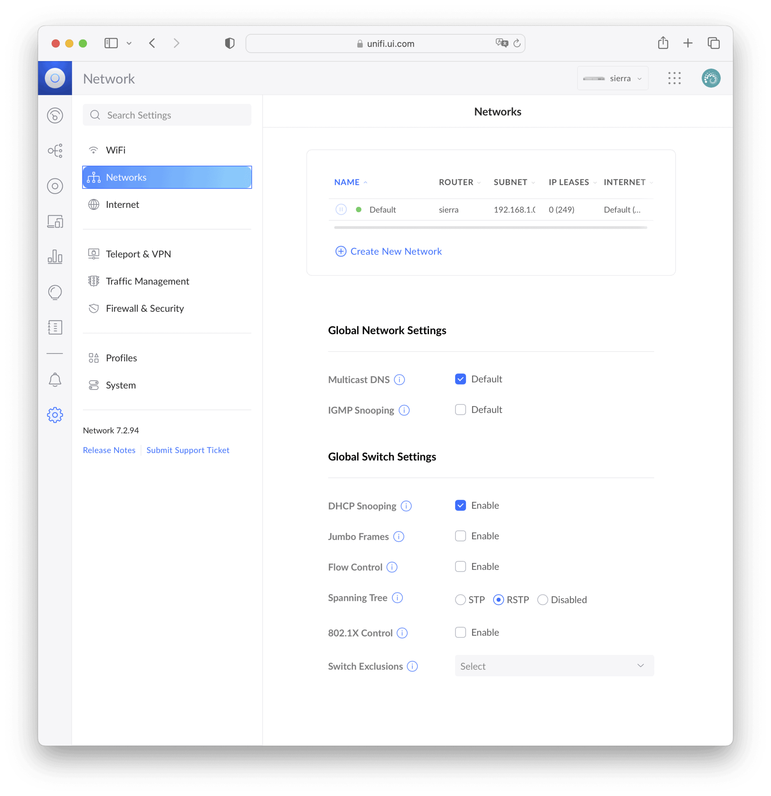
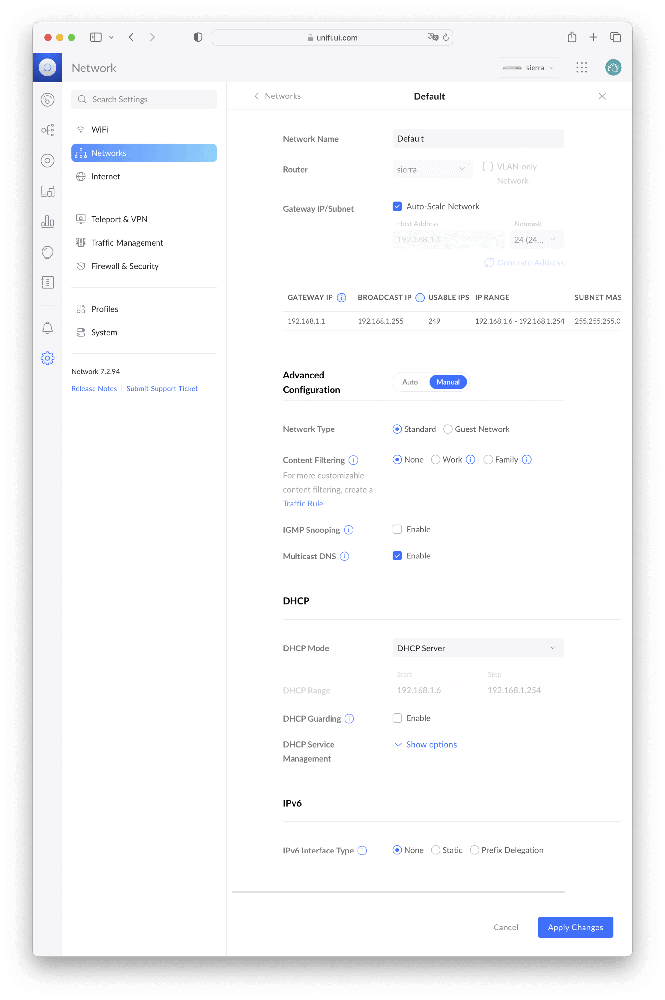
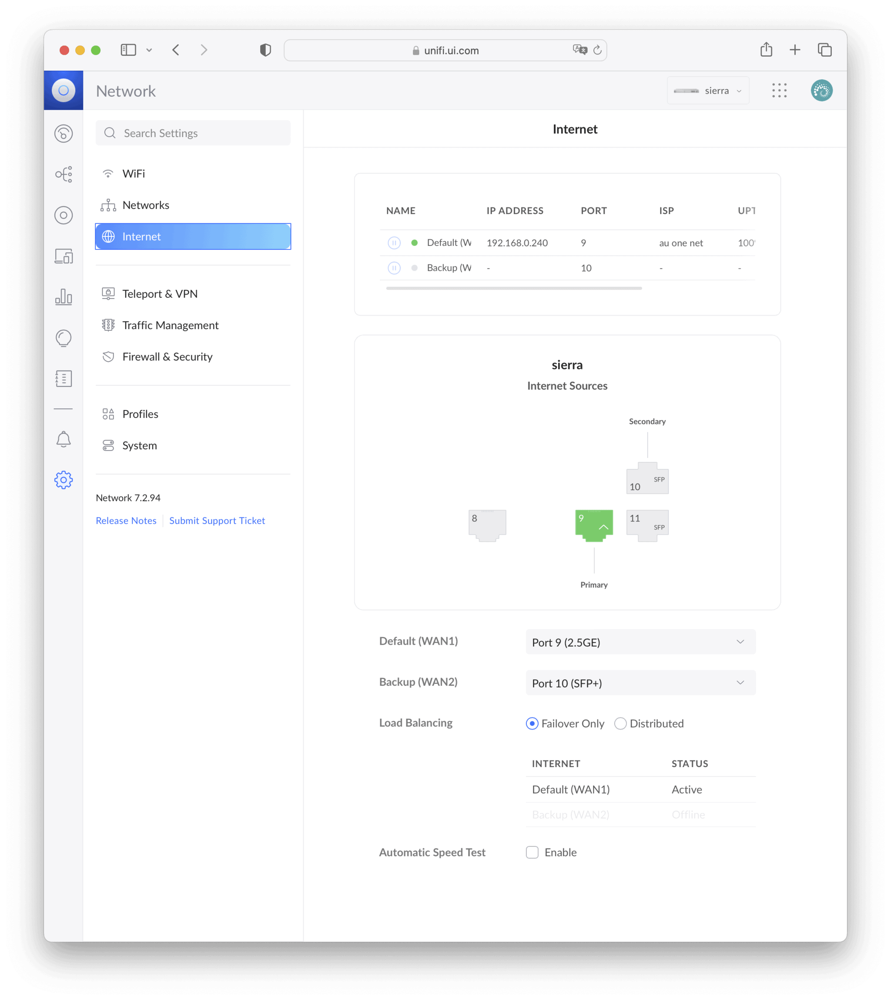
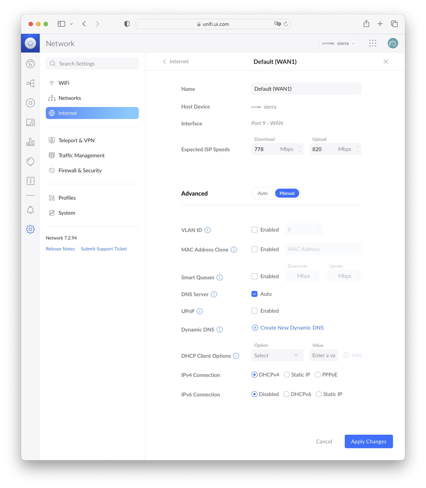
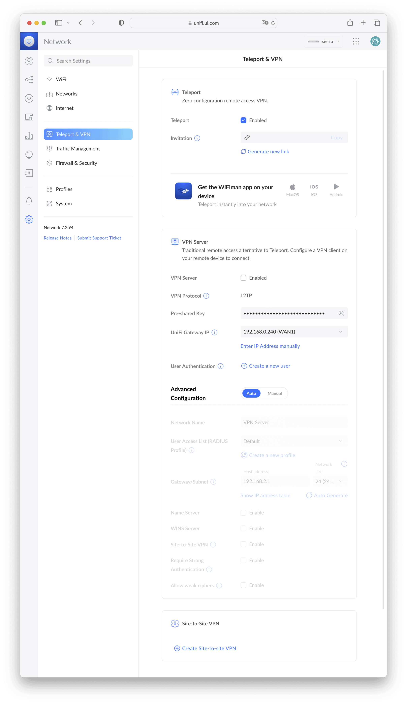

UuniFi OS コンソールの最上位機種 [Ubiquiti UniFi Dream Machine Special Edition (UDM-SE)](https://jp.store.ui.com/collections/unifi-network-unifi-os-consoles/products/dream-machine-se) を使用する機会を得たので、現在使っている [YAMAHA RTX1200](https://network.yamaha.com/products/routers/rtx1200/) をUDM-SEに置き換えてみようと思います。UDM-SEはVPN, DPI (Deep Packet Inspection), IDS/IPS（不正侵入検知防御システム）をそなえた10Gbps対応エンタープライズグレードルーターです。UDM-SEのネットワーク関連は、内蔵されている UniFi Network Application から設定します。以下は UniFi Network 7.2 の内容です。

## Networks

NetworksはLAN側の設定です。大規模ネットワークの効率性を高めるために、IGMP Snooping のようなマルチキャストを制御する機能が付いています。また、Create New Network からVLANを構築することができます。

Auto-Scale Network をオンにしておくと、クライアント数に応じて自動的にネットマスクを調整してくれるようです。Content Filitering は悪意のあるサイト / フィッシングサイト / アダルトサイトをブロックします。また、検索エンジンとYoutubeを強制的にセーフモードにします。FamilyではさらにVPNを禁止します。

## Internet

InternetはWAN側の設定です。Backup (WAN2) を Port 8 の 1Gbps RJ45 に変更することができるため、2.5Gbps以下で良ければ、SFP+モジュールを購入しなくても冗長構成を組むことができます。Load Balancing には2つの方法が選べます。Failover Only はWAN1が通信できない場合のみWAN2を使う設定で、WAN1が復帰した場合は自動でFailbackします。DistributedはActive-Activeの構成で、WAN1とWAN2の比率を50:50から変更することもできます。

我が家ではマンションに標準で[CYBERHOME](https://www.fnj.co.jp/service/cyberhome/)というインターネット回線が来ているもののプライベートIPしか割り当てられず、外から自宅に入ってこられないので、別途[auひかり](https://www.au.com/internet/)を契約しています。そのため、インターネット回線が2つある状況のため、auひかりを Port 9、CYBERHOMEを Port 8 につないで、Load Balacing を Failover Only にしました。これによって、通常はグローバルIPでインターネット通信するものの、auひかり側が何らかの障害で使えない場合はCYBERHOMEにフェイルオーバーすることで、外から内には入れないけど、内から外の通信だけは確保できます。

Automatic Speed Test を有効にしておくと、定期的にインターネット通信速度を自動計測してくれます。この値はインターネット帯域が飽和していないかどうかの監視に使われます。

Smart Queues は帯域が飽和しているときにトラフィックの優先付けをしてくれるそうです。ただし、300Mbpsを超える環境ではオフが推奨です。IPv4 Connection にStaticを選んだ場合、複数のIPアドレスを割り当てることができます。

## Teleport & VPN

Teleportは、[WiFiman](https://apps.apple.com/jp/app/ubiquiti-wifiman/id1385561119)アプリがインストールされたMac / iOS / Android端末からのリモートアクセスVPNをURLワンクリックで構築できる機能です。Generate new link で生成したURLをiOS / Android端末でクリックするとWiFimanが起動し、それだけでVPNが構築されます。次回以降は、iOSの場合は「設定」からVPNを接続にするだけです。URLは一度きりしか使えないため、ひも付いたあとのURLは漏洩しても安全です。Macの場合はURLをクリックするだけではダメで、URLをデスクトップなどにドラッグ & ドロップしてweblocファイルを作り、それを右クリックしてWiFimanで開くと設定されます。非常に手軽なので、クライアントがMac / iOS / Androidに限られる環境であれば、これだけでも良いかもしれません。詳しくは [UniFi - Get to Know: Teleport – Ubiquiti Support and Help Center](https://help.ui.com/hc/en-us/articles/5246403561495-UniFi-Get-to-Know-Teleport) を参照してください。

VPNサーバーはL2TPに対応しています。Site-to-Site VPN はIPSec/IKEv2またはOpenVPNに対応しています。VPNクライアントはOpenVPNに対応しています。AWSとの Site-to-Site VPN の構築方法については、以下の記事をご覧ください。

*※VPNサーバーは UniFi Network 7.3 からWireGuard、7.4からOpenVPNにも対応しました（2023-06-04追記）*

[Wp Content](/blog/posts/wp-content/)

### MAP-E / DS-Lite

*※ transix IPv4接続 (DS-Lite) には UniFi OS 3.2 + UniFi Network 8.0.7 から対応しました。詳しくは [IPv6 IPoE transix IPv4 (DS-Lite)の設定手順｜Ubiquiti UniFi ｜Ubiquiti Japan (UI Japan)](https://note.com/ui_japan/n/n3154ff641db5)（2024-02-04追記）*

MAP-EまたはDS-Liteは[フレッツ光](https://flets.com/)で IPv4 over IPv6 するための機能ですが、世界規模でいうとマイナーな仕様のため、海外製ルーターで対応しているものはUDM-SE含めて少ない印象です。MAP-E / DS-Liteが必要な場合は、UDM-SEの上流に別のMAP-E / DS-Liteに対応したHGW (Home Gateway) などを置く必要があります。詳しくは [Unifi Dream Machine で MAP-E方式の IPv6 に対応する - tech.guitarrapc.cóm](https://guitarrapc-tech.hatenablog.com/entry/2020/10/17/044555) が参考になるでしょう。私が使っているauひかりはMAP-E / DS-Liteが不要なので問題ありませんでした。

### IGMP Proxy / MLD Proxy

*※ IGMP Proxy には UniFi Network 7.4 から対応しました。しかし、auひかり テレビサービスは引き続き表示されません（2023-06-04追記）*

IGMP Proxy または MLD Proxy はIPTV（インターネットテレビ）を使うときに必要な場合があります。 UDM-SEの下に [auひかり テレビサービス](https://www.au.com/internet/service/auhikari/tv/) のセットトップボックスである[STW2000](https://www.au.com/internet/service/auhikari/tv/stb/)を置くと、IPTVだけが表示されず、Amazon Prime Video などは問題なく表示されるという症状が起きます。auひかり テレビサービス の仕様が全く不明なのですが、HGWに直接つなげばSTW2000にIPv6アドレスを割り当てなくてもIPTVが見られるので、おそらくIPv4の規格である IGMP Proxy への対応が必要となりそうです。なお、ぷららの[ひかりTV](https://www.hikaritv.net/)はIPv6の規格であるMLDv2を必要とします。

そのため、我が家では以下のような構成を取っています。HGWとSTW2000を有線でつなぐ、またはHGWがVLANに対応していればシンプルに解決できるのですが、我が家の環境ではどちらもできないため、IGMP Proxy に対応しているWi-Fiアクセスポイントである [TP-Link TL-WR902AC](https://www.tp-link.com/jp/home-networking/wifi-router/tl-wr902ac/) をHGWから直接生やしています。


flowchart TD
    Internet([auひかり]) --- ONU[ONU: au Mitsubishi H06NU5]
    ONU --- HGW[HGW: au NEC Aterm BL900HW]
    HGW --- Router[Router: Ubiquiti UDM-SE]
    Router --- Clients-1
    Router --- AP1[Wi-Fi AP: Ubiquiti U6-Pro]
    Router --- AP2[Wi-Fi AP: Ubiquiti U6-Lite]
    AP1 -.- Clients-2
    AP1 -.- Clients-3
    AP2 -.- Clients-4
    HGW --- AP3[Wi-Fi AP: TP-Link TL-WR902AC]
    AP3 -.- Settop[Set-Top Box: au STW2000]


欧州では IGMP Proxy を必要とするIPTVが多いようで、公式 UI Community で[かなり話題になっています](https://community.ui.com/questions?q=igmp+proxy)。[fabianishere/udm-iptv: Helper tool for configuring routed IPTV on the UniFi Dream Machine (Pro)](https://github.com/fabianishere/udm-iptv) というのも公開されているので、がんばれば設定できるかもしれません。IGMPとMLDについては [MLD スヌーピングとひかり TV | yabe.jp](https://yabe.jp/gadgets/mld-snooping-on-edgeswitch/) が詳しいです。

## まとめ

UDM-SEはVPN, DPI, IDS/IPSをそなえた10Gbps対応エンタープライズグレードのルーターです。すべての設定がGUIから行えます。しかし、BGP, MAP-E, MLD Proxy には非対応です。
