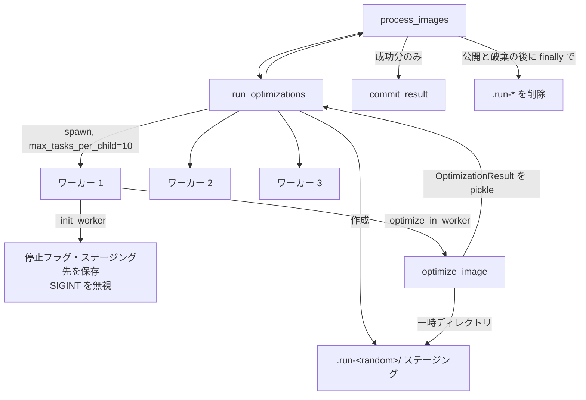

# optimize_images のワーカーをプロセス化する設計

## 背景

`scripts/optimize_images.py` は `ThreadPoolExecutor` で画像を並列に最適化している。Amplify のビルドイメージ `public.ecr.aws/v5r5z4u0/amplify-hugo-vips:v4`（libvips 8.18.0、libheif 1.21.2）では、AVIF を保存するたびに約 130 MB のメモリが解放されずに残る。同じイメージの amd64 コンテナで先頭 40 枚を処理すると RSS は 5.3 GB に達し、AVIF を出力しない場合は 0.5 GB にとどまった。libvips の操作キャッシュを無効にしても、エンコーダーを aom と rav1e のどちらに固定しても増え続けるため、`heifsave` か libheif の内部で漏れていると判断した。

このため全 530 枚の作り直しは約 150 枚目で 16 GiB を使い切り、Amplify のジョブ 108 と 109 は終了コード 137 で失敗した。現在は `PROCESSING_VERSION` を 1 に戻して作り直しを止めている。sRGB 変換の修正は、新しく追加した画像と変更した画像にしか適用されていない。

## 目的と成功条件

ネイティブライブラリのリークがあっても、全画像の作り直しが Amplify の 16 GiB 環境で最後まで完了するようにする。最終的に `PROCESSING_VERSION` を 2 に上げ、キャッシュされた全出力を sRGB 変換済みの出力に置き換える。

成功条件は次のとおり。

- `v4` イメージのコンテナで全 530 枚を処理したときのピーク使用メモリが 6 GB 以下になる。
- Amplify で `PROCESSING_VERSION = 2` のビルドが 60 分のタイムアウト内に成功する。
- 公開された Adobe RGB と Display P3 の画像が sRGB に変換されている。
- 二段階の処理（全画像を最適化してから公開する）、ロールバック、キャンセル時の後片付けについて、今の保証を失わない。

## 範囲外

- ビルドイメージの更新と、libvips や libheif のリークそのものの修正。
- エンコード設定（品質、幅、形式）の変更。
- 公開処理 `commit_result` とマニフェスト形式の変更。

## 設計

### 構成

並列実行の詳細は `_run_optimizations` の中に閉じたままにする。呼び出し側の `process_images` から見た戻り値（結果のリストと割り込みの有無）は変えない。

`ProcessPoolExecutor` は `max_workers=MAX_WORKERS`（3）、`mp_context` に `spawn` のコンテキスト、`max_tasks_per_child=TASKS_PER_WORKER`（新しい定数で値は 10）、`initializer=_init_worker` で作る。ワーカーは 10 枚を処理すると終了して新しいプロセスに入れ替わるので、リークは 1 プロセスあたり約 1.3 GB で頭打ちになる。libvips は内部でスレッドを使うため、`fork` で子プロセスを作ると安全でない。そのため `spawn` を使う。

`_init_worker(stop_event, staging_root)` は、共有の停止フラグとステージング先をモジュール変数に保存し、SIGINT を無視するよう設定する。`_optimize_in_worker(source)` は、保存した値を使って `optimize_image` を呼ぶだけの入口にする。`spawn` のワーカーはスクリプトを import し直すが、`if __name__ == "__main__"` のガードがあるので `main()` は実行されない。

`optimize_image` の `stop_event` 引数は、`is_set()` と `set()` を持つ Protocol 型にする。`threading.Event` と `multiprocessing` の Event のどちらも満たすので、既存の呼び出しとテストはそのまま動く。一時ディレクトリの作成先を指定するため、`optimize_image` にステージング先の引数を追加する。省略したときは今と同じく `OUTPUT_DIR` 直下に作る。

`OptimizationResult` は Path、文字列、リスト、真偽値だけを持つので、pickle して親に返せる。公開とマニフェストの更新は今までどおり親プロセスだけが行うため、書き込みの競合は起きない。

`max_tasks_per_child` は Python 3.11 で追加されたので、スクリプトの `requires-python` を `>=3.11` に、`pyrightconfig.json` の `pythonVersion` を `3.11` に上げる。Amplify のイメージは 3.14、手元の uv は 3.13 を使っている。依存は標準ライブラリだけで、追加はない。

### キャンセル

ターミナルで Ctrl-C を押すと、SIGINT はプロセスグループ全体に届く。エンコード中のワーカーが `KeyboardInterrupt` を受けると、`optimize_image` の `except Exception` では捕まらず、ステージングが残る。これを防ぐため、ワーカーは SIGINT を無視し、キャンセルは親だけが扱う。

親は `KeyboardInterrupt` を受けると共有の停止フラグを立てる。ワーカーは次のキャンセル確認で `Optimization cancelled` のエラーになり、自分のステージングを削除して結果を返す。割り込みを受け止めながら終了を待つ `_shutdown_executor` と、回収されていない完了済みの結果を拾う処理は今のまま使う。

### 実行ごとのステージング

親は実行のたびに `OUTPUT_DIR/.run-<random>/` を作ってワーカーに渡す。`optimize_image` は画像ごとの一時ディレクトリをその中に作る。`_run_optimizations` の後、`process_images` は公開処理と破棄処理を終えてから、成功時も失敗時も `.run-*` をまるごと削除する。公開はステージングから最終パスへのファイル移動なので、公開済みのファイルは `.run-*` の削除の影響を受けない。ワーカーが OOM などで途中で終了しても、そのワーカーが作った一時ディレクトリはこの削除でなくなる。

### エラー処理

子プロセスが強制終了されると、プールは `BrokenProcessPool` になり、残りの future はすべて例外で終わる。この例外は今の `except Exception` で受け、エラー付きの `OptimizationResult` に変換する。その後は今と同じく、成功した画像だけを公開し、失敗を `✗` で報告して終了コード 1 で終わる。

AVIF エンコーダーがない場合（`Unsupported compression`）は、ワーカーが共有の停止フラグを立てる。ほかのワーカーも止まり、親はすべての更新を中止する。これは今と同じ挙動である。dry-run は並列実行を使わないので変わらない。

## テスト

単体テストでは、`_run_optimizations` のテストが差し替える対象を `ProcessPoolExecutor` に変え、進捗ログ、2 回の割り込み、回収されていない結果のケースが引き続き通ることを確認する。加えて次を確認する。

- プールを `spawn`、`max_tasks_per_child=TASKS_PER_WORKER`、`_init_worker` を指定して作る。
- `_init_worker` が SIGINT を無視する設定をし、停止フラグとステージング先を保存する。
- `optimize_image` が、指定されたステージング先の中に一時ディレクトリを作る。
- `process_images` が、成功時も例外で抜けたときも `.run-*` を削除する。
- `BrokenProcessPool` がエラー付きの結果になる。

本物のプロセスを使う結合テストを 1 件追加する。小さな PNG を 2 枚、実際の `spawn` ワーカーで処理し、出力ができることと、後片付けが済むことを確認する。

手元では `pyright` と全テストを実行する。そのうえで次を確認する。

- macOS で全 530 枚を処理し、スレッド版の 8 分 47 秒と処理時間を比べる。
- SIGINT を 2 回送り、トレースバックが出ず、`.run-*` が残らず、終了コード 1 で終わることを確かめる。
- `v4` イメージの amd64 コンテナ（8 CPU、16 GB）で全 530 枚を処理し、ピーク使用メモリが 6 GB 以下であることを確かめる。

## 展開

1. プロセス化のコミットを push し、Amplify のビルドが成功することを確認する。この時点では作り直しは起きない。
2. `PROCESSING_VERSION` を 2 に上げるコミットを push し、全画像の作り直しが成功することを確認する。
3. 公開された Adobe RGB と Display P3 の画像を 1 枚ずつ取得し、sRGB に変換されていることを確かめる。
